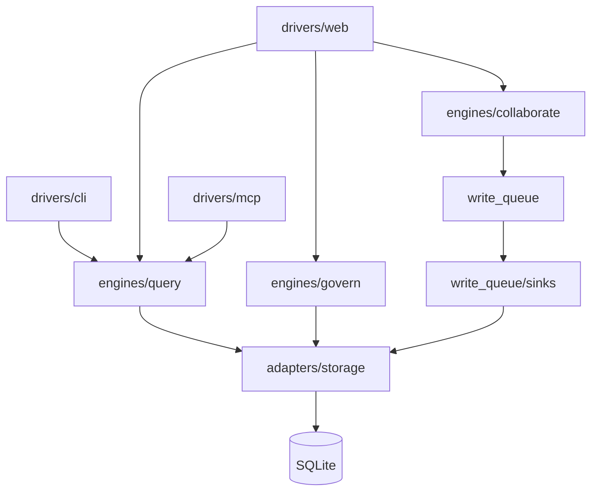

# 模块清单 — Smart Agent Wiki @ v1.19.0

> 聚焦审计（G安全+F代码审查+H性能+I可观测/文档drift；D前端/E测试深度标 `未验证-范围`）。ground 自 `.csp/code-spec/saw/` CMS。

## 1. 模块总览
| 模块 | 职责 | 入口 | 关键文件 | 关联 PMS |
|---|---|---|---|---|
| M1 Ingest | 文档摄入→分块→抽 claims→落库 | `saw ingest` / `engines/ingest/pipeline.py` | `engines/ingest/pipeline/phases/{parse,extract,classify,validate,store,merge}` | embedding/e2e-tail |
| M2 Query/Search | BM25+FTS5+语义(ANN)+图遍历+NL查询 | `saw query/search` / `engines/query/engine.py` | `engines/query/{engine,semantic,search,graph_traverse,tree_mode,compiler,cache,memory}` | semantic-perf/embedding |
| M3 Govern | 4级置信+9级新鲜度+矛盾检测+Ed25519凭证 | `saw verify/lint/freshness/audit` / `engines/govern/governor.py` | `engines/govern/`, `adapters/crypto/ed25519.py`, `cedar_policy.py` | security-hardening/claim-alignment |
| M4 Collaborate | 6 agent + workflow + A2A + activity | `saw workflow` / `engines/collaborate/` | `engines/collaborate/{agents,dispatcher,workflow_executor,orchestrator,a2a_protocol,activity_tracker}` | agent-link/agent-viz |
| M5 Write Queue | SQLite outbox 唯一变更网关+dispatcher+sinks | `write_queue/` | `write_queue/{queue,dispatcher,receipt_store,sinks/*}` | debt-closure |
| M6 DB/Storage | SQLite schema/migration/repositories | `db/models.py`, `db/migrations.py` | `adapters/storage/{claims,wiki}_repository.py`, `db/migrations.py` | graph-workspace/per-request-ws |
| M7 Drivers | CLI/Web/MCP 前端驱动 | `drivers/{cli,web,mcp}/` | `drivers/cli/commands/*`, `drivers/web/{app,routes,middleware}`, `drivers/mcp/tools/*` | dashboard/desktop/per-request-ws |

## 2. 各模块详情（摘要）
- **M2 Query**：S4 已拆分（engine.py 881→635，semantic mixin）。scale-driven ANN(hnswlib>500)/numpy-cosine 切换 + fallback（engine.py:563）。per-request workspace contextvar（compiler.py:68 effective_workspace_id）。
- **M3 Govern**：Ed25519 receipt（`adapters/crypto/ed25519.py`），矛盾检测（governor.verify_claim/freshness）。
- **M5 Write Queue**：dispatcher.recover() 重启恢复搁浅 op（app.py lifespan），DLQ 死信告警（app.py:_recover_loop）。
- **M7 Web**：RBAC（get_current_user/require_role），限流（RateLimitMiddleware），审计日志（AuditLogMiddleware），per-request workspace 中间件，安全头。

## 3. DB 底层模块（M6）
### 3.1 系统参数/配置
- `WikiSettings`（`config/settings.py`）：path/llm/embedding。tier 检测 OFFLINE/LIGHTWEIGHT/FULL（`detect_tier`）。
- 环境变量：`SAW_AUTH_MODE`/`SAW_ANN_THRESHOLD`/`SAW_SEMANTIC_CACHE_*`/`VITE_POLL_INTERVAL_MS`。
### 3.2 表管理
- 表：claim/claim_relation/entity/entity_relation/embedding_store/workflow_executions 等（`db/models.py` CREATE TABLE IF NOT EXISTS，`db/migrations.py` PRAGMA user_version 链）。
- migration 链连续性：`未验证-范围`（未逐版本 diff 迁移链；migrations.py PRAGMA user_version={version} 为内部 int，非用户输入，安全）。
- 索引：`未验证-范围`（未逐表核对索引覆盖高频查询）。
- 数据一致性：WAL+busy_timeout=5000（app.py:create_app_from_config），per-test `:memory:` 隔离。
### 3.3 前后端与数据联动（典型往返）
- REST `/api/v1/workflows` POST → CollaborateEngine → WorkflowExecutor → dispatcher → Write Queue → sinks(wiki/claims/fts5/graph/contradictions/embedding) → DB → WS broadcast（workflow_progress）→ UI Dashboard。
- trace_id：RequestContextMiddleware 注入 request_id_var contextvar（observability.py:30），贯穿日志（AuditLogMiddleware）。`未验证-范围`：未实跑四层 trace 截图（需运行实例）。

## 4. 模块依赖图（Mermaid）

## 5. 已知技术债/边界 drift
- **S4** engine.py god-file → **本周期已拆**（semantic mixin，635 行）。
- **T1** activity 不持久化（PRD §3.3 rule 6 设计决策，非债）。
- coverage 67.76%（gate 67 踩线过）—— #1 风险（见裁决）。
- `未验证-范围`：mutation/fuzz/property/chaos 测试能力未建（见裁决 §6）。
