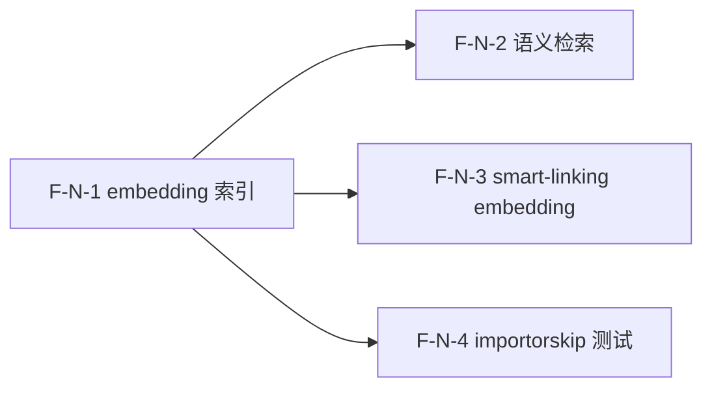

# Decomposition Delta — v1.10.0（2026-09-04）

> 新一轮 02 拆解 delta。源自 PRD-embedding-v1.10.0 + retrospective-v1.9.0.md（findings M1 + L1 解除）。
> embedding track：4 原子 Feature（F-N-1..4），语义索引与检索 + smart-linking 语义增强 + 测试 skip 策略，复用既有 embeddings.py / QueryEngine / Write Queue sink 范式。

## 新增 Feature

| id | name | domain | priority | complexity | depends_on | wave | blocked_by | source | AC |
|---|---|---|---|---|---|---|---|---|---|
| F-N-1 | embedding 索引（向量入库 Write Queue sink + 重建命令） | embedding | P0 | M | — | 1 | — | PRD §3.1 F-EMB-1 | AC-EMB-1, AC-EMB-2, AC-EMB-3 |
| F-N-2 | 语义检索端点+CLI（QueryEngine semantic + CLI + REST） | embedding | P0 | M | F-N-1 | 2 | — | PRD §3.2 F-EMB-2 | AC-SEM-1, AC-SEM-2, AC-SEM-3 |
| F-N-3 | smart-linking suggest 接 embedding 相似度 | embedding | P1 | M | F-N-1 | 2 | — | PRD §3.3 F-EMB-3 | AC-LINK-1, AC-LINK-2, AC-LINK-3 |
| F-N-4 | heavy-SDK 测试 importorskip 沿用 | embedding | P0 | S | F-N-1 | 2 | — | PRD §3.4 F-EMB-4 | AC-TEST-1, AC-TEST-2, AC-TEST-3 |

## 原子 Feature → Spec 映射（03 1:1）
- F-N-1 → SPEC-F-N-1（embedding 索引 + EmbeddingSink + 重建命令）
- F-N-2 → SPEC-F-N-2（语义检索 QueryEngine semantic 模式 + CLI + REST）
- F-N-3 → SPEC-F-N-3（smart-linking embedding 相似度信号）
- F-N-4 → SPEC-F-N-4（importorskip 测试策略 + CI coverage 兼容）
> 4 原子 Feature = 4 Spec。

## DAG delta

- F-N-1（索引）先行，无依赖。
- F-N-2（检索）依赖 F-N-1（需向量索引存在）。
- F-N-3（smart-linking）依赖 F-N-1（需页面向量存在）。
- F-N-4（测试）依赖 F-N-1（需 embedding 代码存在以测试）。
- F-N-2 / F-N-3 / F-N-4 互相独立，可并行。
- 无新环；DAG 无环 ✓。

## Wave 划分（v1.10.0）

- **Wave 1（基础层）**：F-N-1（embedding 索引 — EmbeddingSink + 重建命令）
  - 无依赖，先行启动；为 Wave 2 解锁向量索引。
- **Wave 2（核心业务 + 测试，全并行）**：F-N-2（语义检索） / F-N-3（smart-linking embedding） / F-N-4（importorskip 测试）
  - 三者均依赖 F-N-1，互相独立，可全并行。

## 共享资源串行
- EmbeddingSink（F-N-1 新建）：Write Queue sink 范式，参照 fts5_sink.py，独立文件。
- QueryEngine.query()（F-N-2 改 mode）：F-N-3 改 compute_related_pages()（不同函数），不冲突。
- embeddings.py（F-N-1/F-N-2/F-N-3 共用只读调用）：不冲突。
- test 文件（F-N-4 加 importorskip）：各 Feature 实现时产出的 test_embedding_*.py 由 F-N-4 统一加 importorskip。

## AC 归属表

| AC ID | 描述 | 归属 Feature |
|---|---|---|
| AC-EMB-1 | embedding 索引随 ingest 写入 | F-N-1 |
| AC-EMB-2 | 无 [learn] 时不报错 | F-N-1 |
| AC-EMB-3 | 存量重建索引 | F-N-1 |
| AC-SEM-1 | 语义检索返回同义结果 | F-N-2 |
| AC-SEM-2 | 无 [learn] 降级 BM25 | F-N-2 |
| AC-SEM-3 | 空索引优雅处理 | F-N-2 |
| AC-LINK-1 | suggest 含语义相似页面 | F-N-3 |
| AC-LINK-2 | 无 [learn] 保持 3-signal | F-N-3 |
| AC-LINK-3 | 语义不相似排名下降 | F-N-3 |
| AC-TEST-1 | CI skip embedding 测试 | F-N-4 |
| AC-TEST-2 | 本地 embedding 测试 pass | F-N-4 |
| AC-TEST-3 | coverage 不回归 | F-N-4 |

> PRD §6 共 12 条 AC，全部分配到对应 Feature → 无丢失 ✓

## 技术维度汇总

| 维度 | 需要该能力的 Feature | 推荐优先级 |
|---|---|---|
| needs_database | F-N-1, F-N-2, F-N-3 | P0 |
| needs_queue | F-N-1（Write Queue sink） | P0 |
| needs_ai | F-N-1, F-N-2, F-N-3（embeddings） | P0 |
| needs_vector_store | F-N-1, F-N-2, F-N-3 | P0 |
| needs_search | F-N-2（语义检索） | P0 |

> 注：needs_vector_store 本轮首次标记为 true（v1.0 SUMMARY 中为"—"）。向量存储方案（本地 SQLite 生态 vs 向量库）归 03 ADR。

## NFR delta
- **性能**：向量检索 P99 [TBD]（须优于或接近 BM25 毫秒级）；F-N-3 O(pages²) 相似度计算须限 top N + 缓存 [TBD]。
- **降级**：tier=LIGHTWEIGHT/OFFLINE 时全功能回退 BM25（F-N-1 skip 向量入库 / F-N-2 降级检索 / F-N-3 保持 3-signal），不报错不中断。
- **workspace 隔离**：向量索引须含 workspace_id（参照 ADR-008/009），跨 workspace 查询不泄漏。
- **可测性**：F-N-4 importorskip 使 CI 无 [learn] 时 embedding 测试 skip 不 fail；coverage 不回归。

## 下游消费
- → 03：需 1 ADR（向量存储方案：本地 SQLite 生态 vs 向量库）；BM25+semantic 融合策略需 Spec；embedding 信号权重需 Spec。4 Spec 1:1。
- → 04：~4 Task；2 Wave（Wave 1: F-N-1；Wave 2: F-N-2 + F-N-3 + F-N-4 全并行）。
