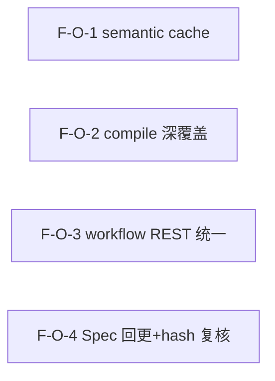

# Decomposition Delta — v1.11.0（2026-09-05）

> 新一轮 02 拆解 delta。源自 PRD-debt-closure-v1.11.0 + retrospective-v1.10.0.md（findings N7/N2·K1/M3/N5/N6）。
> 债务收口 IV track：4 原子 Feature（F-O-1..4），semantic cache + compile 深覆盖 + workflow REST 统一读 DB + Spec 命名回更/hash 复核。不引入新能力、不需 SDK。

## 新增 Feature

| id | name | domain | priority | complexity | depends_on | wave | blocked_by | source | AC |
|---|---|---|---|---|---|---|---|---|---|
| F-O-1 | semantic search 走 query cache（复用 F-QS-07，TTL + 索引变更失效） | debt-closure | P0 | M | — | 1 | — | PRD §3.1 (N7) | AC-CACHE-1, AC-CACHE-2, AC-CACHE-3, AC-CACHE-4 |
| F-O-2 | compile/compiler.py 深覆盖（30 函数 17%→高，fail_under 64→65） | debt-closure | P0 | L | — | 1 | — | PRD §3.2 (N2/K1) | AC-COV-1, AC-COV-2 |
| F-O-3 | workflow REST 统一读 DB（collaborate.py list_workflows 读 workflow_executions + merge live） | debt-closure | P0 | M | — | 1 | — | PRD §3.3 (M3) | AC-WF-1, AC-WF-2, AC-WF-3 |
| F-O-4 | Spec 命名回更 + tag hash 复核（N5+N6，文档修复） | debt-closure | P1 | S | — | 1 | — | PRD §3.4+§3.5 (N5+N6) | AC-SPEC-1, AC-SPEC-2, AC-HASH-1 |

## 原子 Feature → Spec 映射（03 1:1）
- F-O-1 → SPEC-F-O-1（semantic cache 层：_semantic_search 复用 F-QS-07 cache 路径）
- F-O-2 → SPEC-F-O-2（compile/compiler.py 测试覆盖 + fail_under 棘轮 65）
- F-O-3 → SPEC-F-O-3（workflow REST list_workflows 读 DB + merge live）
- F-O-4 → SPEC-F-O-4（Spec CLI 命名回更 + tag hash 三处复核）
> 4 原子 Feature = 4 Spec。

## DAG delta

- 4 Feature 互相独立（不同文件：engine.py / compiler.py 测试 / collaborate.py / SPEC-F-N-1.md+ROADMAP）。
- 无依赖边 → DAG 全并行，无环。
- DAG 无环 ✓。

## Wave 划分（v1.11.0）

- **Wave 1（全并行，4 Feature）**：F-O-1（semantic cache） / F-O-2（compile 深覆盖） / F-O-3（workflow REST 统一） / F-O-4（Spec 回更+hash 复核）
  - 4 Feature 互相独立（不同文件），可全并行启动。
  - 无 Wave 2 — 无依赖边。

## 共享资源串行
- engine.py（F-O-1 改 _semantic_search）：独立方法，不与 F-O-2/F-O-3/F-O-4 冲突。
- compiler.py（F-O-2 仅加测试）：不改实现，不冲突。
- collaborate.py（F-O-3 改 list_workflows）：独立路由文件，不冲突。
- SPEC-F-N-1.md + ROADMAP + lifecycle-state.json（F-O-4 文档回更）：仅文档，不冲突。
- pyproject.toml（F-O-2 改 fail_under）：仅 F-O-2 触及，不冲突。

## AC 归属表

| AC ID | 描述 | 归属 Feature |
|---|---|---|
| AC-CACHE-1 | semantic cache 命中 | F-O-1 |
| AC-CACHE-2 | semantic cache workspace 隔离 | F-O-1 |
| AC-CACHE-3 | semantic cache 索引变更失效 | F-O-1 |
| AC-CACHE-4 | semantic fallback 不缓存 | F-O-1 |
| AC-COV-1 | compile/compiler 深覆盖 | F-O-2 |
| AC-COV-2 | fail_under 棘轮 | F-O-2 |
| AC-WF-1 | REST 读 DB | F-O-3 |
| AC-WF-2 | REST merge live | F-O-3 |
| AC-WF-3 | CLI/REST 语义一致 | F-O-3 |
| AC-SPEC-1 | Spec 命名回更 | F-O-4 |
| AC-SPEC-2 | 实现不变 | F-O-4 |
| AC-HASH-1 | hash 三处一致 | F-O-4 |

> PRD §6 共 12 条 AC，全部分配到对应 Feature → 无丢失 ✓

## 技术维度汇总

| 维度 | 需要该能力的 Feature | 推荐优先级 |
|---|---|---|
| needs_database | F-O-1（cache 表）, F-O-3（workflow_executions） | P0 |
| needs_cache | F-O-1（semantic query cache） | P0 |
| needs_ai | F-O-1（embeddings，复用既有） | P0 |
| needs_vector_store | F-O-1（embedding 索引，复用既有） | P0 |
| needs_search | F-O-1（semantic 检索，复用既有） | P0 |
| needs_file_storage | F-O-2（测试 fixture 临时 vault） | P0 |

> 注：v1.11.0 无新增技术维度（全部复用 v1.10.0 既有能力：cache 模块 / DB 表 / embeddings）。F-O-2 needs_file_storage=true（测试 fixture 用临时目录）。

## NFR delta
- **性能**：semantic cache 命中后查询延迟 ≤ keyword cache 命中延迟（同量级）；命中率 [TBD]（须 benchmark 后定基线）。
- **测试覆盖**：全量 coverage ≥65%，fail_under=65（AC-COV-2）；compiler.py 覆盖率 17%→[TBD]（须实施后测量）。
- **不回归**：passed ≥1993（v1.10.0 基线）；ruff 0 errors；smoke 6/6。
- **兼容**：无 breaking API 变更（additive MINOR）；REST schema 不变；CLI 命令不变。

## 下游消费
- → 03：无新 ADR（全部复用既有 ADR-008/009/010 + F-QS-07 cache 模块）；4 Spec 1:1。F-O-3 merge live 策略 HOW 须 Spec 设计。
- → 04：~4 Task；1 Wave（全并行，4 Feature 独立）。
