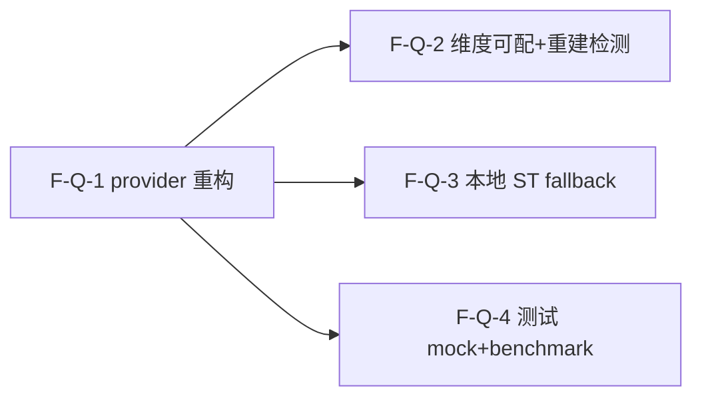

# Decomposition Delta — v1.12.0（2026-09-05）

> 新一轮 02 拆解 delta。源自 PRD-embedding-api-v1.12.0 + retrospective-v1.10.0.md（findings N1/N4）+ 用户决策（pivot to API）。
> embedding API pivot track：4 原子 Feature（F-Q-1..4），provider 重构 litellm API + 维度可配 + 本地 ST 可选 fallback + 测试改 API mock/benchmark。闭合 N1（High/P1）+ N4（Medium/P2）。additive MINOR，无 breaking API 变更。

## 新增 Feature

| id | name | domain | priority | complexity | depends_on | wave | blocked_by | source | AC |
|---|---|---|---|---|---|---|---|---|---|
| F-Q-1 | embed_texts provider 重构为 litellm API（替代本地 ST，base_url/api_key/model 走 config） | embedding-api | P0 | M | — | 1 | — | PRD §3.1 (F-EA-1) | AC-EA-1, AC-EA-2 |
| F-Q-2 | 维度可配 + embedding_store dim 列驱动 + 索引重建检测维度变更（API dim 1536 ≠ 本地 384） | embedding-api | P0 | M | F-Q-1 | 2 | F-Q-1 | PRD §3.2 (F-EA-2) | AC-DIM-1, AC-DIM-2 |
| F-Q-3 | 本地 ST 可选 fallback（[learn] extra 装了可用，detect_tier 感知 API 配置为主、ST 为辅） | embedding-api | P1 | M | F-Q-1 | 2 | F-Q-1 | PRD §3.3 (F-EA-3) | AC-FB-1, AC-FB-2 |
| F-Q-4 | 测试改 API mock（去 importorskip，CI 可跑）+ benchmark semantic vs BM25 | embedding-api | P0 | M | F-Q-1 | 2 | F-Q-1 | PRD §3.4 (F-EA-4) | AC-TEST-1, AC-TEST-2, AC-TEST-3 |

## 原子 Feature → Spec 映射（03 1:1）
- F-Q-1 → SPEC-F-Q-1（embed_texts provider 重构：litellm.embedding/aembedding + config + embeddings_available/detect_tier 改 API 检测）
- F-Q-2 → SPEC-F-Q-2（维度可配 + dim 驱动 + 重建检测 + EmbeddingSink.write model 列动态化）
- F-Q-3 → SPEC-F-Q-3（本地 ST 可选 fallback：provider 三级路由 API > ST > BM25）
- F-Q-4 → SPEC-F-Q-4（测试改 API mock + benchmark semantic vs BM25 召回 + P99）
> 4 原子 Feature = 4 Spec。

## DAG delta

- F-Q-1（provider 重构）先行，无依赖。
- F-Q-2（维度可配）、F-Q-3（fallback）、F-Q-4（测试）均依赖 F-Q-1——provider 重构是前置条件。
- F-Q-2/Q-3/Q-4 互相独立（不同关注点：dim 驱动 / fallback 路由 / 测试 mock），可并行。
- DAG 无环 ✓（拓扑序：Q-1 → {Q-2, Q-3, Q-4}，无回边）。

## Wave 划分（v1.12.0）

- **Wave 1（基础层，1 Feature）**：F-Q-1（embed_texts provider 重构为 litellm API）
  - 无依赖，先行启动；为 Wave 2 解锁前置。
- **Wave 2（核心业务+测试，3 Feature 全并行）**：F-Q-2（维度可配 + 重建检测） / F-Q-3（本地 ST 可选 fallback） / F-Q-4（测试改 API mock + benchmark）
  - 三者均依赖 F-Q-1，互相独立，可全并行启动。

## 共享资源串行
- embeddings.py（F-Q-1 改 embed_texts/embeddings_available/detect_tier；F-Q-3 扩展 fallback 分支）：F-Q-3 依赖 F-Q-1 完成，串行 Wave 1→2。
- embedding_sink.py（F-Q-2 改 model 列动态化）：独立文件，不与 F-Q-3 冲突。
- search_cmd.py（F-Q-2 改 rebuild_embeddings 维度检测）：独立命令，不冲突。
- 测试文件（F-Q-4 改 7 个 importorskip 测试 + 4 个降级 mock + benchmark）：独立测试文件，不与 F-Q-2/F-Q-3 冲突。
- settings.py（F-Q-1 新增 embedding 专用配置项；F-Q-3 改 detect_tier OR 逻辑）：F-Q-1 先行，F-Q-3 在 F-Q-1 基础上扩展，串行 Wave 1→2。

## AC 归属表

| AC ID | 描述 | 归属 Feature |
|---|---|---|
| AC-EA-1 | API 配置可用时语义检索 | F-Q-1 |
| AC-EA-2 | API 未配置时降级 | F-Q-1 |
| AC-DIM-1 | 维度变更触发重建 | F-Q-2 |
| AC-DIM-2 | ingest 写入正确 model | F-Q-2 |
| AC-FB-1 | 本地 ST fallback | F-Q-3 |
| AC-FB-2 | 无 ST 走 API | F-Q-3 |
| AC-TEST-1 | CI embedding 测试全 pass | F-Q-4 |
| AC-TEST-2 | CI 无 importorskip | F-Q-4 |
| AC-TEST-3 | benchmark 可执行 | F-Q-4 |

> PRD §6 共 9 条 AC，全部分配到对应 Feature → 无丢失 ✓

## 技术维度汇总

| 维度 | 需要该能力的 Feature | 推荐优先级 |
|---|---|---|
| needs_ai | F-Q-1, F-Q-2, F-Q-3, F-Q-4（embedding API + fallback + 测试） | P0 |
| needs_vector_store | F-Q-1, F-Q-2, F-Q-3, F-Q-4（embedding_store 向量存储） | P0 |
| needs_database | F-Q-2（embedding_store dim/model 列驱动 + 重建） | P0 |
| needs_queue | F-Q-2（EmbeddingSink Write Queue sink） | P0 |
| needs_search | F-Q-1, F-Q-3, F-Q-4（语义检索 + 降级 BM25 + benchmark） | P0 |
| needs_file_storage | F-Q-4（测试 fixture 临时向量集） | P0 |

> 注：v1.12.0 复用 v1.10.0 既有 vector_store（SQLite BLOB + numpy cosine），不变。needs_ai/needs_vector_store 全 4 Feature 标 true（embedding provider 重构涉及全链路）。F-Q-2 needs_database=true（dim 驱动 + 重建），needs_queue=true（EmbeddingSink sink）。F-Q-4 needs_file_storage=true（测试 fixture）。

## NFR delta
- **性能**：API embedding P99 延迟 [TBD]（须优于或接近 BM25 毫秒级，benchmark 后定 baseline）；semantic vs BM25 召回率 [TBD]（同义查询集 benchmark）。
- **无本地 torch 加载**：runner 进程不 import torch（CI 日志 + pip show torch 不存在）——API 为默认路径，不要求 [learn] extra。
- **降级策略**：API 失败 → BM25，不报错不中断（semantic_fallback: true）；API 不可用 + ST 已装 → 走本地 ST fallback。
- **不回归**：passed ≥2064（v1.11.0 基线）；ruff 0 errors；smoke 6/6。
- **workspace 隔离**：embedding 索引须遵守 workspace_id 隔离（embedding_store PK (doc_id, workspace_id) 既有，不变）。
- **向量索引存储开销**：[TBD]（API dim 如 1536 > 本地 384，每 claim/wiki 页面向量大小 × 总量）。
- **兼容**：无 breaking API 变更（additive MINOR）；embed_texts() 签名不变；REST/CLI 命令不变。

## 下游消费
- → 03：ADR 候选（embedding provider 选型 litellm API vs 本地 ST fallback 优先级 + 维度变更数据迁移策略）；4 Spec 1:1。litellm embedding API 具体调用参数/模型名/异步 vs 同步选型归 Spec。
- → 04：~4 Task；2 Wave（Wave 1: F-Q-1；Wave 2: F-Q-2 + F-Q-3 + F-Q-4 全并行）。
