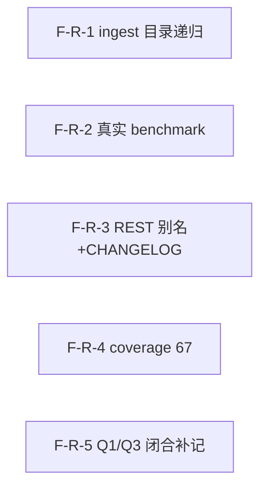

# Decomposition Delta — v1.13.0（2026-09-06）

> 新一轮 02 拆解 delta。源自 PRD-e2e-tail-v1.13.0 + retrospective-v1.12.0.md（findings Q1/Q2/Q3/O1/O2/O3 + E2E Bug A）。
> E2E 收尾轮：5 原子 Feature（F-R-1..5），ingest 目录递归 Bug A + 真实 vLLM benchmark + REST 兼容别名+CHANGELOG + coverage 棘轮 67 + 闭合 Q1/Q3 复盘补记。闭合 Q1（High/P1）+ Q2（Medium/P2）+ Q3（Low/P3）+ O1（Medium/P2）+ O2（Low/P3）+ O3（Low/P3）。additive MINOR，无 breaking API 变更。基线含 commit `84e1776`（httpx 直连 vLLM + 去 ST fallback，已合入 master）。

## 新增 Feature

| id | name | domain | priority | complexity | depends_on | wave | blocked_by | source | AC |
|---|---|---|---|---|---|---|---|---|---|
| F-R-1 | ingest 目录递归遍历（Bug A） | e2e-tail | P0 | M | — | 1 | — | PRD §3.1 | AC-A-1, AC-A-2, AC-A-3, AC-A-4, AC-A-5 |
| F-R-2 | 真实 embedding benchmark 脚本（semantic vs BM25 召回 + P99 + cache 命中率） | e2e-tail | P0 | M | — | 1 | — | PRD §3.2 | AC-B-1, AC-B-2, AC-B-3, AC-B-4 |
| F-R-3 | REST /workflows 字段别名 + CHANGELOG.md | e2e-tail | P1 | S | — | 1 | — | PRD §3.3 | AC-C-1, AC-C-2, AC-C-3 |
| F-R-4 | coverage 棘轮 fail_under 65→67 + 补测达 67% | e2e-tail | P2 | S | — | 1 | — | PRD §3.4 | AC-D-1, AC-D-2 |
| F-R-5 | 闭合 Q1/Q3 复盘补记（retrospective-v1.12.0.md 标注闭合） | e2e-tail | P2 | S | — | 1 | — | PRD §3.5 | AC-E-1, AC-E-2 |

## 原子 Feature → Spec 映射（03 1:1）
- F-R-1 → SPEC-F-R-1（ingest 目录递归：classifier is_dir 后 walk 子文件，逐文件 ingest，聚合 IngestResult，排除 .git/.saw）
- F-R-2 → SPEC-F-R-2（真实 vLLM benchmark 脚本：scripts/benchmark_semantic.py，semantic vs BM25 召回 + P99 + cache 命中率，vLLM 不可达报错不 mock）
- F-R-3 → SPEC-F-R-3（REST /workflows name/workflow 别名 + CHANGELOG.md 回溯 v1.10.0–v1.13.0）
- F-R-4 → SPEC-F-R-4（pyproject.toml fail_under 65→67 + 补测覆盖既有未覆盖路径）
- F-R-5 → SPEC-F-R-5（retrospective-v1.12.0.md Q1/Q3 闭合标注，commit 84e1776 证据）
> 5 原子 Feature = 5 Spec。

## DAG delta

- F-R-1（ingest 目录递归）：无依赖，独立。
- F-R-2（真实 benchmark）：无依赖，独立。触及不同文件（scripts/benchmark_semantic.py 新建）。
- F-R-3（REST 别名+CHANGELOG）：无依赖，独立。触及不同文件（collaborate.py + 项目根 CHANGELOG.md）。
- F-R-4（coverage 67）：无依赖，独立。触及不同文件（pyproject.toml + 测试文件）。
- F-R-5（Q1/Q3 闭合补记）：无依赖，独立。触及不同文件（.csp/artifacts/retrospective-v1.12.0.md）。
- 5 Feature 互相独立（不同文件），全 Wave 1 并行，无依赖边。
- DAG 无环 ✓（5 个独立节点，无边，无回边）。

## Wave 划分（v1.13.0）

- **Wave 1（全并行，5 Feature）**：F-R-1（ingest 目录递归） / F-R-2（真实 benchmark 脚本） / F-R-3（REST 别名+CHANGELOG） / F-R-4（coverage 67） / F-R-5（Q1/Q3 闭合补记）
  - 5 Feature 互相独立（不同文件），可全并行启动。无 Wave 2 — 无依赖边。

## 共享资源串行
- 无共享资源串行。5 Feature 各自触及不同文件：
  - F-R-1：classifier.py + pipeline.py（ingest 目录递归分支）
  - F-R-2：scripts/benchmark_semantic.py（新建）
  - F-R-3：collaborate.py（list_workflows 响应加别名）+ CHANGELOG.md（新建，项目根）
  - F-R-4：pyproject.toml（fail_under）+ 测试文件（补测）
  - F-R-5：.csp/artifacts/retrospective-v1.12.0.md（闭合标注）
  - 无文件重叠，无串行约束。

## AC 归属表

| AC ID | 描述 | 归属 Feature |
|---|---|---|
| AC-A-1 | 目录递归 ingest | F-R-1 |
| AC-A-2 | 空目录 | F-R-1 |
| AC-A-3 | 部分失败 | F-R-1 |
| AC-A-4 | 子目录递归 | F-R-1 |
| AC-A-5 | 排除 SAW 内部目录 | F-R-1 |
| AC-B-1 | 真实 API 召回 | F-R-2 |
| AC-B-2 | P99 延迟 | F-R-2 |
| AC-B-3 | cache 命中率 | F-R-2 |
| AC-B-4 | vLLM 不可达报错 | F-R-2 |
| AC-C-1 | 别名兼容 | F-R-3 |
| AC-C-2 | CHANGELOG 存在 | F-R-3 |
| AC-C-3 | CHANGELOG 回溯 | F-R-3 |
| AC-D-1 | fail_under 提升 | F-R-4 |
| AC-D-2 | 实际覆盖率达标 | F-R-4 |
| AC-E-1 | Q1 闭合标注 | F-R-5 |
| AC-E-2 | Q3 闭合标注 | F-R-5 |

> PRD §6 共 16 条 AC，全部分配到对应 Feature → 无丢失 ✓

## 技术维度汇总

| 维度 | 需要该能力的 Feature | 推荐优先级 |
|---|---|---|
| needs_ai | F-R-2（真实 vLLM API embedding） | P0 |
| needs_vector_store | F-R-2（embedding_store 向量存储，cosine 检索） | P0 |
| needs_cache | F-R-2（semantic cache 命中率测试） | P0 |
| needs_search | F-R-2（semantic vs BM25 召回对比） | P0 |
| needs_database | F-R-3（workflow_executions 表，既有读 DB merge live） | P1 |
| needs_file_storage | F-R-1（目录递归文件遍历） / F-R-2（测试数据集临时 wiki） / F-R-3（CHANGELOG.md） / F-R-5（retrospective 文档） | P0-P2 |
| needs_queue | — | — |
| needs_realtime | — | — |
| needs_scheduler | — | — |
| needs_notification | — | — |

> 注：v1.13.0 不引入新技术维度。F-R-2 复用 v1.12.0 既有 API 路径（httpx 直连 vLLM）+ v1.10.0 既有 vector_store（SQLite BLOB + numpy cosine）。F-R-3 复用 v1.11.0 既有 DB 读逻辑。F-R-1 复用既有 classify→extract→fuse→validate→enqueue 链路。

## NFR delta
- **性能**：benchmark 不 OOM（脚本在 vLLM 8001 可达时跑完不超时，单次 < 5 min）；ingest 递归不阻塞（100 文件目录 60s 内完成，无 LLM 模式）。
- **不回归**：passed ≥2076（v1.12.0 基线 2076）；ruff 0 errors；smoke 6/6。
- **兼容**：2076+ passed 不回归；REST 别名不破坏现有契约（definition_name/status/steps_completed/steps_total/updated_at/finished_at 值不变）；无 breaking API 变更（additive MINOR）。
- **可维护**：CHANGELOG 可追溯（每条变更带版本号 + 日期）。
- **coverage**：fail_under 65→67，实际覆盖率 ≥67%。

## 下游消费
- → 03：ADR 候选（benchmark 脚本 vLLM httpx 接入方式 + 数据集构造策略 + 召回/P99/cache 统计方法）；5 Spec 1:1。benchmark 脚本具体实现框架/数据集内容/排除目录清单归 Spec。
- → 04：~5 Task；1 Wave（Wave 1: F-R-1 + F-R-2 + F-R-3 + F-R-4 + F-R-5 全并行）。
