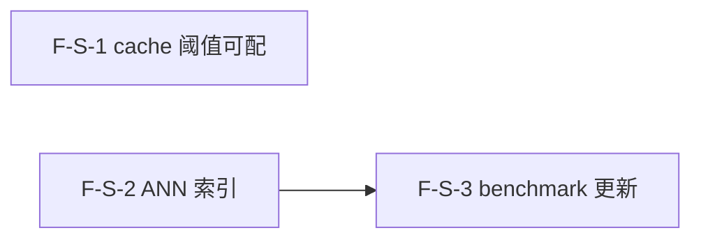

# Decomposition Delta — v1.14.0（2026-09-06）

> 新一轮 02 拆解 delta。源自 PRD-semantic-perf-v1.14.0 + retrospective-v1.13.0.md（findings R1/R2 + 续留 N3/M2/L2/O2/O4）。
> semantic 性能优化轮：3 原子 Feature（F-S-1..3），cache 阈值可配 + ANN 索引替代全量 cosine + benchmark 更新（cache 真实度量 + ANN vs cosine 对比 + 规模延迟曲线）。additive MINOR，默认行为不变（向后兼容）。基线含 v1.13.0（2179 passed, coverage 67.27%, tag v1.13.0@779d6cb）。

## 新增 Feature

| id | name | domain | priority | complexity | depends_on | wave | blocked_by | source | AC |
|---|---|---|---|---|---|---|---|---|---|
| F-S-1 | semantic cache 阈值可配（env 驱动启用/禁用 + 触发阈值）+ 文档标注 | semantic-perf | P0 | M | — | 1 | — | PRD §3.1 | AC-A-1, AC-A-2, AC-A-3, AC-A-4, AC-A-5 |
| F-S-2 | ANN 索引替代全量 cosine 扫描（规模驱动自动切换 + cosine 降级兜底） | semantic-perf | P0 | L | — | 1 | — | PRD §3.2 | AC-B-1, AC-B-2, AC-B-3, AC-B-4, AC-B-5 |
| F-S-3 | benchmark 更新（cache 真实度量 + ANN vs cosine 对比 + 规模延迟曲线） | semantic-perf | P1 | M | F-S-2 | 2 | — | PRD §3.3 | AC-C-1, AC-C-2, AC-C-3, AC-C-4, AC-C-5 |

## 原子 Feature → Spec 映射（03 1:1）
- F-S-1 → SPEC-F-S-1（cache 阈值可配：_semantic_search cache.get/set 路径 env 控制 + SAW_SEMANTIC_CACHE_ENABLED + SAW_SEMANTIC_CACHE_THRESHOLD_MS + 默认行为不变）
- F-S-2 → SPEC-F-S-2（ANN 索引：engine.py _semantic_search 全量 cosine→ANN 切换 + SAW_ANN_THRESHOLD + sqlite-vss/hnswlib/numpy 选型留 ADR + related_pages 复用 + cosine 降级兜底）
- F-S-3 → SPEC-F-S-3（benchmark 更新：cache 命中测量改 QueryEngine._semantic_search 生产路径 + cache.stats() hits 计数 + ANN vs cosine P99 + 100/500/1000/5000 规模延迟曲线）
> 3 原子 Feature = 3 Spec。

## DAG delta

- F-S-1（cache 阈值可配）：无依赖，独立。触及 engine.py cache 路径 + settings.py 配置项。
- F-S-2（ANN 索引）：无依赖，独立。触及 engine.py _semantic_search cosine→ANN + related_pages.py + embeddings.py + ANN 库。
- F-S-3（benchmark 更新）：依赖 F-S-2（ANN vs cosine 对比需要 ANN 索引路径实现完成）。触及 scripts/benchmark_semantic.py。
- F-S-1 与 F-S-2 独立（不同文件/路径），可 Wave 1 并行。
- DAG 无环 ✓（S-2→S-3 单向边，S-1 独立，无回边）。

## Wave 划分（v1.14.0）

- **Wave 1（2 Feature 并行）**：F-S-1（cache 阈值可配） / F-S-2（ANN 索引）
  - F-S-1 与 F-S-2 互相独立（不同文件：F-S-1 = engine.py cache 路径 + settings.py；F-S-2 = engine.py cosine→ANN + related_pages.py + embeddings.py + ANN 库），可并行启动。
- **Wave 2（1 Feature）**：F-S-3（benchmark 更新）
  - 依赖 F-S-2 完成（ANN 路径可用后才能跑 ANN vs cosine 对比）。

## 共享资源串行
- F-S-2 与 F-S-3 串行（F-S-2 → F-S-3）：benchmark ANN vs cosine 对比依赖 ANN 索引实现。
- F-S-1 与 F-S-2 可并行（不同文件路径，无文件重叠）。
- 文件分工：
  - F-S-1：engine.py（cache 路径条件分支） + settings.py（新增 env 项） + cache.py（不改动）
  - F-S-2：engine.py（_semantic_search cosine→ANN 切换） + related_pages.py（复用 ANN） + embeddings.py（ANN 索引路径） + ANN 库依赖
  - F-S-3：scripts/benchmark_semantic.py（更新既有脚本）
  - F-S-1 与 F-S-2 均触及 engine.py 但不同路径（cache 条件分支 vs cosine→ANN 切换），03 技术方案需注意协调。

## AC 归属表

| AC ID | 描述 | 归属 Feature |
|---|---|---|
| AC-A-1 | cache 禁用（hits 不增加） | F-S-1 |
| AC-A-2 | cache 启用默认（hits 增加） | F-S-1 |
| AC-A-3 | 阈值跳过写入（cache.set 跳过，cache.get 可命中） | F-S-1 |
| AC-A-4 | 向后兼容（无 env 行为不变） | F-S-1 |
| AC-A-5 | keyword cache 不受影响 | F-S-1 |
| AC-B-1 | ANN 自动切换（规模 > 阈值走 ANN） | F-S-2 |
| AC-B-2 | 小规模保持 cosine（规模 ≤ 阈值） | F-S-2 |
| AC-B-3 | ANN 降级（库未装/损坏→cosine + ann_fallback） | F-S-2 |
| AC-B-4 | ANN 召回一致性（top-K 重叠率 ≥95%）[TBD] | F-S-2 |
| AC-B-5 | related_pages 复用 ANN 路径 | F-S-2 |
| AC-C-1 | cache 命中真实度量（cache.stats() hits 计数） | F-S-3 |
| AC-C-2 | ANN vs cosine 对比（ann_p99_ms + cosine_p99_ms） | F-S-3 |
| AC-C-3 | 规模延迟曲线（100/500/1000/5000 scale_curve） | F-S-3 |
| AC-C-4 | vLLM 不可达报错退出 | F-S-3 |
| AC-C-5 | cache 单元测试 CI 可跑（mock embedding，不 skip） | F-S-3 |

> PRD §6 共 15 条 AC，全部分配到对应 Feature → 无丢失 ✓

## 技术维度汇总

| 维度 | 需要该能力的 Feature | 推荐优先级 |
|---|---|---|
| needs_cache | F-S-1（semantic cache env 控制） / F-S-3（benchmark cache 命中度量） | P0 |
| needs_vector_store | F-S-2（ANN 索引替代全量 cosine） / F-S-3（benchmark ANN vs cosine 对比） | P0 |
| needs_ai | F-S-2（embedding 向量检索） / F-S-3（benchmark embedding API） | P0-P1 |
| needs_search | F-S-2（ANN 近似最近邻检索） / F-S-3（benchmark semantic 检索对比） | P0-P1 |
| needs_database | F-S-2（embedding_store 表读取 + ANN 索引附加结构） | P0 |
| needs_file_storage | F-S-3（benchmark 合成数据集临时文件 + 既有脚本） | P1 |
| needs_queue | — | — |
| needs_realtime | — | — |
| needs_scheduler | — | — |
| needs_notification | — | — |

> 注：v1.14.0 核心技术维度是 needs_vector_store（ANN 索引）+ needs_cache（阈值可配）。F-S-2 是首次引入 ANN 索引路径（替代 v1.10.0 既有全量 cosine）。ANN 库选型留 03 ADR（候选：sqlite-vss / hnswlib / numpy 分块矩阵乘）。不引入 faiss/torch 重依赖。

## NFR delta
- **性能 — ANN 加速**：ANN 检索 P99 优于全量 cosine（规模 ≥1k 时）——benchmark 输出 ANN P99 < cosine P99 @ ≥1k 文档 `[TBD]`。
- **性能 — cache 可配**：env 配置 cache 启用/禁用后行为可验证——`SAW_SEMANTIC_CACHE_ENABLED=false` 时 cache.stats() 无新增 hit；`=true`（默认）时行为不变。
- **不回归**：passed ≥2179（v1.13.0 基线 2179）；ruff 0 errors；smoke 6/6。
- **覆盖率**：coverage ≥67% 不回归（CI fail_under=67）。
- **依赖约束**：不引入重依赖——不新增 faiss/torch/scikit-learn 等；ANN 库须 pip 可装、MIT/Apache 许可。
- **向后兼容**：默认行为不变——不设 env 时行为与 v1.13.0 一致（cache 始终启用 + 全量 cosine）。

## 下游消费
- → 03：ADR 候选（ANN 库选型：sqlite-vss / hnswlib / numpy 分块矩阵乘，约束不引 faiss/torch、pip 可装、MIT/Apache）；SAW_ANN_THRESHOLD 默认值（benchmark 实测确定 cosine 可接受延迟的拐点）；cache 自适应判定是否实现（localhost 检测 [TBD]）；3 Spec 1:1。benchmark 脚本 cache 度量改生产路径 / 规模数据集构造策略归 Spec。
- → 04：~3 Task；2 Wave（Wave 1: F-S-1 + F-S-2 并行；Wave 2: F-S-3）。
