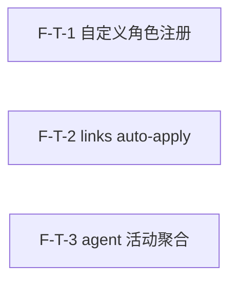

# Decomposition Delta — v1.15.0（2026-09-06）

> 新一轮 02 拆解 delta。源自 PRD-agent-link-v1.15.0 + retrospective-v1.14.0.md（findings M2/L2 + 续留 v1.5.0 自定义 agent 角色候选）。
> agent/link 能力轮：3 原子 Feature（F-T-1..3），自定义 agent 角色注册 + L2 links auto-apply + M2 agent 活动聚合。additive MINOR，不修改 build_default_agents() 签名/返回结构，不实现 undo/持久化。基线含 v1.14.0（2192 passed, coverage 67.34%, tag v1.14.0@136befe）。

## 新增 Feature

| id | name | domain | priority | complexity | depends_on | wave | blocked_by | source | AC |
|---|---|---|---|---|---|---|---|---|---|
| F-T-1 | 自定义 agent 角色注册（.saw/agents/*.yaml 加载 + build_default_agents 合并 + CLI/REST 可见） | agent-link | P0 | M | — | 1 | — | PRD §3.1 | AC-A-1, AC-A-2, AC-A-3, AC-A-4 |
| F-T-2 | L2 links auto-apply（saw links apply --suggestion 写回 WikiRepository + dry-run/confirm + 去重） | agent-link | P0 | M | — | 1 | — | PRD §3.2 | AC-B-1, AC-B-2, AC-B-3, AC-B-4 |
| F-T-3 | M2 agent 活动聚合（event bus 订阅 WorkflowStep + GET /api/v1/agents/{name}/activity 端点） | agent-link | P0 | M | — | 1 | — | PRD §3.3 | AC-C-1, AC-C-2, AC-C-3, AC-C-4 |

## 原子 Feature → Spec 映射（03 1:1）
- F-T-1 → SPEC-F-T-1（自定义角色注册：.saw/agents/*.yaml 扫描加载 + name/model_tier/system_prompt/tools_allowed 校验 + additive 合并到 build_default_agents roster + CLI/REST 可见 + workflow YAML validate 含自定义角色）
- F-T-2 → SPEC-F-T-2（links auto-apply：saw links apply 子命令 + compute_related_pages suggest 消费 + dry-run/confirm + ## Related 段落插入 + frontmatter related 同步 + 去重 + WikiRepository.write 复用）
- F-T-3 → SPEC-F-T-3（agent 活动聚合：InMemoryEventBus.add_subscriber WorkflowStep 订阅 + handler 内存计数器 + GET /api/v1/agents/{name}/activity 端点 + GET /api/v1/agents activity_summary 扩展 + 不阻塞 workflow）
> 3 原子 Feature = 3 Spec。

## DAG delta

- F-T-1（自定义角色注册）：无依赖，独立。触及 agents/__init__.py + base.py + links_cmd.py + collaborate.py REST。
- F-T-2（links auto-apply）：无依赖，独立。触及 links_cmd.py + related_pages.py + wiki_repository.py。
- F-T-3（agent 活动聚合）：无依赖，独立。触及 event_bus.py + workflow_executor.py + collaborate.py REST。
- 3 Feature 互相独立（不同关注点：角色注册 / 链接写回 / 活动聚合），可 Wave 1 全并行。
- DAG 无环 ✓（3 个独立节点，无边，无回边）。

## Wave 划分（v1.15.0）

- **Wave 1（3 Feature 全并行）**：F-T-1（自定义角色注册） / F-T-2（links auto-apply） / F-T-3（agent 活动聚合）
  - 3 Feature 互相独立（不同文件/关注点：F-T-1 = agents 模块 + CLI/REST 角色列表；F-T-2 = links_cmd + wiki_repository；F-T-3 = event_bus + workflow_executor + REST activity 端点），可全并行启动。无 Wave 2 — 无依赖边。

## 共享资源串行
- 无串行依赖。3 Feature 全独立，Wave 1 全并行。
- 文件分工：
  - F-T-1：engines/collaborate/agents/__init__.py（build_default_agents 合并） + agents/base.py（BaseAgent 复用） + drivers/cli/commands/（saw agents CLI） + api/routes/collaborate.py（GET /api/v1/agents 扩展）
  - F-T-2：drivers/cli/commands/links_cmd.py（apply 子命令） + engines/query/related_pages.py（compute_related_pages 复用） + adapters/storage/wiki_repository.py（write 复用）
  - F-T-3：plugins/event_bus.py（add_subscriber 订阅） + engines/collaborate/workflow_executor.py（WorkflowStep 事件发布既有） + api/routes/collaborate.py（GET activity 端点 + activity_summary）
  - F-T-1 与 F-T-3 均触及 collaborate.py REST 但不同端点（F-T-1 = GET /agents 扩展 custom 标记；F-T-3 = GET /agents/{name}/activity 新增 + activity_summary 扩展），03 技术方案需注意协调。

## AC 归属表

| AC ID | 描述 | 归属 Feature |
|---|---|---|
| AC-A-1 | 自定义角色注册并出现在 roster（saw agents 含 custom 标注） | F-T-1 |
| AC-A-2 | 自定义角色被 workflow 引用（validate 无错误） | F-T-1 |
| AC-A-3 | 重名角色被拒绝（跳过 + conflict warning） | F-T-1 |
| AC-A-4 | REST 端点返回自定义角色（custom: true） | F-T-1 |
| AC-B-1 | dry-run 预览不写回（打印将应用链接，不修改文件） | F-T-2 |
| AC-B-2 | confirm 写回（## Related 段落 + frontmatter related 同步） | F-T-2 |
| AC-B-3 | 已有链接不重复（skipped） | F-T-2 |
| AC-B-4 | apply 后 audit 无新断链 | F-T-2 |
| AC-C-1 | activity 端点返回聚合数据（calls≥1, last_action, last_active_at 非空） | F-T-3 |
| AC-C-2 | 无活动的 agent 返回空活动（200, calls=0, last_active_at=null） | F-T-3 |
| AC-C-3 | 不存在的 agent 返回 404 | F-T-3 |
| AC-C-4 | agents 端点含 activity_summary | F-T-3 |

> PRD §6 共 12 条 AC，全部分配到对应 Feature → 无丢失 ✓

## 技术维度汇总

| 维度 | 需要该能力的 Feature | 推荐优先级 |
|---|---|---|
| needs_ai | F-T-1（自定义角色复用 BaseAgent/LLM 路由） / F-T-2（compute_related_pages 复用 embedding 相似度） | P0 |
| needs_file_storage | F-T-1（.saw/agents/*.yaml 角色定义文件） / F-T-2（WikiRepository.write 写回 wiki 页面文件） | P0 |
| needs_realtime | F-T-3（event bus 订阅 + 内存态活动聚合，须不阻塞 workflow） | P0 |
| needs_database | — | — |
| needs_cache | — | — |
| needs_queue | — | — |
| needs_vector_store | — | — |
| needs_search | — | — |
| needs_scheduler | — | — |
| needs_notification | — | — |

> 注：v1.15.0 核心技术维度是 needs_ai（自定义角色复用 BaseAgent/LLM）+ needs_file_storage（角色定义文件 + wiki 写回）+ needs_realtime（event bus 订阅聚合）。无新依赖引入（复用既有 event_bus/BaseAgent/WikiRepository/compute_related_pages）。

## NFR delta
- **不回归**：passed ≥2192（v1.14.0 基线 2192）；ruff 0 errors；smoke 11/11。
- **覆盖率**：coverage ≥67% 不回归（CI fail_under=67）。
- **links apply 破坏性确认**：apply 命令默认 dry-run，须 `--confirm` 方写回（AC-B-1 Given-When-Then）。
- **activity 聚合不阻塞 workflow**：event bus handler 轻量（仅计数器更新），不抛异常不传播，workflow 执行时间不因聚合器增加（无可感知延迟）。
- **自定义角色向后兼容**：不修改 build_default_agents() 签名和返回；内置 6 角色行为不变，自定义角色是 additive。
- **无新依赖**：复用既有 event_bus / BaseAgent / WikiRepository / compute_related_pages，不引入新库。

## 下游消费
- → 03：无 ADR 候选（无新选型，全复用既有）；自定义角色 YAML schema 具体字段定义（03 Spec 细化）；event bus 订阅 handler 数据结构 + 并发安全（03 Spec 细化）；links apply ## Related 段落插入策略 + frontmatter related 同步（03 Spec 细化）；3 Spec 1:1。
- → 04：~3 Task；1 Wave（Wave 1: F-T-1 + F-T-2 + F-T-3 全并行，无依赖边）。
