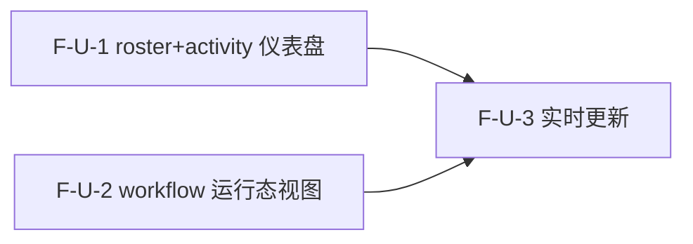

# Decomposition Delta — v1.16.0（2026-09-06）

> 新一轮 02 拆解 delta。源自 PRD-dashboard-v1.16.0 + retrospective-v1.15.0.md（下一候选 realtime 仪表盘 v4.3 前端）。
> realtime 仪表盘轮：3 原子 Feature（F-U-1..3），agent roster+activity 仪表盘 + workflow 运行态视图 + 实时更新。additive MINOR，纯前端消费 v1.15.0 后端 REST 端点，不新增后端端点。基线含 v1.15.0（2220 passed, coverage 67.42%, tag v1.15.0@d5b644f）。

## 新增 Feature

| id | name | domain | priority | complexity | depends_on | wave | blocked_by | source | AC |
|---|---|---|---|---|---|---|---|---|---|
| F-U-1 | Agent roster + activity 仪表盘（Dashboard.tsx 接 react-query 拉 GET /api/v1/agents + /agents/{name}/activity） | dashboard | P0 | M | — | 1 | — | PRD §3.1 | AC-D-1, AC-D-2, AC-D-3, AC-D-4 |
| F-U-2 | Workflow 运行态视图（新组件拉 GET /api/v1/workflows durable+live + /workflows/{id}/status 步骤进度） | dashboard | P0 | M | — | 1 | — | PRD §3.2 | AC-D-5, AC-D-6, AC-D-7 |
| F-U-3 | 实时更新（复用 useWebSocket/dashboardStore + react-query invalidateQueries polling 刷新） | dashboard | P0 | M | F-U-1, F-U-2 | 2 | F-U-1, F-U-2 | PRD §3.3 | AC-D-8 |

> AC-D-9（后端不回归）为系统级 NFR，不归属单一 Feature，见 NFR delta。

## 原子 Feature → Spec 映射（03 1:1）
- F-U-1 → SPEC-F-U-1（agent roster + activity 仪表盘：Dashboard.tsx 接 react-query 拉 GET /api/v1/agents 渲染 roster 表 + 点击展开 GET /agents/{name}/activity 详情 + activity null '—' 降级 + 404 'Agent not found' + status 排序 + WS agent_status live status 覆盖）
- F-U-2 → SPEC-F-U-2（workflow 运行态视图：新 WorkflowList/WorkflowRow 组件拉 GET /api/v1/workflows durable+live merge + status 色标 + running 置顶 + live 标记 + WS workflow_progress 增量更新匹配行不替换列表 + 空状态 + 5xx 重试）
- F-U-3 → SPEC-F-U-3（实时更新：复用 useWebSocket + dashboardStore + react-query invalidateQueries polling + WS 断连 polling 降级 + 重连 invalidate + polling 连续 3 次失败降级横幅）
> 3 原子 Feature = 3 Spec。

## DAG delta

- F-U-1（roster + activity 仪表盘）：无依赖，独立。触及 web/src/pages/Dashboard.tsx + components/dashboard/AgentList/AgentCard/ConnectionStatus + react-query 拉 GET /api/v1/agents + /agents/{name}/activity。
- F-U-2（workflow 运行态视图）：无依赖，独立。触及 web/src/pages/Dashboard.tsx + 新增 components/dashboard/WorkflowList/WorkflowRow + react-query 拉 GET /api/v1/workflows + /workflows/{id}/status。
- F-U-3（实时更新）：依赖 F-U-1 + F-U-2（实时更新接 roster + workflow 数据）。触及 web/src/hooks/useWebSocket.ts（复用） + stores/dashboardStore.ts（复用） + react-query invalidateQueries polling。
- F-U-1 与 F-U-2 互相独立（不同数据源 + 不同组件），Wave 1 全并行。
- F-U-3 依赖 F-U-1 + F-U-2，Wave 2。
- DAG 无环 ✓（U-1 → U-3, U-2 → U-3，无回边）。

## Wave 划分（v1.16.0）

- **Wave 1（2 Feature 全并行）**：F-U-1（roster + activity 仪表盘） / F-U-2（workflow 运行态视图）
  - 2 Feature 互相独立（不同数据源 + 不同组件：F-U-1 = GET /api/v1/agents roster 表 + activity 详情；F-U-2 = GET /api/v1/workflows 列表 + 步骤进度），可全并行启动。
- **Wave 2（1 Feature）**：F-U-3（实时更新）
  - 依赖 F-U-1 + F-U-2 完成（polling 刷新 + WS 增量更新接 roster + workflow 数据），Wave 2 启动。

## 共享资源串行
- F-U-3 串行在 F-U-1 + F-U-2 之后（实时更新接它们的数据）。
- F-U-1 与 F-U-2 均触及 web/src/pages/Dashboard.tsx 但不同区域（roster 表 vs workflow 列表），03 技术方案需注意布局协调。
- F-U-1 与 F-U-3 均触及 useWebSocket/dashboardStore 但 F-U-1 只读 WS agent_status live status，F-U-3 管理 WS 连接 + polling 编排，03 技术方案需注意协调。

## AC 归属表

| AC ID | 描述 | 归属 Feature |
|---|---|---|
| AC-D-1 | roster 表渲染（GET /api/v1/agents 返回 ≥1 agent → 表显示 name/status/custom/activity_summary.calls） | F-U-1 |
| AC-D-2 | activity 详情（点击 agent 行 → GET /agents/{name}/activity 展示 calls/failures/last_action/last_active_at） | F-U-1 |
| AC-D-3 | activity 为 null（计数列显示 '—'，不报错） | F-U-1 |
| AC-D-4 | activity 404（详情区显示 'Agent not found'） | F-U-1 |
| AC-D-5 | workflow 列表渲染（GET /api/v1/workflows 返回 ≥1 → 列表显示 id/status/step/progress/created_at） | F-U-2 |
| AC-D-6 | workflow running 置顶（running 行在 completed 行之前） | F-U-2 |
| AC-D-7 | WS workflow_progress 更新（对应 running 行 current_step/step/status 实时更新，不替换整个列表） | F-U-2 |
| AC-D-8 | WS 断连降级（顶部 'Reconnecting...'，roster/workflow 仍周期刷新） | F-U-3 |
| AC-D-9 | 后端不回归（pytest ≥ 2220 passed，ruff 0，coverage ≥ 67%） | 系统级 NFR（不归属单一 Feature） |

> PRD §6 共 9 条 AC，8 条分配到对应 Feature，AC-D-9 为系统级 NFR（不归属单一 Feature）→ 无丢失 ✓

## 技术维度汇总

| 维度 | 需要该能力的 Feature | 推荐优先级 |
|---|---|---|
| needs_realtime | F-U-1（WS agent_status live status 覆盖） / F-U-2（WS workflow_progress 增量更新） / F-U-3（WS 连接 + polling 刷新） | P0 |
| needs_scheduler | F-U-3（polling 周期刷新 interval） | P0 |
| needs_ai | — | — |
| needs_database | — | — |
| needs_cache | — | — |
| needs_queue | — | — |
| needs_vector_store | — | — |
| needs_file_storage | — | — |
| needs_search | — | — |
| needs_notification | — | — |

> 注：v1.16.0 核心技术维度是 needs_realtime（WS + polling 双源实时更新）+ needs_scheduler（polling interval）。无新依赖引入（复用既有 useWebSocket/dashboardStore/react-query/tailwind）。纯前端消费 v1.15.0 后端 REST 端点，不新增后端端点。

## NFR delta
- **前端测试**：web vitest 全 pass（`cd web && npm test` 0 fail）。
- **后端不回归**：pytest ≥ 2220 passed（v1.15.0 基线 2220），ruff 0 errors，coverage ≥ 67%（CI fail_under=67），smoke 6/6。
- **实时延迟**：WS 推送 → UI 更新 < 1s；polling interval [TBD]（默认不低于 10s，03 技术方案锁定）。
- **兼容性**：复用现有前端栈（react-router 7 / zustand 5 / react-query 5 / tailwind 4 / vite 8），不引入新框架，依赖 diff 为空。
- **可访问性**：状态色标同时有文字标签（不只是颜色）。
- **暗色模式**：新增组件支持 dark: 前缀（沿用现有 Tailwind dark mode 范式）。
- **无新依赖**：复用既有 useWebSocket/dashboardStore/react-query，不引入新库。

## 下游消费
- → 03：前端框架选型 ADR 候选（polling interval 锁定 / SSE vs polling 选型 / 组件拆分粒度 / REST WorkflowExecution 类型定义 — PRD 附录 ground 标 WS WorkflowProgress 类型已存但 REST 结构不同）；3 Spec 1:1。
- → 04：~3 Task；2 Wave（Wave 1: F-U-1 + F-U-2 全并行；Wave 2: F-U-3 依赖 U-1/U-2）。
