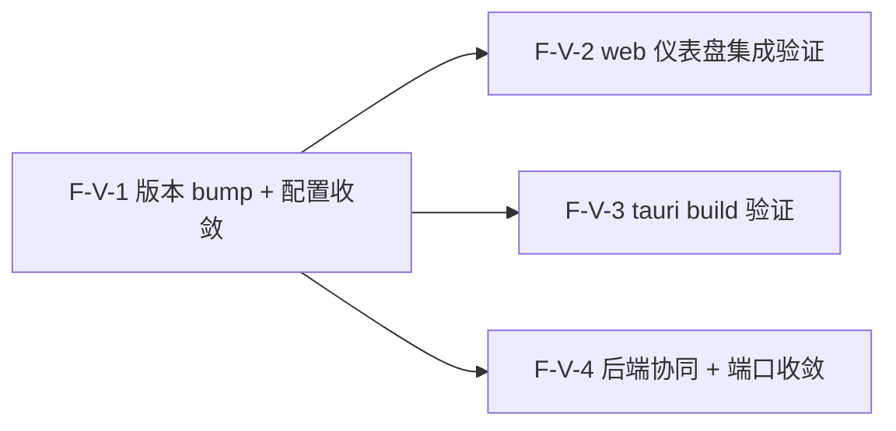

# Decomposition Delta — v1.17.0（2026-09-07）

> 新一轮 02 拆解 delta。源自 PRD-desktop-v1.17.0 + retrospective-v1.16.0.md（下一候选 desktop 完成 v4.4 Tauri→1.0）。
> desktop 完成轮：4 原子 Feature（F-V-1..4），版本 bump+配置收敛 / web 仪表盘集成验证 / tauri build 验证 / 后端协同+端口收敛 bug。additive MINOR，desktop 0.1.0→1.0.0 版本对齐，验证 tauri build 产出原生包，收敛 dev/prod 后端协同端口。基线含 v1.16.0（vitest 64 passed, pytest 2217 passed, tag v1.16.0@57b9550）。

## 新增 Feature

| id | name | domain | priority | complexity | depends_on | wave | blocked_by | source | AC |
|---|---|---|---|---|---|---|---|---|---|
| F-V-1 | desktop 1.0 版本 bump + 配置收敛（4 文件 0.1.0→1.0.0 + tauri.conf.json 字段一致性审查） | desktop | P0 | S | — | 1 | — | PRD §3.1 | AC-V-1, AC-V-2 |
| F-V-2 | web 仪表盘集成验证（frontendDist→web/dist 已 wired，验证 desktop 加载 v1.16.0 仪表盘构建产出） | desktop | P0 | M | F-V-1 | 2 | F-V-1 | PRD §3.2 | AC-W-1, AC-W-2 |
| F-V-3 | tauri build 验证（cargo build --release + bundle 产出原生包，至少 .app/.deb/.appimage） | desktop | P0 | L | F-V-1 | 2 | F-V-1 | PRD §3.3 | AC-B-1, AC-B-2 |
| F-V-4 | 后端协同 + 端口收敛 bug（vite proxy 8080 vs saw web 8000 错配统一 + CORS 扩展 + prod 模式连接） | desktop | P1 | M | F-V-1 | 2 | F-V-1 | PRD §3.4 | AC-C-1, AC-C-2, AC-C-3 |

## 原子 Feature → Spec 映射（03 1:1）
- F-V-1 → SPEC-F-V-1（desktop 1.0 版本 bump + 配置收敛：4 文件 0.1.0→1.0.0 + tauri.conf.json frontendDist/devUrl/beforeDevCommand/beforeBuildCommand/bundle 一致性审查 + $schema/Cargo.toml rust-version/release profile 确认）
- F-V-2 → SPEC-F-V-2（web 仪表盘集成验证：prod 模式 desktop 加载 web/dist 仪表盘页可访问 + dev 模式 desktop 加载 localhost:5173 热更新生效 + beforeBuildCommand/beforeDevCommand 构建链验证 + @tauri-apps/api IPC 可调用）
- F-V-3 → SPEC-F-V-3（tauri build 验证：beforeBuildCommand→cargo build --release→bundle 产出至少 1 个原生包 + bundle.targets 覆盖 macOS/Windows/Linux + release profile 优化 + 签名/公证 defer）
- F-V-4 → SPEC-F-V-4（后端协同 + 端口收敛：vite proxy 8080→8000 收敛 + CORS 添加 localhost:5173 + WS /ws prefix 一致 + prod 模式 saw 后端独立/sidecar 明确）
> 4 原子 Feature = 4 Spec。

## DAG delta

- F-V-1（版本 bump + 配置收敛）：无依赖，独立。触及 desktop/package.json + desktop/src-tauri/tauri.conf.json + desktop/src-tauri/Cargo.toml + web/package.json。
- F-V-2（web 仪表盘集成验证）：依赖 F-V-1（版本 bump 先行，配置收敛确认 frontendDist 正确）。验证 desktop 加载 web/dist 仪表盘页可访问。
- F-V-3（tauri build 验证）：依赖 F-V-1（版本 bump 后才能 tauri build 1.0.0 包）。执行 cargo build --release + bundle 产出原生包。
- F-V-4（后端协同 + 端口收敛）：依赖 F-V-1（版本 bump 先行，配置收敛确认 devUrl/proxy 一致性）。触及 web/vite.config.ts + web_cmd.py CORS + app.py WS 路由。
- F-V-2 与 F-V-3 互相独立（验证 vs 构建，不同操作），Wave 2 全并行。
- F-V-2 与 F-V-4 互相独立（仪表盘加载验证 vs 端口收敛/CORS），Wave 2 全并行。
- F-V-3 与 F-V-4 互相独立（tauri build vs 端口配置），Wave 2 全并行。
- F-V-2/F-V-3/F-V-4 均依赖 F-V-1，Wave 2 全并行启动。
- DAG 无环 ✓（V-1 → {V-2, V-3, V-4}，无回边）。

## Wave 划分（v1.17.0）

- **Wave 1（1 Feature）**：F-V-1（版本 bump + 配置收敛）
  - 无依赖，先行启动。版本号 4 文件 0.1.0→1.0.0 + tauri.conf.json 配置一致性审查。
- **Wave 2（3 Feature 全并行）**：F-V-2（web 仪表盘集成验证） / F-V-3（tauri build 验证） / F-V-4（后端协同 + 端口收敛）
  - 均依赖 F-V-1（版本 bump + 配置收敛先行），互相独立（验证 / 构建 / 端口配置，不同操作），可全并行启动。

## 共享资源串行
- F-V-1 串行在 F-V-2/F-V-3/F-V-4 之前（版本 bump 先行，后续验证/构建/端口均依赖 1.0.0 版本基线）。
- F-V-2 与 F-V-3 均触及 tauri.conf.json 但 F-V-2 只读验证（frontendDist/beforeBuildCommand），F-V-3 执行构建（依赖 F-V-1 已 bump 版本），03 技术方案需注意构建链顺序。
- F-V-2 与 F-V-4 均触及 web/vite.config.ts 但 F-V-2 只读验证（devUrl/proxy），F-V-4 修改 proxy target 端口，03 技术方案需注意 F-V-4 端口收敛后 F-V-2 验证用新端口。
- F-V-3 与 F-V-4 均涉及后端协同但 F-V-3 关注构建产物，F-V-4 关注运行时连接，无冲突。

## AC 归属表

| AC ID | 描述 | 归属 Feature |
|---|---|---|
| AC-V-1 | 版本 bump（4 文件 0.1.0→1.0.0，版本一致性校验通过） | F-V-1 |
| AC-V-2 | 配置收敛（frontendDist=../../web/dist, devUrl=5173, bundle.active=true, 无废弃字段） | F-V-1 |
| AC-W-1 | web 仪表盘 prod 集成（tauri build 后 desktop 内仪表盘页可访问，agent roster + workflow 列表渲染） | F-V-2 |
| AC-W-2 | web 仪表盘 dev 集成（tauri dev 后 desktop 窗口加载 localhost:5173，仪表盘渲染，热更新生效） | F-V-2 |
| AC-B-1 | tauri build 成功（构建退出码 0，target/release/bundle/ 下产出至少 1 个原生包） | F-V-3 |
| AC-B-2 | macOS 构建目标（bundle.targets 含 app/dmg，macOS 环境产出 .app bundle） | F-V-3 |
| AC-C-1 | dev proxy 端口收敛（vite proxy target 与 saw web 端口对齐） | F-V-4 |
| AC-C-2 | prod 后端连接（prod 模式 frontend 可连接 saw 后端，仪表盘数据加载，WS 实时更新或降级 polling） | F-V-4 |
| AC-C-3 | CORS 扩展（CORS 允许列表包含 localhost:5173，API 请求不被 CORS 拒绝） | F-V-4 |

> PRD §6 共 9 条 AC，全部 9 条分配到对应 Feature（AC-V-1/2→F-V-1, AC-W-1/2→F-V-2, AC-B-1/2→F-V-3, AC-C-1/2/3→F-V-4）→ 无丢失 ✓

## 技术维度汇总

| 维度 | 需要该能力的 Feature | 推荐优先级 |
|---|---|---|
| needs_file_storage | F-V-2（web/dist 构建产物嵌入） / F-V-3（target/release/bundle/ 原生包产出） | P0 |
| needs_realtime | F-V-4（WS /ws prefix 连接 + prod 模式实时更新或降级 polling） | P1 |
| needs_database | — | — |
| needs_cache | — | — |
| needs_queue | — | — |
| needs_ai | — | — |
| needs_vector_store | — | — |
| needs_search | — | — |
| needs_scheduler | — | — |
| needs_notification | — | — |

> 注：v1.17.0 核心技术维度是 needs_file_storage（web/dist 嵌入 + 原生包产出）+ needs_realtime（WS 连接 + prod 模式实时更新）。无新依赖引入（复用既有 Tauri v2 + vite proxy + saw 后端 WS/CORS）。desktop 消费 v1.16.0 web 仪表盘产物，不新增前端组件。后端协同为配置收敛（端口 + CORS），不新增后端端点。

## NFR delta
- **构建成功**：`tauri build` 无错误完成，构建退出码 0，`target/release/bundle/` 下产出至少 1 个原生包。
- **后端不回归**：pytest ≥ 2217 passed（v1.16.0 基线 2217），ruff 0 errors，coverage ≥ 67%（CI fail_under=67），smoke 6/6。
- **前端不回归**：vitest 64 passed（13 files），tsc -b + vite build success。
- **包大小 [TBD]**：桌面包产物大小合理（原生包大小 [TBD] MB，首次基线，无回归阈值）。
- **启动时间**：desktop 窗口首次渲染 < 3 秒（从应用启动到窗口可见，本地环境）。
- **版本一致性**：4 文件版本号一致（package.json / tauri.conf.json / Cargo.toml / web/package.json 均为 1.0.0）。
- **降级策略**：saw 后端未启动 → 前端 API 请求失败，仪表盘显示空态/错误条；CORS 未配 → 请求被拒；WS 连接失败 → 降级 polling 模式（v1.16.0 已有降级逻辑）。
- **无新依赖**：复用既有 Tauri v2 + vite proxy + saw 后端 WS/CORS，不引入新库。

## 下游消费
- → 03：技术方案选型 ADR 候选（prod 模式 saw 后端嵌入 vs 独立 / 端口收敛方案 proxy→8000 vs 文档约定 8080 / CORS 扩展方式 / sidecar 实现细节）；4 Spec 1:1。
- → 04：~4 Task；2 Wave（Wave 1: F-V-1 先行；Wave 2: F-V-2 + F-V-3 + F-V-4 全并行）。
