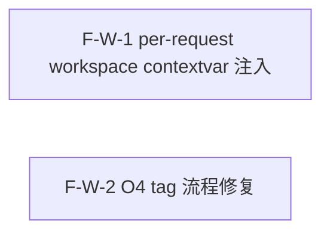

# Decomposition Delta — v1.18.0（2026-09-07）

> 新一轮 02 拆解 delta。源自 PRD-per-request-ws-v1.18.0 + retrospective-v1.17.0.md（续留 N3/K2 per-request ws + O4 tag 流程）。
> per-request workspace 轮：2 原子 Feature（F-W-1..2），版本 v1.18.0 additive MINOR。F-W-1 per-request workspace 注入 via contextvar（middleware 注入 + QueryEngine fallback 读取，构造签名不变），F-W-2 O4 tag 流程修复（tag 指向 release commit 非 reconcile）。2 Feature 互相独立，1 Wave 全并行，DAG 无环。基线含 v1.17.0（pytest 2267 passed, tag v1.17.0@e391611）。

## 新增 Feature

| id | name | domain | priority | complexity | depends_on | wave | blocked_by | source | AC |
|---|---|---|---|---|---|---|---|---|---|
| F-W-1 | per-request workspace 注入（FastAPI middleware contextvar 注入 + QueryEngine fallback 读取） | per-request-ws | P0 | M | — | 1 | — | PRD §3.1 | AC-WS-1, AC-WS-2, AC-WS-3, AC-WS-4, AC-WS-5 |
| F-W-2 | O4 tag 流程修复（release-manager tag 指向 release commit 非 reconcile） | per-request-ws | P0 | S | — | 1 | — | PRD §3.2 | AC-O4-1, AC-O4-2 |

## 原子 Feature → Spec 映射（03 1:1）
- F-W-1 → SPEC-F-W-1（per-request workspace 注入：workspace_id_var ContextVar + FastAPI middleware 提取+校验+set+reset + QueryEngine 内部 contextvar fallback 读取 + 子服务 TreeModeSearch/ContextCompiler/GraphTraverse contextvar fallback + JSON 日志 workspace_id 字段）
- F-W-2 → SPEC-F-W-2（O4 tag 流程修复：06 ship 流程调整顺序 reconcile→release→tag + release commit 含 ship artifacts + tag 指向 release commit + GitHub Release 关联 + 约定文档 scripts/RELEASE-FLOW.md）
> 2 原子 Feature = 2 Spec。

## DAG delta

- F-W-1（per-request workspace contextvar 注入）：无依赖，独立。触及 src/saw/drivers/web/middleware/workspace.py（新增）+ src/saw/engines/query/engine.py（内部读取改 contextvar fallback）+ 子服务。
- F-W-2（O4 tag 流程修复）：无依赖，独立。触及 06 ship 流程（release-manager 内部约定）+ scripts/RELEASE-FLOW.md（新增约定文档）。
- F-W-1 与 F-W-2 互相独立（多租户 web 隔离 vs release 流程，不同文件/关注点），Wave 1 全并行启动。
- DAG 无环 ✓（2 个独立节点，无边，无回边）。

## Wave 划分（v1.18.0）

- **Wave 1（2 Feature 全并行）**：F-W-1（per-request workspace contextvar 注入） / F-W-2（O4 tag 流程修复）
  - 2 Feature 互相独立（不同文件路径，不同关注点：多租户 web 隔离 vs release 流程），可全并行启动。无 Wave 2 — 无依赖边。

## 共享资源串行
- F-W-1 触及 engine.py + middleware，F-W-2 触及 release 流程脚本/文档，无共享文件冲突。
- F-W-1 的测试（test_workspace_contextvar.py）与 F-W-2 的测试/约定文档无冲突。

## AC 归属表

| AC ID | 描述 | 归属 Feature |
|---|---|---|
| AC-WS-1 | contextvar 注入生效（请求携带 X-Workspace-Id: team-a → 返回 team-a 数据） | F-W-1 |
| AC-WS-2 | fallback 默认值（请求未携带 workspace header → 返回 default 数据，与 v1.17.0 一致） | F-W-1 |
| AC-WS-3 | 跨 workspace 不泄漏（workspace A 请求搜索结果不含 workspace B claim） | F-W-1 |
| AC-WS-4 | CLI 不受影响（saw query 行为与 v1.17.0 一致，用 default workspace） | F-W-1 |
| AC-WS-5 | 构造签名不变（QueryEngine.__init__ 参数列表与 v1.17.0 一致） | F-W-1 |
| AC-O4-1 | tag 指向 release commit（git log v1.18.0 → release commit 非 reconcile） | F-W-2 |
| AC-O4-2 | GitHub Release 关联（Release tag 指向 release commit） | F-W-2 |

> PRD §6 共 7 条 AC，全部 7 条分配到对应 Feature（AC-WS-1..5→F-W-1, AC-O4-1/2→F-W-2）→ 无丢失 ✓

## 技术维度汇总

| 维度 | 需要该能力的 Feature | 推荐优先级 |
|---|---|---|
| needs_database | — | — |
| needs_cache | — | — |
| needs_queue | — | — |
| needs_ai | — | — |
| needs_vector_store | — | — |
| needs_realtime | — | — |
| needs_file_storage | — | — |
| needs_search | — | — |
| needs_scheduler | — | — |
| needs_notification | — | — |

> 注：v1.18.0 核心技术维度是 contextvar 注入（Python stdlib contextvars），无新依赖引入。F-W-1 复用 observability.py contextvars 先例（request_id_var），不引新库。F-W-2 为流程约定，无技术维度新增。

## NFR delta
- **不回归**：pytest ≥ 2267 passed（v1.17.0 基线 2267），ruff 0 errors，coverage ≥ 67%（CI fail_under=67），smoke 6/6。
- **多租户不泄漏**：跨 workspace 查询结果泄漏率 0%（多租户集成测试 workspace A 查询不返回 workspace B 数据）。
- **构造签名不变**：QueryEngine.__init__ 参数列表与 v1.17.0 一致，既有调用方无需修改。
- **CLI 行为不变**：saw query / saw search / saw links 等 CLI 命令行为与 v1.17.0 一致。
- **contextvar 开销可忽略**：< 1μs per request（contextvars 是 Python stdlib 原生，O(1)）。
- **JSON 日志**：payload 新增 workspace_id 字段（结构化日志可观测）。
- **tag 流程**：06 ship 流程 tag 指向 release commit（非 reconcile），git checkout vX.Y.Z 检出完整发布态。
- **无新依赖**：复用既有 contextvars + observability.py 先例，不引入新库。

## 下游消费
- → 03：技术方案选型 ADR 候选（contextvar 传播机制 ThreadPoolExecutor 兼容性 / middleware 提取策略 header vs JWT vs param / 子服务 fallback 实现方式）；2 Spec 1:1。
- → 04：~2 Task；1 Wave（Wave 1: F-W-1 + F-W-2 全并行）。
