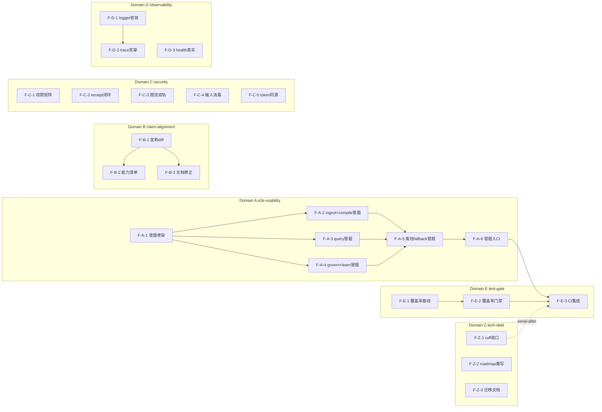

# Dependency Graph — Feature DAG 与实施路径

## DAG（Mermaid）

## DAG 校验
- 拓扑序无环（手动核验：A1→{A2,A3,A4}→A5→A6→E3；B1→{B2,B3}；D1→D2；E1→E2→E3；Z1 串行末位 after E3；Z2/Z3 独立）。
- 无回边、无环。✓ 若 03 重构依赖导致环 → 报错停步。

## 实施波次

### Wave 1 — 基础层（可并行，10 Feature）
F-A-1, F-B-1, F-C-1, F-C-2, F-C-3, F-C-4, F-C-5, F-D-1, F-D-3, F-E-1
- 无依赖，并行启动；为 Wave 2 解锁前置。

### Wave 2 — 核心业务（7 Feature）
F-A-2, F-A-3, F-A-4, F-B-2, F-B-3, F-D-2, F-E-2
- 依赖 Wave 1 对应前置；三引擎冒烟（A2/A3/A4）可并行。

### Wave 3 — 集成/增强（3 Feature）
F-A-5, F-A-6, F-E-3
- F-A-5 汇聚 A2/A3/A4；F-A-6 依赖 A5；F-E-3 依赖 A6 + E2。

## 关键路径
F-A-1 → F-A-2 → F-A-5 → F-A-6 → F-E-3（5 步，最长链）
- 次长：F-E-1 → F-E-2 → F-E-3（3 步）
- A2/A3/A4 并行可压缩 A1→A5 段。

## 并行机会
- Wave 1 全并行（10 路无依赖）。
- Wave 2 中 A2/A3/A4 三个引擎冒烟并行。
- B 域（P1）可与 P0 域异步推进，不阻塞关键路径。
