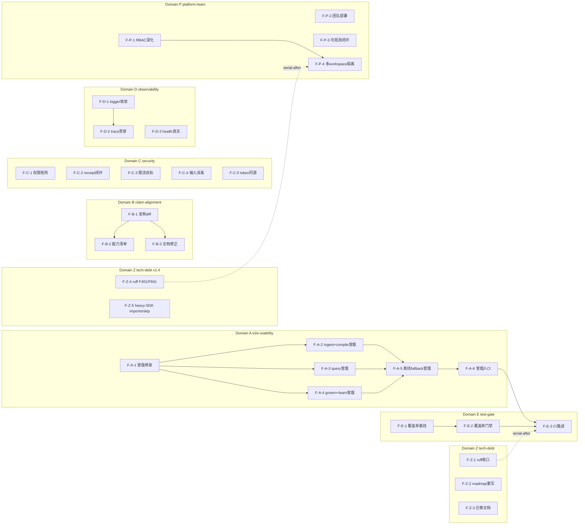
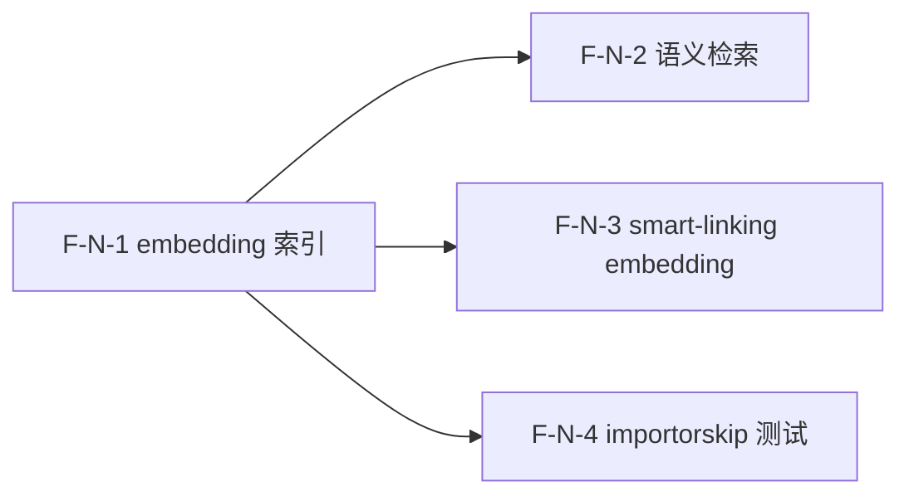
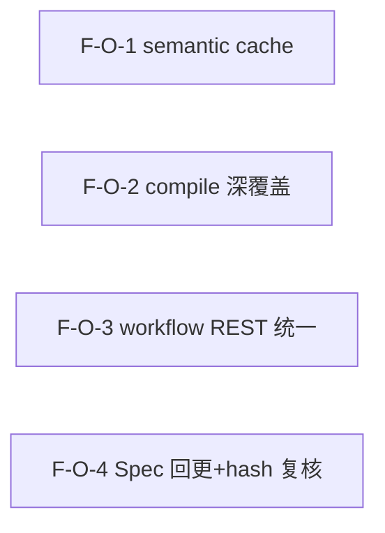
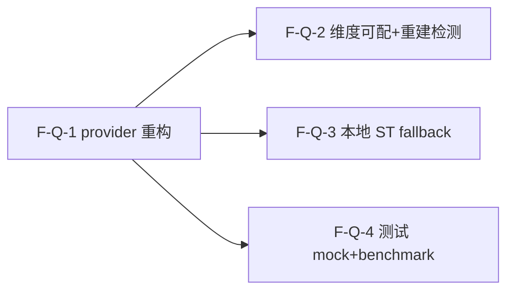
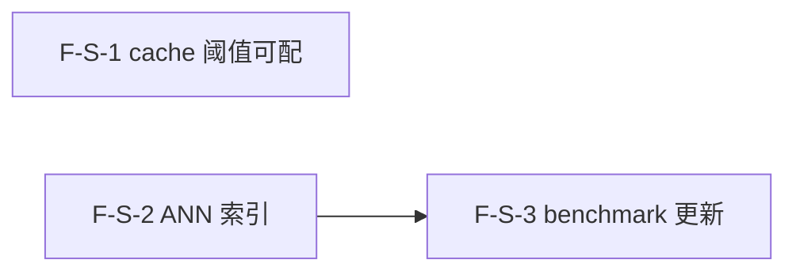
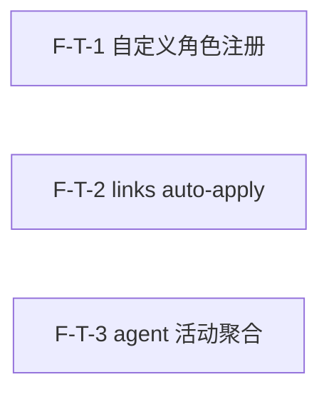

# Dependency Graph — Feature DAG 与实施路径

## DAG（Mermaid）

## DAG 校验
- 拓扑序无环（手动核验：A1→{A2,A3,A4}→A5→A6→E3；B1→{B2,B3}；D1→D2；E1→E2→E3；Z1 串行末位 after E3；Z2/Z3 独立）。
- 无回边、无环。✓ 若 03 重构依赖导致环 → 报错停步。

## 实施波次

### Wave 1 — 基础层（可并行，10 Feature）
F-A-1, F-B-1, F-C-1, F-C-2, F-C-3, F-C-4, F-C-5, F-D-1, F-D-3, F-E-1
- 无依赖，并行启动；为 Wave 2 解锁前置。

### Wave 2 — 核心业务（7 Feature）
F-A-2, F-A-3, F-A-4, F-B-2, F-B-3, F-D-2, F-E-2
- 依赖 Wave 1 对应前置；三引擎冒烟（A2/A3/A4）可并行。

### Wave 3 — 集成/增强（3 Feature）
F-A-5, F-A-6, F-E-3
- F-A-5 汇聚 A2/A3/A4；F-A-6 依赖 A5；F-E-3 依赖 A6 + E2。

## 关键路径
F-A-1 → F-A-2 → F-A-5 → F-A-6 → F-E-3（5 步，最长链）
- 次长：F-E-1 → F-E-2 → F-E-3（3 步）
- A2/A3/A4 并行可压缩 A1→A5 段。

## v1.10.0 delta（embedding track）

### v1.10.0 Wave
- **Wave 1**：F-N-1（embedding 索引 — EmbeddingSink + 重建命令，无依赖）
- **Wave 2（全并行）**：F-N-2（语义检索） / F-N-3（smart-linking embedding） / F-N-4（importorskip 测试）— 均依赖 F-N-1，互相独立

### v1.10.0 DAG 校验
- 拓扑序无环：N1 → {N2, N3, N4}，无回边 ✓

## 并行机会
- Wave 1 全并行（10 路无依赖）。
- Wave 2 中 A2/A3/A4 三个引擎冒烟并行。
- B 域（P1）可与 P0 域异步推进，不阻塞关键路径。
- v1.10.0 Wave 2 中 N2/N3/N4 全并行（3 路独立）。

## v1.11.0 delta（debt-closure IV track）

### v1.11.0 Wave
- **Wave 1（全并行，4 Feature）**：F-O-1（semantic cache） / F-O-2（compile 深覆盖） / F-O-3（workflow REST 统一） / F-O-4（Spec 回更+hash 复核）
  - 4 Feature 互相独立（不同文件），可全并行启动。无 Wave 2 — 无依赖边。

### v1.11.0 DAG 校验
- 拓扑序无环：4 个独立节点，无边，无回边 ✓

### v1.11.0 并行机会
- 4 Feature 全并行（4 路独立，不同文件）。

## v1.12.0 delta（embedding API pivot track）

### v1.12.0 Wave
- **Wave 1（基础层，1 Feature）**：F-Q-1（embed_texts provider 重构为 litellm API）— 无依赖，先行启动。
- **Wave 2（核心业务+测试，3 Feature 全并行）**：F-Q-2（维度可配 + 重建检测） / F-Q-3（本地 ST 可选 fallback） / F-Q-4（测试改 API mock + benchmark）— 均依赖 F-Q-1，互相独立，可全并行启动。

### v1.12.0 DAG 校验
- 拓扑序无环：Q-1 → {Q-2, Q-3, Q-4}，无回边 ✓

### v1.12.0 并行机会
- Wave 2 中 Q-2/Q-3/Q-4 全并行（3 路独立，不同关注点：dim 驱动 / fallback 路由 / 测试 mock）。

## v1.14.0 delta（semantic perf track）

### v1.14.0 Wave
- **Wave 1（2 Feature 并行）**：F-S-1（cache 阈值可配） / F-S-2（ANN 索引）
  - F-S-1 与 F-S-2 互相独立（不同文件路径），可并行启动。
- **Wave 2（1 Feature）**：F-S-3（benchmark 更新）
  - 依赖 F-S-2 完成（ANN 路径可用后才能跑 ANN vs cosine 对比）。

### v1.14.0 DAG 校验
- 拓扑序无环：S-2 → S-3 单向边，S-1 独立，无回边 ✓

### v1.14.0 并行机会
- Wave 1 中 F-S-1 / F-S-2 并行（2 路独立：cache 配置 / ANN 索引）。
- F-S-1 与 F-S-2 均触及 engine.py 但不同路径（cache 条件分支 vs cosine→ANN 切换），03 技术方案需注意协调。

## v1.15.0 delta（agent/link track）

### v1.15.0 Wave
- **Wave 1（3 Feature 全并行）**：F-T-1（自定义角色注册） / F-T-2（links auto-apply） / F-T-3（agent 活动聚合）
  - 3 Feature 互相独立（不同文件/关注点），可全并行启动。无 Wave 2 — 无依赖边。

### v1.15.0 DAG 校验
- 拓扑序无环：3 个独立节点，无边，无回边 ✓

### v1.15.0 并行机会
- 3 Feature 全并行（3 路独立：角色注册 / 链接写回 / 活动聚合）。
- F-T-1 与 F-T-3 均触及 collaborate.py REST 但不同端点（F-T-1 = GET /agents 扩展 custom 标记；F-T-3 = GET /agents/{name}/activity 新增 + activity_summary 扩展），03 技术方案需注意协调。
