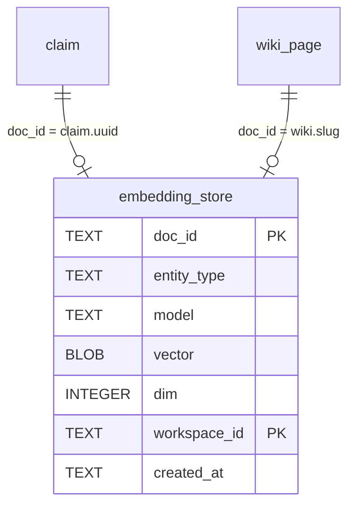

# SPEC-F-N-1: embedding 索引

## 实现 delta（ground 自源码）

- **migration v10**：`db/migrations.py::_register(10, _create_embedding_store)` → 新建 `embedding_store` 表（参照 ADR-010 DDL）。
- **EmbeddingSink**（`src/saw/write_queue/sinks/embedding_sink.py`，新建）：参照 `fts5_sink.py` 范式（`write(op)` + `can_handle(sink_name)` + `name` property）。
- **复用** `embeddings.py::embed_texts()`（`src/saw/adapters/embeddings.py:41-57`）生成向量，`embeddings_available()` 检测可用性。
- **复用** `config/settings.py::detect_tier()`（`src/saw/config/settings.py:115-120`）检测 FULL tier。
- **重建命令**：`saw search rebuild-embeddings`（新增 CLI 子命令，参照 `learn_cmd.py` 的 `_open_db` + Typer app 范式）。

## 数据库 Schema（DDL 级）

### migration v10：`embedding_store` 表

```sql
CREATE TABLE IF NOT EXISTS embedding_store (
    doc_id TEXT NOT NULL,          -- claim UUID 或 wiki slug
    entity_type TEXT NOT NULL,     -- 'claim' | 'wiki'
    model TEXT NOT NULL,           -- 'all-MiniLM-L6-v2'
    vector BLOB NOT NULL,          -- struct.pack float32 数组
    dim INTEGER NOT NULL,          -- 384
    workspace_id TEXT NOT NULL DEFAULT 'default',
    created_at TEXT NOT NULL DEFAULT (datetime('now')),
    PRIMARY KEY (doc_id, workspace_id)
);
CREATE INDEX IF NOT EXISTS idx_embedding_workspace
    ON embedding_store(workspace_id);
CREATE INDEX IF NOT EXISTS idx_embedding_model
    ON embedding_store(model);
```

**设计说明**：
- `doc_id` + `workspace_id` 联合主键 → workspace 隔离天然覆盖（参照 ADR-008 claim workspace_id / ADR-009 entity workspace_id）。
- `model` + `dim` 列 → 维度变更检测：重建时若 `dim != 当前模型 dim` 则 `DELETE FROM embedding_store` 全量重建。
- 向量 BLOB 序列化：`struct.pack(f"<{dim}f", *vec)` 写入 / `struct.unpack(f"<{dim}f", blob)` 读出。
- 不在 `claim` 表加列：embedding 是可选的（tier<FULL 时不存在），加列会导致非 FULL tier 的空值膨胀。独立表更清晰。

### ER 关系



## 后端架构

### EmbeddingSink（`src/saw/write_queue/sinks/embedding_sink.py`，新建）

参照 `FTS5Sink`（`fts5_sink.py:18-40`）范式：

```python
class EmbeddingSink:
    """Write Queue sink for embedding vector persistence."""

    def __init__(self, conn: sqlite3.Connection) -> None:
        self._conn = conn

    @property
    def name(self) -> str:
        return "embedding"

    def write(self, op) -> None:
        """Generate + persist embedding vector for a claim/wiki write op."""
        payload = op.payload
        doc_id = payload.get("doc_id") or payload.get("claim_uuid") or op.op_id
        content = payload.get("content", "")
        workspace_id = payload.get("workspace_id", "default")
        entity_type = payload.get("entity_type", "claim")

        # tier check: skip if embeddings unavailable
        from saw.adapters.embeddings import embeddings_available
        if not embeddings_available():
            logger.info("embeddings unavailable, skipping vector index")
            return

        vecs = embed_texts([content])
        if vecs is None:
            logger.warning("Embedding failed for %s, skipping", doc_id)
            return

        vec = vecs[0]
        dim = len(vec)
        blob = struct.pack(f"<{dim}f", *vec)

        # upsert (DELETE + INSERT pattern, same as FTS5Sink)
        self._conn.execute(
            "DELETE FROM embedding_store WHERE doc_id = ? AND workspace_id = ?",
            (doc_id, workspace_id),
        )
        self._conn.execute(
            """INSERT INTO embedding_store
               (doc_id, entity_type, model, vector, dim, workspace_id)
               VALUES (?, ?, ?, ?, ?, ?)""",
            (doc_id, entity_type, "all-MiniLM-L6-v2", blob, dim, workspace_id),
        )

    def can_handle(self, sink_name: str) -> bool:
        return sink_name == "embedding"
```

### Write Queue 注册

在 IngestPipeline `_build_write_ops`（`pipeline.py:310`）中，当 `embeddings_available()` 为 True 时，为每个 claim/wiki write op 追加一个 `sink_name="embedding"` 的 op 条目（参照 fts5 sink 的 op 生成模式）。

### 重建命令（`saw search rebuild-embeddings`）

新增 CLI 子命令，参照 `learn_cmd.py::_open_db` + Typer app 范式：

```python
@app.command(name="rebuild-embeddings")
def rebuild_embeddings(path: str = typer.Option(".", "--path", "-p")):
    """Rebuild embedding index from all existing claims and wiki pages."""
    conn, wiki_path = _open_db(path)
    try:
        from saw.adapters.embeddings import embeddings_available, embed_texts
        if not embeddings_available():
            console.print("[yellow]Embeddings unavailable. Install [learn] extra.[/yellow]")
            raise typer.Exit(0)

        # Dimension change detection
        old_dim = conn.execute(
            "SELECT DISTINCT dim FROM embedding_store LIMIT 1"
        ).fetchone()
        # ... detect dim mismatch → DELETE all → rebuild

        # Scan all claims (non-deleted) + wiki pages
        claims = conn.execute(
            "SELECT uuid, content, workspace_id FROM claim WHERE deleted_at IS NULL"
        ).fetchall()
        # Batch embed (chunks of 32)
        for chunk in _chunks(claims, 32):
            texts = [c[1] for c in chunk]
            vecs = embed_texts(texts)
            if vecs is None:
                continue
            for (doc_id, _, ws), vec in zip(chunk, vecs):
                _upsert_embedding(conn, doc_id, "claim", vec, ws)

        # Scan wiki pages via WikiRepository
        # ... similar pattern

        conn.commit()
        console.print(f"[green]Rebuilt {count} embedding vectors.[/green]")
    finally:
        conn.close()
```

**维度变更检测逻辑**：
1. 查询 `SELECT DISTINCT dim FROM embedding_store` → 若与当前模型 dim（384）不一致 → `DELETE FROM embedding_store` 全量清除。
2. 全量扫描 claim（`WHERE deleted_at IS NULL`，跳过已删除）+ wiki 页面。
3. 批量 `embed_texts()`（分块 32 条，避免 OOM）。
4. 逐条 upsert（DELETE+INSERT）。

## API 契约

无新 REST 端点（重建为 CLI 命令）。

### CLI

```
saw search rebuild-embeddings [--path DIR]
```

- **参数**：`--path` wiki 目录路径（默认 `.`）。
- **前置条件**：`[learn]` extra 已安装（`embeddings_available()` True）。
- **行为**：全量扫描 claim + wiki 页面，生成/更新 embedding 向量，跳过已删除 claim。
- **退出码**：成功 exit 0；embeddings 不可用 exit 0 + 提示。
- **输出**：`Rebuilt {N} embedding vectors.`

## 降级策略

| 条件 | 行为 |
|---|---|
| tier=FULL（embeddings available） | EmbeddingSink.write() 正常生成向量并持久化 |
| tier=LIGHTWEIGHT/OFFLINE | EmbeddingSink.write() 检测 `embeddings_available()=False` → skip，日志提示 "embeddings unavailable, skipping vector index"，不报错 |
| `embed_texts()` 返回 None（模型下载失败/OOM） | write() catch None → skip 该 doc，warning 日志，不中断 ingest |
| 维度变更（模型升级后 dim 不一致） | 重建命令检测 → DELETE all → 全量重建 |

## 安全考量

- **workspace 隔离**：`embedding_store` 表含 `workspace_id` 列，PRIMARY KEY 含 `workspace_id`。EmbeddingSink.write() 从 op payload 读取 `workspace_id`（参照 fts5_sink 的 payload 模式）。跨 workspace 查询时 `WHERE workspace_id = ?` 过滤，不泄漏。
- **已删除 claim**：重建命令 `WHERE deleted_at IS NULL` 过滤已删除 claim，不被索引。

## 测试映射（AC→用例）

| AC | 用例落点 | 断言 |
|---|---|---|
| AC-EMB-1（embedding 索引随 ingest 写入） | `tests/unit/test_embedding_index.py`（新建）：importorskip + in-memory DB + seed claim → ingest → `SELECT FROM embedding_store` 有行 + dim=384 + workspace_id 正确 | 向量可查 + dim=384 + workspace_id 匹配 |
| AC-EMB-2（无 [learn] 时不报错） | `tests/unit/test_embedding_index.py`：mock `embeddings_available()=False` → ingest → claim 正常写入 FTS5 + embedding_store 无行 + 无异常 | 无异常 + FTS5 正常 + embedding_store 空 |
| AC-EMB-3（存量重建索引） | `tests/unit/test_embedding_index.py`：seed 3 claims（1 deleted）→ `rebuild-embeddings` → 2 行 in embedding_store（deleted 不索引）+ dim=384 | 3 claims→2 vectors（deleted skip） |

## 实现就绪度

- [x] DDL 可执行（migration v10 `embedding_store` 表，参照 ADR-010）
- [x] EmbeddingSink 范式可参照 `fts5_sink.py:18-40`
- [x] `embed_texts()` / `embeddings_available()` 既有可复用
- [x] workspace 隔离覆盖（workspace_id 列 + PRIMARY KEY）
- [x] 维度变更检测机制设计完整
- [x] AC 覆盖 3/3
- [x] 降级策略完备（tier<FULL → skip + 日志）
- [ ] 向量检索 P99 延迟 [TBD]（05 实施后 benchmark）
- [ ] 规模上限 [TBD]（预估 ~10K docs 可接受）
