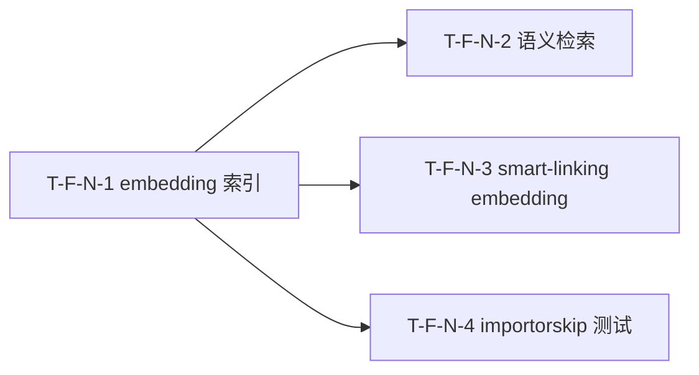

# Tasks Delta — v1.10.0（2026-09-04）

> 04 任务拆解 delta。4 Task（1:1 对应 4 Spec），2 Wave。DAG N-1→{N-2,N-3,N-4} 无环，与 decomposition 一致。

## WBS delta（追加行）

| task_id | spec_ref | 描述 | 类型 | 估时 | depends_on | files | acceptance | pms_module |
|---|---|---|---|---|---|---|---|---|
| T-F-N-1 | SPEC-F-N-1 | embedding_store migration v10 + EmbeddingSink + Write Queue 注册 + `saw search rebuild-embeddings` 重建命令（含 workspace_id 列 + 维度变更检测 + 降级 skip） | db-migration | M | — | db/migrations.py, write_queue/sinks/embedding_sink.py, engines/ingest/pipeline.py, drivers/cli/commands/search_cmd.py, drivers/cli/main.py | AC-EMB-1, AC-EMB-2, AC-EMB-3 | embedding |
| T-F-N-2 | SPEC-F-N-2 | QueryEngine `_semantic_search()` + `saw search --mode semantic` CLI + REST `GET /api/v1/search?mode=semantic` + 降级 BM25（semantic_fallback 标注） | backend-api | M | T-F-N-1 | engines/query/engine.py, drivers/cli/commands/search_cmd.py, drivers/web/routes/search.py, api/routes/query_ingest_learn.py | AC-SEM-1, AC-SEM-2, AC-SEM-3 | embedding |
| T-F-N-3 | SPEC-F-N-3 | `compute_related_pages()` 增 embedding 第 4 信号（权重 2.5）+ RelatedPage dataclass `embedding_sim` 字段 + `links_cmd.py` 透传 conn/workspace_id | backend-logic | M | T-F-N-1 | engines/query/related_pages.py, drivers/cli/commands/links_cmd.py | AC-LINK-1, AC-LINK-2, AC-LINK-3 | embedding |
| T-F-N-4 | SPEC-F-N-4 | importorskip 测试策略落地（3 测试文件 importorskip + 降级测试分离 mock 文件）+ `test_ci_workflow.py` 扩 importorskip 覆盖断言 | test | S | T-F-N-1 | tests/unit/test_embedding_index.py, tests/unit/test_semantic_search.py, tests/unit/test_related_pages_embedding.py, tests/unit/test_embedding_degradation.py, tests/unit/test_ci_workflow.py | AC-TEST-1, AC-TEST-2, AC-TEST-3 | embedding |

## DAG delta（Mermaid）

### DAG 校验
- 拓扑序无环：N1 → {N2, N3, N4}，无回边 ✓
- 与 decomposition DEPENDENCY-GRAPH v1.10.0 delta 一致（N-1 → {N-2, N-3, N-4}）✓
- 无自环、无环。若 05 重构致环 → 报错停步。

## Wave 重排（v1.10.0）

| Wave | Task 集合 | 可并行性 | 里程碑 |
|---|---|---|---|
| Wave 1 | T-F-N-1（embedding 索引 — migration v10 串行先行） | 独立（db migration 共享资源，必须先完成） | embedding_store 表 + sink 就绪 |
| Wave 2 | T-F-N-2 / T-F-N-3 / T-F-N-4（全并行，均依赖 T-F-N-1） | 3 路独立（无共享文件冲突） | 语义检索 + smart-linking + 测试就绪 |

### 共享资源串行
- migration v10（`db/migrations.py`）：Wave 1 串行先行，T-F-N-1 独占。Wave 2 Task 均依赖 embedding_store 表存在。
- `search_cmd.py`：T-F-N-1（Wave 1，加 rebuild-embeddings 子命令）→ T-F-N-2（Wave 2，加 --mode semantic）。Wave 1→2 串行，无并行写冲突。

### Wave 2 文件冲突分析
| 文件 | Wave 2 写入方 | 冲突? |
|---|---|---|
| engines/query/engine.py | T-F-N-2 | 否（N-3 写 related_pages.py） |
| engines/query/related_pages.py | T-F-N-3 | 否 |
| drivers/cli/commands/links_cmd.py | T-F-N-3 | 否 |
| drivers/cli/commands/search_cmd.py | T-F-N-2 | 否（N-1 已在 Wave 1 完成） |
| tests/unit/test_*.py | T-F-N-4 | 否（测试文件独占） |

## AC 归属

| AC | Task | Spec | 断言 |
|---|---|---|---|
| AC-EMB-1（embedding 索引随 ingest 写入） | T-F-N-1 | SPEC-F-N-1 | 向量可查 + dim=384 + workspace_id 匹配 |
| AC-EMB-2（无 [learn] 时不报错） | T-F-N-1 | SPEC-F-N-1 | 无异常 + FTS5 正常 + embedding_store 空 |
| AC-EMB-3（存量重建索引） | T-F-N-1 | SPEC-F-N-1 | 3 claims→2 vectors（deleted skip） |
| AC-SEM-1（语义检索返回同义结果） | T-F-N-2 | SPEC-F-N-2 | 同义召回 + score 降序 + mode=semantic |
| AC-SEM-2（无 [learn] 降级 BM25） | T-F-N-2 | SPEC-F-N-2 | 降级 BM25 + fallback 标注 + 无异常 |
| AC-SEM-3（空索引优雅处理） | T-F-N-2 | SPEC-F-N-2 | 空结果 + index_empty 标注 + exit 0 |
| AC-LINK-1（suggest 含语义相似页面） | T-F-N-3 | SPEC-F-N-3 | 无共享 tag/link 的语义相似页面出现 |
| AC-LINK-2（无 [learn] 保持 3-signal） | T-F-N-3 | SPEC-F-N-3 | 3-signal 行为不变 + 无异常 |
| AC-LINK-3（语义不相似排名下降） | T-F-N-3 | SPEC-F-N-3 | 共享 tag 但语义不同的页面排名下降 |
| AC-TEST-1（CI skip embedding 测试） | T-F-N-4 | SPEC-F-N-4 | pytest 无 fail + skip status |
| AC-TEST-2（本地 embedding 测试 pass） | T-F-N-4 | SPEC-F-N-4 | 本地有 [learn] → 测试 pass |
| AC-TEST-3（coverage 不回归） | T-F-N-4 | SPEC-F-N-4 | coverage ≥ 既有基线 |

## files 归属

| 文件 | Task | 新建? | 说明 |
|---|---|---|---|
| src/saw/db/migrations.py | T-F-N-1 | 否（追加 v10） | `_register(10, _create_embedding_store)` |
| src/saw/write_queue/sinks/embedding_sink.py | T-F-N-1 | **是** | 参照 fts5_sink.py 范式 |
| src/saw/engines/ingest/pipeline.py | T-F-N-1 | 否 | Write Queue 注册 embedding sink |
| src/saw/drivers/cli/commands/search_cmd.py | T-F-N-1, T-F-N-2 | 否 | Wave1: rebuild-embeddings; Wave2: --mode semantic |
| src/saw/drivers/cli/main.py | T-F-N-1 | 否 | 命令注册 |
| src/saw/engines/query/engine.py | T-F-N-2 | 否 | _semantic_search + mode 路由 |
| src/saw/drivers/web/routes/search.py | T-F-N-2 | 否 | REST mode=semantic |
| src/saw/api/routes/query_ingest_learn.py | T-F-N-2 | 否 | REST mode=semantic（备选端点） |
| src/saw/engines/query/related_pages.py | T-F-N-3 | 否 | 签名扩展 + embedding 信号 + RelatedPage |
| src/saw/drivers/cli/commands/links_cmd.py | T-F-N-3 | 否 | 透传 conn/workspace_id |
| tests/unit/test_embedding_index.py | T-F-N-4 | **是** | importorskip, AC-EMB-1/3 |
| tests/unit/test_semantic_search.py | T-F-N-4 | **是** | importorskip, AC-SEM-1/3 |
| tests/unit/test_related_pages_embedding.py | T-F-N-4 | **是** | importorskip, AC-LINK-1/3 |
| tests/unit/test_embedding_degradation.py | T-F-N-4 | **是** | 无 importorskip, mock, AC-EMB-2/SEM-2/LINK-2 |
| tests/unit/test_ci_workflow.py | T-F-N-4 | 否（扩） | importorskip 覆盖断言, AC-TEST-3 |

## 类型分派矩阵
| 类型 | Task | 推荐分派 |
|---|---|---|
| db-migration | T-F-N-1 | 后端（DB + sink + CLI） |
| backend-api | T-F-N-2 | 后端（engine + CLI + REST） |
| backend-logic | T-F-N-3 | 后端（related_pages 逻辑） |
| test | T-F-N-4 | QA（测试策略 + 用例） |

## 拆解门控
- [x] Spec 完整性：4 Task == 4 Spec（03 穷尽门控通过）
- [x] 每个 Feature 有 ≥1 Task（4/4）
- [x] Task 粒度 ≤4h（S×1 / M×3）
- [x] DAG 无环（N1→{N2,N3,N4}，实机校验 cycle=none）
- [x] Task 依赖与 decomposition Feature 依赖一致（N-1→{N-2,N-3,N-4}）
- [x] Wave 划分合理（db migration 共享资源 Wave 1 串行先行；Wave 2 全并行无文件冲突）
- [x] 每 Task acceptance 非空（指向 AC，共 12 AC 全映射）
- [x] 不越 PMS 边界（embedding 模块）

## assumptions / [TBD]
- 向量检索 P99 延迟 [TBD]（05 实施后 benchmark）
- 规模上限 [TBD]（预估 ~10K docs 可接受）
- embedding 信号权重 2.5 需 benchmark 调优 [TBD]
- 相似度缓存 [TBD]（后续优化）
- 降级测试 mock 策略需 05 实施时验证 mock 边界
