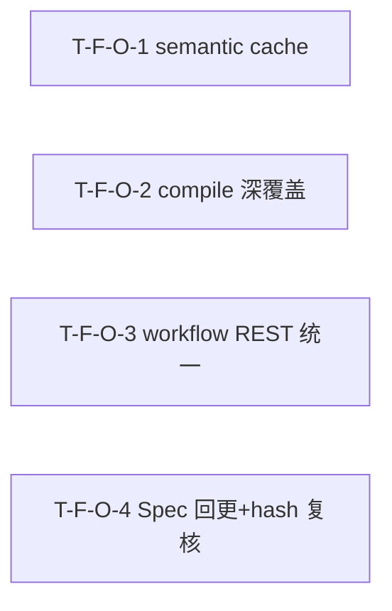

# Tasks Delta — v1.11.0（2026-09-05）

> 04 任务拆解 delta。债务收口 IV / bug fix。4 Task（1:1 对应 4 Spec），1 Wave 全并行。DAG 无环（4 Task 互相独立，无依赖边），与 decomposition 一致。

## WBS delta（追加行）

| task_id | spec_ref | 描述 | 类型 | 估时 | depends_on | files | acceptance | pms_module |
|---|---|---|---|---|---|---|---|---|
| T-F-O-1 | SPEC-F-O-1 | `_semantic_search` 入口插 `cache.get` + 出口插 `cache.set`（参照 `_keyword_search` 范式），复用 `get_cache()` 单例 + `mode="semantic"` key 隔离 + TTL 300s + rebuild-embeddings 补 `cache.clear()` 钩子 + fallback/index_empty 不缓存 | backend-logic | M | — | engines/query/engine.py, engines/query/cache.py, drivers/cli/commands/search_cmd.py | AC-CACHE-1, AC-CACHE-2, AC-CACHE-3, AC-CACHE-4 | debt-closure |
| T-F-O-2 | SPEC-F-O-2 | compile/compiler.py 深覆盖：新建 `tests/unit/engines/compile/`（7 测试文件 + conftest，20 用例覆盖 30 函数）+ `pyproject.toml` `fail_under` 64→65 | test | L | — | tests/unit/engines/compile/__init__.py, tests/unit/engines/compile/conftest.py, tests/unit/engines/compile/test_compiler_init.py, tests/unit/engines/compile/test_compiler_compile.py, tests/unit/engines/compile/test_compiler_helpers.py, tests/unit/engines/compile/test_compiler_content.py, tests/unit/engines/compile/test_compiler_index.py, tests/unit/engines/compile/test_compiler_cascade.py, tests/unit/engines/compile/test_coverage_config.py, pyproject.toml | AC-COV-1, AC-COV-2 | debt-closure |
| T-F-O-3 | SPEC-F-O-3 | `collaborate.py::list_workflows` 改读 `workflow_executions` DB 表（与 CLI `list_recent` 同源 `ORDER BY COALESCE(updated_at, started_at) DESC LIMIT ?`）+ merge live in-memory running workflow + conn=None fallback + 无表 auto-migrate | backend-api | M | — | api/routes/collaborate.py, drivers/cli/commands/workflow_cmd.py | AC-WF-1, AC-WF-2, AC-WF-3 | debt-closure |
| T-F-O-4 | SPEC-F-O-4 | SPEC-F-N-1.md L27/L133/L189 `saw search rebuild-embeddings`→`saw rebuild-embeddings` 命名回更（3 处）+ ROADMAP/lifecycle-state tag hash `@3865c75` 三处一致性复核（确认一致零改动或更正） | docs | S | — | .csp/specs/SPEC-F-N-1.md, docs/strategy/ROADMAP.md, .csp/lifecycle-state.json | AC-SPEC-1, AC-SPEC-2, AC-HASH-1 | debt-closure |

## DAG delta（Mermaid）

### DAG 校验
- 拓扑序无环：O1 / O2 / O3 / O4 互相独立，无依赖边 → 无回边 ✓
- 与 decomposition DEPENDENCY-GRAPH v1.11.0 delta 一致（4 Feature 全并行，无依赖边）✓
- 无自环、无环。若 05 重构致环 → 报错停步。

## Wave 重排（v1.11.0）

| Wave | Task 集合 | 可并行性 | 里程碑 |
|---|---|---|---|
| Wave 1 | T-F-O-1 / T-F-O-2 / T-F-O-3 / T-F-O-4 | 4 路全并行（无共享文件冲突） | semantic cache + compile 深覆盖 + workflow REST 统一 + Spec 回更就绪 |

### 共享资源串行
- 无共享资源串行约束。4 Task 触及完全不同的文件集，无重叠。

### Wave 1 文件冲突分析
| 文件 | Wave 1 写入方 | 冲突? |
|---|---|---|
| engines/query/engine.py | T-F-O-1 | 否（O-2/O-3/O-4 不写 engine.py） |
| engines/query/cache.py | T-F-O-1（仅读 `get_cache()` 单例） | 否（不改 cache.py） |
| tests/unit/engines/compile/* | T-F-O-2 | 否（新建测试目录，独占） |
| pyproject.toml | T-F-O-2（改 fail_under） | 否（仅 O-2 触及） |
| api/routes/collaborate.py | T-F-O-3 | 否（O-1/O-2/O-4 不写 collaborate.py） |
| .csp/specs/SPEC-F-N-1.md | T-F-O-4 | 否（仅 O-4 回更文档） |
| docs/strategy/ROADMAP.md | T-F-O-4（仅复核） | 否（仅 O-4 触及） |
| .csp/lifecycle-state.json | T-F-O-4（仅复核） | 否（仅 O-4 触及） |

> 并行检测结论：4 Task 文件集无重叠，全 Wave 1 并行安全。

## AC 归属

| AC | Task | Spec | 断言 |
|---|---|---|---|
| AC-CACHE-1（cache 命中） | T-F-O-1 | SPEC-F-O-1 | 首次 embed/cosine 被调用 → 再次同查询 embed/cosine 不被调用 + 结果一致 |
| AC-CACHE-2（workspace 隔离） | T-F-O-1 | SPEC-F-O-1 | workspace A 缓存后 workspace B 同查询 cache miss（独立计算） |
| AC-CACHE-3（索引变更失效） | T-F-O-1 | SPEC-F-O-1 | 缓存后 cache.clear() → 再次查询 cache miss（重新计算） |
| AC-CACHE-4（fallback 不缓存） | T-F-O-1 | SPEC-F-O-1 | embeddings_available()=False → semantic_fallback=True → cache 无 semantic key |
| AC-COV-1（compile/compiler 深覆盖） | T-F-O-2 | SPEC-F-O-2 | compiler.py 覆盖率 17%→高，全量 coverage ≥65% |
| AC-COV-2（fail_under 棘轮） | T-F-O-2 | SPEC-F-O-2 | pyproject.toml fail_under = 65 |
| AC-WF-1（REST 读 DB） | T-F-O-3 | SPEC-F-O-3 | seed 3 workflow_executions → GET /api/v1/workflows 返回 ≥3 条 + 字段含 workflow_id/status/steps |
| AC-WF-2（REST merge live） | T-F-O-3 | SPEC-F-O-3 | in-memory _workflows 有 1 running（DB 无记录）→ 返回含 live running |
| AC-WF-3（CLI/REST 语义一致） | T-F-O-3 | SPEC-F-O-3 | 同 DB → CLI list_recent vs REST list_workflows 同数据源 |
| AC-SPEC-1（Spec 命名回更） | T-F-O-4 | SPEC-F-O-4 | grep `saw search rebuild-embeddings` 于 SPEC-F-N-1.md → 0 匹配 |
| AC-SPEC-2（实现不变） | T-F-O-4 | SPEC-F-O-4 | `saw rebuild-embeddings --help` exit 0 |
| AC-HASH-1（hash 三处一致） | T-F-O-4 | SPEC-F-O-4 | git rev-list -n1 v1.10.0 short hash → ROADMAP + lifecycle-state.json 三处一致 |

## files 归属

| 文件 | Task | 新建? | 说明 |
|---|---|---|---|
| src/saw/engines/query/engine.py | T-F-O-1 | 否 | `_semantic_search` 入口 cache.get + 出口 cache.set |
| src/saw/engines/query/cache.py | T-F-O-1 | 否（仅读） | 复用 `get_cache()` 单例 + `QueryCache` 类，不改 |
| src/saw/drivers/cli/commands/search_cmd.py | T-F-O-1 | 否 | rebuild-embeddings 命令补 `cache.clear()` 钩子 |
| tests/unit/engines/compile/__init__.py | T-F-O-2 | **是** | 测试包初始化 |
| tests/unit/engines/compile/conftest.py | T-F-O-2 | **是** | tmp_vault + engine fixture |
| tests/unit/engines/compile/test_compiler_init.py | T-F-O-2 | **是** | TC-COMP-01/19/20 |
| tests/unit/engines/compile/test_compiler_compile.py | T-F-O-2 | **是** | TC-COMP-02/03/04 |
| tests/unit/engines/compile/test_compiler_helpers.py | T-F-O-2 | **是** | TC-COMP-05/06/07/11/17 |
| tests/unit/engines/compile/test_compiler_content.py | T-F-O-2 | **是** | TC-COMP-08/09/10/12 |
| tests/unit/engines/compile/test_compiler_index.py | T-F-O-2 | **是** | TC-COMP-13/14/16 |
| tests/unit/engines/compile/test_compiler_cascade.py | T-F-O-2 | **是** | TC-COMP-15 |
| tests/unit/engines/compile/test_coverage_config.py | T-F-O-2 | **是** | TC-COV-01（fail_under=65） |
| pyproject.toml | T-F-O-2 | 否 | fail_under 64→65 |
| src/saw/api/routes/collaborate.py | T-F-O-3 | 否 | list_workflows 读 DB + merge live |
| src/saw/drivers/cli/commands/workflow_cmd.py | T-F-O-3 | 否（仅参照） | CLI list_recent 同源参照，不改 |
| .csp/specs/SPEC-F-N-1.md | T-F-O-4 | 否 | L27/L133/L189 命名回更 |
| docs/strategy/ROADMAP.md | T-F-O-4 | 否（仅复核） | tag hash 复核 |
| .csp/lifecycle-state.json | T-F-O-4 | 否（仅复核） | tag hash 复核 |

## 类型分派矩阵
| 类型 | Task | 推荐分派 |
|---|---|---|
| backend-logic | T-F-O-1 | 后端（engine.py cache 插入 + 失效钩子） |
| test | T-F-O-2 | QA（compiler 深覆盖测试 + fail_under 棘轮） |
| backend-api | T-F-O-3 | 后端（collaborate.py REST 读 DB + merge live） |
| docs | T-F-O-4 | Tech Writer（Spec 命名回更 + hash 复核） |

## 拆解门控
- [x] Spec 完整性：4 Task == 4 Spec（03 穷尽门控通过）
- [x] 每个 Feature 有 ≥1 Task（4/4）
- [x] Task 粒度 ≤4h（S×1 / M×2 / L×1）
- [x] DAG 无环（O1/O2/O3/O4 互相独立，无依赖边，实机校验 cycle=none）
- [x] Task 依赖与 decomposition Feature 依赖一致（4 Feature 全并行无依赖边）
- [x] Wave 划分合理（全 Wave 1 并行，无共享资源串行约束）
- [x] 每 Task acceptance 非空（指向 AC，共 12 AC 全映射）
- [x] 不越 PMS 边界（debt-closure 模块）
- [x] 并行检测通过（4 Task 文件集无重叠）

## assumptions / [TBD]
- cache 命中率基线 [TBD]（须 05 实施后 benchmark）
- compiler.py 覆盖率目标值 [TBD]（须 05 实施后测量，预计 17%→~70%+）
- 全量 coverage 65 是否仅靠 compiler 深覆盖即可达成 [TBD]（须实施后验证）
- REST 查询延迟 [TBD]（须 05 实施后与 CLI 同量级验证）
