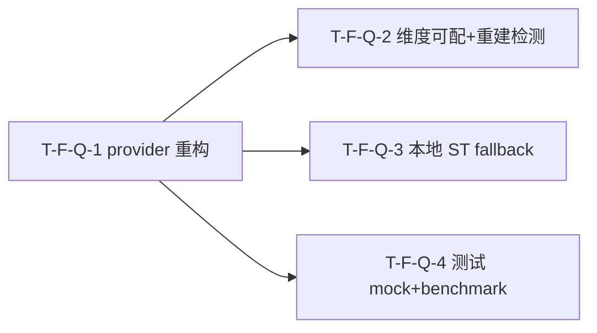

# Tasks Delta — v1.12.0（2026-09-05）

> 04 任务拆解 delta。embedding API 重构（pivot to litellm API）。4 Task（1:1 对应 4 Spec F-Q-1..4），2 Wave，DAG Q-1→{Q-2,Q-3,Q-4} 无环，与 decomposition 一致。

## WBS delta（追加行）

| task_id | spec_ref | 描述 | 类型 | 估时 | depends_on | files | acceptance | pms_module |
|---|---|---|---|---|---|---|---|---|
| T-F-Q-1 | SPEC-F-Q-1 | `embed_texts()` 改调 `litellm.embedding(model=cfg.model, input=texts, api_base/api_key)` + 新增 `EmbeddingSettings`（复用 `LLMSettings` 范式：model/api_key/api_base/timeout，env `EMBEDDING_API_KEY`/`OPENAI_API_KEY`）+ `_api_embedding_available()`/`_embed_via_api()`/`_normalize()` + `embeddings_available()` 改 API OR ST + `detect_tier()._embeddings_available()` 改 API OR ST；`embed_texts` 签名不变（下游零改动） | backend-logic | M | — | src/saw/adapters/embeddings.py, src/saw/config/settings.py | AC-EA-1, AC-EA-2 | embedding-api |
| T-F-Q-2 | SPEC-F-Q-2 | `EmbeddingSink.write()` model 列动态化（`_current_model_name()` 从 `EmbeddingSettings.model` 取，fallback `all-MiniLM-L6-v2`）+ `_upsert_embedding` model 列动态传参 + `rebuild_embeddings` 维度检测适配（`embed_texts(["dimension probe"])` 自动走 API/ST，`SELECT DISTINCT dim` 比对不匹配则 wipe 重建）；`embedding_store` 表结构不变（v10 已有 dim+model 列） | backend-logic | M | T-F-Q-1 | src/saw/write_queue/sinks/embedding_sink.py, src/saw/drivers/cli/commands/search_cmd.py | AC-DIM-1, AC-DIM-2 | embedding-api |
| T-F-Q-3 | SPEC-F-Q-3 | 本地 ST 可选 fallback 分支确认：`embed_texts()` provider 三级路由 API → ST → None（F-Q-1 建 API 路径，本 Task 补 ST fallback 分支 `_st_available()`/`_embed_via_st()` 保留既有逻辑）+ `embeddings_available()` OR 逻辑对称 + `detect_tier()._embeddings_available()` OR 逻辑（API 配置 OR 本地 ST importable）；向后兼容 v1.10.0（装 ST 无 API 配置 → 走本地 ST，FULL tier，行为不变） | backend-logic | M | T-F-Q-1 | src/saw/adapters/embeddings.py, src/saw/config/settings.py | AC-FB-1, AC-FB-2 | embedding-api |
| T-F-Q-4 | SPEC-F-Q-4 | 测试改 API mock：`test_embedding_index.py`/`test_semantic_search.py`/`test_related_pages_embedding.py` 去 `importorskip` 改 mock `litellm.embedding` 返回固定 1536 维向量（7 测试）+ `test_embedding_degradation.py` 扩 mock 到 API 不可用场景（4 测试）+ `test_ci_workflow.py` 更新（embedding 测试不再 importorskip ST）+ 新建 `test_embedding_benchmark.py`（semantic vs BM25 召回 + P99 mock baseline） | test | M | T-F-Q-1 | tests/unit/test_embedding_index.py, tests/unit/test_semantic_search.py, tests/unit/test_related_pages_embedding.py, tests/unit/test_embedding_degradation.py, tests/unit/test_ci_workflow.py, tests/unit/test_embedding_benchmark.py | AC-TEST-1, AC-TEST-2, AC-TEST-3 | embedding-api |

## DAG delta（Mermaid）

### DAG 校验
- 拓扑序无环：Q-1 → {Q-2, Q-3, Q-4}，无回边 ✓
- 与 decomposition DEPENDENCY-GRAPH v1.12.0 delta 一致（F-Q-1 → {F-Q-2, F-Q-3, F-Q-4}）✓
- 无自环、无环。若 05 重构致环 → 报错停步。

## Wave 重排（v1.12.0）

| Wave | Task 集合 | 可并行性 | 里程碑 |
|---|---|---|---|
| Wave 1 | T-F-Q-1 | 1 路独占（provider 重构前置，解锁 Wave 2） | embed_texts 走 litellm API 就绪 |
| Wave 2 | T-F-Q-2 / T-F-Q-3 / T-F-Q-4 | 3 路全并行（无共享文件冲突） | 维度可配+重建检测 / ST fallback / 测试 mock+benchmark 就绪 |

### 共享资源串行
- `src/saw/adapters/embeddings.py`：T-F-Q-1（Wave 1，建 API 路径 + `embeddings_available` OR 骨架）→ T-F-Q-3（Wave 2，补 ST fallback 分支 + OR 逻辑对称）。Wave 1→2 串行，禁并行写同文件。
- `src/saw/config/settings.py`：T-F-Q-1（Wave 1，新增 `EmbeddingSettings` + `_embeddings_available` API 检测）→ T-F-Q-3（Wave 2，`_embeddings_available` OR 逻辑扩展 ST importable）。Wave 1→2 串行。
- Wave 2 内三 Task 文件集无重叠（见下表），全并行安全。

### Wave 2 文件冲突分析
| 文件 | Wave 2 写入方 | 冲突? |
|---|---|---|
| src/saw/write_queue/sinks/embedding_sink.py | T-F-Q-2 | 否（Q-3/Q-4 不写 sink） |
| src/saw/drivers/cli/commands/search_cmd.py | T-F-Q-2 | 否（Q-3/Q-4 不写 search_cmd） |
| src/saw/adapters/embeddings.py | T-F-Q-3 | 否（Q-1 已在 Wave 1 完成，Wave 2 仅 Q-3 续写；Q-2/Q-4 不触及） |
| src/saw/config/settings.py | T-F-Q-3 | 否（同上，Wave 2 仅 Q-3） |
| tests/unit/test_embedding_index.py | T-F-Q-4 | 否（Q-2/Q-3 不写测试） |
| tests/unit/test_semantic_search.py | T-F-Q-4 | 否 |
| tests/unit/test_related_pages_embedding.py | T-F-Q-4 | 否 |
| tests/unit/test_embedding_degradation.py | T-F-Q-4 | 否 |
| tests/unit/test_ci_workflow.py | T-F-Q-4 | 否 |
| tests/unit/test_embedding_benchmark.py | T-F-Q-4（新建） | 否（独占新建） |

> 并行检测结论：Wave 2 三 Task 文件集无重叠，全 Wave 2 并行安全。Q-3 对 `embeddings.py`/`settings.py` 的续写依赖 Q-1 Wave 1 完成（串行 Wave 1→2），不构成 Wave 2 内冲突。

## AC 归属

| AC | Task | Spec | 断言 |
|---|---|---|---|
| AC-EA-1（API 配置可用时语义检索） | T-F-Q-1 | SPEC-F-Q-1 | mock `litellm.embedding` 返回固定 1536 维向量 → EmbeddingSink.write → `SELECT FROM embedding_store` 有行 + dim=1536 + model=mock model 名 |
| AC-EA-2（API 未配置时降级） | T-F-Q-1 | SPEC-F-Q-1 | mock `embeddings_available()=False` → semantic search → `semantic_fallback: true` + BM25 回退，不报错 |
| AC-DIM-1（维度变更触发重建） | T-F-Q-2 | SPEC-F-Q-2 | mock `litellm.embedding` 返回 1536 维 → seed 旧 dim=384 向量 → rebuild → `SELECT DISTINCT dim` 不匹配 → wipe 旧向量 → 新向量 dim=1536 + model=mock model 名 |
| AC-DIM-2（ingest 写入正确 model） | T-F-Q-2 | SPEC-F-Q-2 | mock `litellm.embedding` → EmbeddingSink.write → `SELECT model FROM embedding_store` = mock model 名（非 `all-MiniLM-L6-v2`） |
| AC-FB-1（本地 ST fallback） | T-F-Q-3 | SPEC-F-Q-3 | mock `embeddings_available()=True`（ST 路径）+ API 不可用 → semantic search 返回结果 + `semantic_fallback: false` + 日志 "API unavailable, falling back to local ST" |
| AC-FB-2（无 ST 走 API） | T-F-Q-3 | SPEC-F-Q-3 | mock `litellm.embedding` 返回固定向量 + `_st_available()=False` → semantic search 返回结果 + `semantic_fallback: false` + 无需本地 ST |
| AC-TEST-1（CI embedding 测试全 pass） | T-F-Q-4 | SPEC-F-Q-4 | 去 importorskip，mock `litellm.embedding` → `test_embedding_index.py`+`test_semantic_search.py`+`test_related_pages_embedding.py` 全 pass 不 skip |
| AC-TEST-2（CI 无 importorskip） | T-F-Q-4 | SPEC-F-Q-4 | `test_ci_workflow.py` 检查 embedding 测试无 `importorskip("sentence_transformers")` + CI 不需 `[learn]` extra 跑 embedding 测试 |
| AC-TEST-3（benchmark 可执行） | T-F-Q-4 | SPEC-F-Q-4 | `test_embedding_benchmark.py`（新建）：mock 向量集 → semantic vs BM25 召回对比 + P99 延迟（mock baseline [TBD]） |

## files 归属

| 文件 | Task | 新建? | 说明 |
|---|---|---|---|
| src/saw/adapters/embeddings.py | T-F-Q-1, T-F-Q-3 | 否 | Q-1 建 API 路径（`_api_embedding_available`/`_embed_via_api`/`_normalize`/`embed_texts` 三级路由骨架/`embeddings_available` OR）；Q-3 补 ST fallback 分支（`_st_available`/`_embed_via_st` 保留 + OR 逻辑对称） |
| src/saw/config/settings.py | T-F-Q-1, T-F-Q-3 | 否 | Q-1 新增 `EmbeddingSettings`（model/api_key/api_base/timeout）+ `_embeddings_available` API 检测；Q-3 扩 OR 逻辑（API OR 本地 ST importable） |
| src/saw/write_queue/sinks/embedding_sink.py | T-F-Q-2 | 否 | `write()` model 列动态化（`_current_model_name()` 从 `EmbeddingSettings.model` 取） |
| src/saw/drivers/cli/commands/search_cmd.py | T-F-Q-2 | 否 | `_upsert_embedding` model 列动态传参 + `rebuild_embeddings` 维度检测适配（provider 换了自动走 API/ST） |
| tests/unit/test_embedding_index.py | T-F-Q-4 | 否 | 去 `importorskip`，改 mock `litellm.embedding`（3 测试） |
| tests/unit/test_semantic_search.py | T-F-Q-4 | 否 | 去 `importorskip`，改 mock `litellm.embedding`（2 测试） |
| tests/unit/test_related_pages_embedding.py | T-F-Q-4 | 否 | 去 `importorskip`，改 mock `litellm.embedding`（2 测试） |
| tests/unit/test_embedding_degradation.py | T-F-Q-4 | 否 | 扩 mock 到 API 不可用场景（4 测试） |
| tests/unit/test_ci_workflow.py | T-F-Q-4 | 否 | 更新——embedding 测试不再 `importorskip` ST |
| tests/unit/test_embedding_benchmark.py | T-F-Q-4 | **是** | 新建 benchmark：semantic vs BM25 召回 + P99（mock baseline [TBD]） |

## 类型分派矩阵
| 类型 | Task | 推荐分派 |
|---|---|---|
| backend-logic | T-F-Q-1 | 后端（embeddings.py provider 重构 + settings.py EmbeddingSettings） |
| backend-logic | T-F-Q-2 | 后端（embedding_sink.py model 列动态 + search_cmd.py 维度检测） |
| backend-logic | T-F-Q-3 | 后端（embeddings.py ST fallback 分支 + settings.py OR 逻辑） |
| test | T-F-Q-4 | QA（测试改 mock + benchmark 新建） |

## 拆解门控
- [x] Spec 完整性：4 Task == 4 Spec（03 穷尽门控通过，4 Spec == 4 原子 Feature F-Q-1..4）
- [x] 每个 Feature 有 ≥1 Task（4/4）
- [x] Task 粒度 ≤4h（M×4）
- [x] DAG 无环（Q-1→{Q-2,Q-3,Q-4}，拓扑序无回边，实机校验 cycle=none）
- [x] Task 依赖与 decomposition Feature 依赖一致（F-Q-1→{F-Q-2,F-Q-3,F-Q-4}）
- [x] Wave 划分合理（Q-1 Wave 1 独占前置；Q-2/Q-3/Q-4 Wave 2 全并行，共享 `embeddings.py`/`settings.py` 串行 Wave 1→2）
- [x] 每 Task acceptance 非空（指向 AC，共 9 AC 全映射）
- [x] 不越 PMS 边界（embedding-api 模块）
- [x] 并行检测通过（Wave 2 三 Task 文件集无重叠）

## assumptions / [TBD]
- API embedding P99 延迟 [TBD]（须 05 实施后 benchmark，真实 API key 可选 E2E）
- semantic vs BM25 召回率 [TBD]（须同义查询集 benchmark 后定 baseline）
- 具体模型名 [TBD]（默认 `text-embedding-3-small` 或 config 驱动，dim=1536）
- 向量索引存储开销 [TBD]（API dim 如 1536 > 本地 384，须磁盘测量）
- 全量重建延迟 [TBD]（取决于 claim/wiki 总量 × API embedding 单次延迟）
