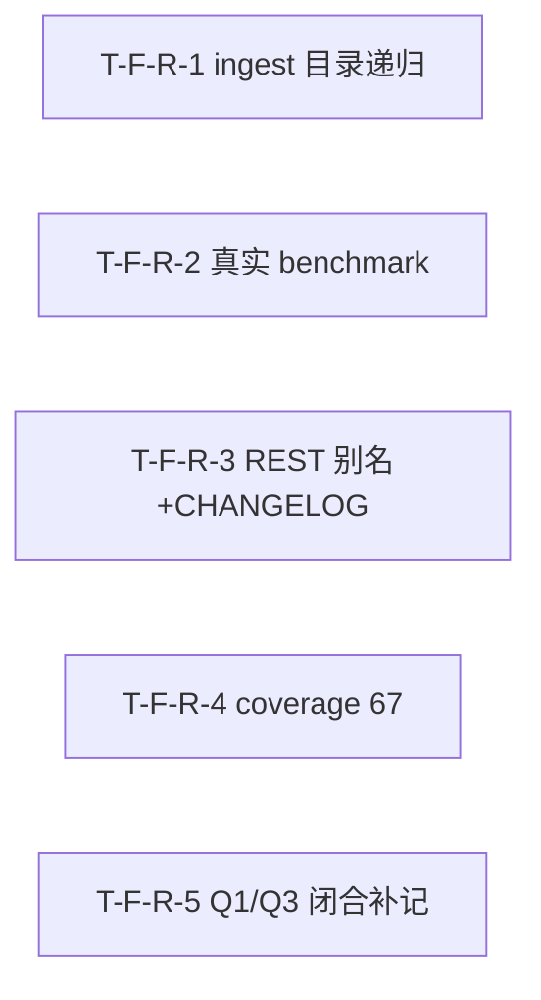

# Tasks Delta — v1.13.0（2026-09-06）

> 04 任务拆解 delta。E2E 收尾轮（ingest 目录递归 Bug A + 真实 vLLM benchmark + REST 兼容别名+CHANGELOG + coverage 棘轮 67 + Q1/Q3 闭合补记）。5 Task（1:1 对应 5 Spec F-R-1..5），1 Wave 全并行，DAG 无环（5 Task 互相独立，无依赖边），与 decomposition 一致。

## WBS delta（追加行）

| task_id | spec_ref | 描述 | 类型 | 估时 | depends_on | files | acceptance | pms_module |
|---|---|---|---|---|---|---|---|---|
| T-F-R-1 | SPEC-F-R-1 | `pipeline.py` `ingest()` 入口加目录递归分支（`Path(source).is_dir()` → `os.walk` 递归枚举子文件，prune 噪声目录 `.git/.saw/node_modules/.venv/__pycache__/` 等 → 逐文件调 `_ingest_single_file()` → 聚合 `IngestResult(parser="directory-batch")`）+ 原 `ingest()` 单文件逻辑提取为 `_ingest_single_file()` + `classifier.py:149` `is_dir` 块改返回 `UNKNOWN`（安全兜底，目录由 pipeline 入口拦截）+ 新建 `tests/unit/test_ingest_directory.py`（5 用例：递归/空目录/部分失败/子目录/排除 SAW 内部） | backend-logic | M | — | src/saw/engines/ingest/classifier.py, src/saw/engines/ingest/pipeline.py, tests/unit/test_ingest_directory.py | AC-A-1, AC-A-2, AC-A-3, AC-A-4, AC-A-5 | e2e-tail |
| T-F-R-2 | SPEC-F-R-2 | 新建 `scripts/benchmark_semantic.py` 独立可执行脚本：vLLM 8001 health check（不可达报错退出不 mock）→ 建数据集（3 主题×5 文档，同义查询）→ BM25 baseline 查询 → semantic 查询 → P99 统计（N≥100，清 cache）→ cache 命中率（同查询 2 次）→ 输出结构化 JSON；复用 `embed_texts()` API 路径 + `_semantic_search`/`_keyword_search` 既有方法；扩 `tests/unit/test_embedding_benchmark.py`（标 `@pytest.mark.benchmark_e2e`，CI 无 vLLM skip；AC-B-4 mock 不可达 CI 始终跑） | infra | M | — | scripts/benchmark_semantic.py, tests/unit/test_embedding_benchmark.py | AC-B-1, AC-B-2, AC-B-3, AC-B-4 | e2e-tail |
| T-F-R-3 | SPEC-F-R-3 | `collaborate.py:373` durable item + `:401` live item 加 `"name"`/`"workflow"` 别名字段（= `definition_name` 同值镜像，主字段不变）+ 新建项目根 `CHANGELOG.md`（Keep a Changelog 约定，回溯 v1.10.0–v1.13.0 关键行为变更）+ 扩 `tests/unit/test_workflow_rest_db.py`（别名断言）+ 新建 `tests/unit/test_changelog.py`（CHANGELOG 存在+回溯断言） | backend-api | S | — | src/saw/api/routes/collaborate.py, CHANGELOG.md, tests/unit/test_workflow_rest_db.py, tests/unit/test_changelog.py | AC-C-1, AC-C-2, AC-C-3 | e2e-tail |
| T-F-R-4 | SPEC-F-R-4 | `pyproject.toml:127` `fail_under` 65→67 + `tests/unit/engines/compile/test_coverage_config.py:14` 断言改 `>= 65`（去硬编码上限）+ `tests/unit/test_coverage_gate.py:32` 断言改 `<= 80`（去硬编码上限 65）+ 补测既有未覆盖路径达 ≥67%（候选：ingest pipeline 边界 / query engine 边界 / collaborate live merge 分支，具体 [TBD-05] 实施时择优） | test | M | — | pyproject.toml, tests/unit/engines/compile/test_coverage_config.py, tests/unit/test_coverage_gate.py | AC-D-1, AC-D-2 | e2e-tail |
| T-F-R-5 | SPEC-F-R-5 | `.csp/artifacts/retrospective-v1.12.0.md` Q1/Q3 finding 段落追加 `**v1.13.0 闭合**` 标注（Q1：commit `84e1776` httpx 直连 vLLM 真实 API E2E 验证通过 / Q3：commit `84e1776` 删除 ST fallback 路径，provider API-only，无 ST fallback 分支需测）+ 新建 `tests/unit/test_retrospective_closure.py`（Q1/Q3 闭合标注断言） | docs | S | — | .csp/artifacts/retrospective-v1.12.0.md, tests/unit/test_retrospective_closure.py | AC-E-1, AC-E-2 | e2e-tail |

## DAG delta（Mermaid）

### DAG 校验
- 拓扑序无环：R1 / R2 / R3 / R4 / R5 互相独立，无依赖边 → 无回边 ✓
- 与 decomposition DEPENDENCY-GRAPH v1.13.0 delta 一致（5 Feature 全并行，无依赖边）✓
- 无自环、无环。若 05 重构致环 → 报错停步。

## Wave 重排（v1.13.0）

| Wave | Task 集合 | 可并行性 | 里程碑 |
|---|---|---|---|
| Wave 1 | T-F-R-1 / T-F-R-2 / T-F-R-3 / T-F-R-4 / T-F-R-5 | 5 路全并行（无共享文件冲突） | E2E 收尾就绪 → v1.13.0 可交付 |

### 共享资源串行
- 无共享资源串行约束。5 Task 触及完全不同的文件集，无重叠。

### Wave 1 文件冲突分析
| 文件 | Wave 1 写入方 | 新建? | 冲突? |
|---|---|---|---|
| src/saw/engines/ingest/classifier.py | T-F-R-1 | 否 | 否 |
| src/saw/engines/ingest/pipeline.py | T-F-R-1 | 否 | 否 |
| tests/unit/test_ingest_directory.py | T-F-R-1 | 是 | 否 |
| scripts/benchmark_semantic.py | T-F-R-2 | 是 | 否 |
| tests/unit/test_embedding_benchmark.py | T-F-R-2 | 否（扩） | 否 |
| src/saw/api/routes/collaborate.py | T-F-R-3 | 否 | 否 |
| CHANGELOG.md | T-F-R-3 | 是 | 否 |
| tests/unit/test_workflow_rest_db.py | T-F-R-3 | 否（扩） | 否 |
| tests/unit/test_changelog.py | T-F-R-3 | 是 | 否 |
| pyproject.toml | T-F-R-4 | 否 | 否 |
| tests/unit/engines/compile/test_coverage_config.py | T-F-R-4 | 否 | 否 |
| tests/unit/test_coverage_gate.py | T-F-R-4 | 否 | 否 |
| .csp/artifacts/retrospective-v1.12.0.md | T-F-R-5 | 否 | 否 |
| tests/unit/test_retrospective_closure.py | T-F-R-5 | 是 | 否 |

> 并行检测结论：Wave 1 五 Task 文件集无重叠，全 Wave 1 并行安全。

## AC 归属

| AC | Task | Spec | 断言 |
|---|---|---|---|
| AC-A-1（目录递归 ingest） | T-F-R-1 | SPEC-F-R-1 | tmp dir 含 3 .md → `pipeline.ingest(dir)` → claim_count ≥ 3 + errors 无 "Is a directory" |
| AC-A-2（空目录） | T-F-R-1 | SPEC-F-R-1 | tmp 空目录 → errors 含 "No ingestible files found" + claim_count=0 |
| AC-A-3（部分失败） | T-F-R-1 | SPEC-F-R-1 | tmp dir 含 2 .md + 1 损坏 .pdf → 2 .md 成功 + errors 含 pdf 失败 + 不中断 |
| AC-A-4（子目录递归） | T-F-R-1 | SPEC-F-R-1 | tmp dir 含子目录内 1 .md → 子目录文件被 ingest + claim_count 含子目录 |
| AC-A-5（排除 SAW 内部目录） | T-F-R-1 | SPEC-F-R-1 | tmp dir 含 `.saw/inside.md` → `.saw/inside.md` 不被 ingest |
| AC-B-1（真实 API 召回） | T-F-R-2 | SPEC-F-R-2 | vLLM 可达时跑 benchmark → semantic 召回 ≥ BM25（同义查询集） |
| AC-B-2（P99 延迟） | T-F-R-2 | SPEC-F-R-2 | benchmark P99 统计 → 输出 P99 数值（[TBD] 跑完填） |
| AC-B-3（cache 命中率） | T-F-R-2 | SPEC-F-R-2 | 同查询跑 2 次 → 第 2 次命中 cache，延迟显著低，输出 hit/miss |
| AC-B-4（vLLM 不可达报错） | T-F-R-2 | SPEC-F-R-2 | mock vLLM 不可达 → benchmark 报 "vLLM endpoint unreachable" 退出，不 mock |
| AC-C-1（别名兼容） | T-F-R-3 | SPEC-F-R-3 | `GET /workflows` 返回非空 → 每个 item 含 `name` 且 == `definition_name` + 含 `workflow` 且 == `definition_name` |
| AC-C-2（CHANGELOG 存在） | T-F-R-3 | SPEC-F-R-3 | 读 `CHANGELOG.md` → 文件存在 + 含 v1.11.0 `/workflows` 行为变更条目 |
| AC-C-3（CHANGELOG 回溯） | T-F-R-3 | SPEC-F-R-3 | 读 `CHANGELOG.md` → 含 v1.12.0 embedding pivot 条目 + v1.13.0 本轮条目 |
| AC-D-1（fail_under 提升） | T-F-R-4 | SPEC-F-R-4 | 读 pyproject.toml → `fail_under` 值为 67（或 ≥ 65 棘轮） |
| AC-D-2（实际覆盖率达标） | T-F-R-4 | SPEC-F-R-4 | CI `pytest --cov` → coverage 报告 ≥ 67% + CI 绿 |
| AC-E-1（Q1 闭合标注） | T-F-R-5 | SPEC-F-R-5 | 读 `retrospective-v1.12.0.md` Q1 finding → 含 `**v1.13.0 闭合**` + commit `84e1776` |
| AC-E-2（Q3 闭合标注） | T-F-R-5 | SPEC-F-R-5 | 读 Q3 finding → 含 `**v1.13.0 闭合**` + ST fallback 已删 |

## files 归属

| 文件 | Task | 新建? | 说明 |
|---|---|---|---|
| src/saw/engines/ingest/classifier.py | T-F-R-1 | 否 | `is_dir` 块改返回 `UNKNOWN`（安全兜底） |
| src/saw/engines/ingest/pipeline.py | T-F-R-1 | 否 | `ingest()` 入口加目录递归分支 + 提取 `_ingest_single_file` + `_ingest_directory` |
| tests/unit/test_ingest_directory.py | T-F-R-1 | 是 | 5 用例：递归/空目录/部分失败/子目录/排除 SAW 内部 |
| scripts/benchmark_semantic.py | T-F-R-2 | 是 | 独立可执行脚本：vLLM health check + 数据集 + BM25 baseline + semantic + P99 + cache 命中率 |
| tests/unit/test_embedding_benchmark.py | T-F-R-2 | 否 | 扩 `@pytest.mark.benchmark_e2e`（CI 无 vLLM skip）+ AC-B-4 mock 不可达 |
| src/saw/api/routes/collaborate.py | T-F-R-3 | 否 | durable `:373` + live `:401` 加 `name`/`workflow` 别名字段 |
| CHANGELOG.md | T-F-R-3 | 是 | 项目根，Keep a Changelog，回溯 v1.10.0–v1.13.0 |
| tests/unit/test_workflow_rest_db.py | T-F-R-3 | 否 | 扩别名断言 |
| tests/unit/test_changelog.py | T-F-R-3 | 是 | CHANGELOG 存在 + 回溯断言 |
| pyproject.toml | T-F-R-4 | 否 | `fail_under` 65→67 |
| tests/unit/engines/compile/test_coverage_config.py | T-F-R-4 | 否 | 断言 `== 65` → `>= 65`（去硬编码上限） |
| tests/unit/test_coverage_gate.py | T-F-R-4 | 否 | 断言 `<= 65` → `<= 80`（去硬编码上限） |
| .csp/artifacts/retrospective-v1.12.0.md | T-F-R-5 | 否 | Q1/Q3 finding 追加闭合标注 |
| tests/unit/test_retrospective_closure.py | T-F-R-5 | 是 | Q1/Q3 闭合标注断言 |

## 类型分派矩阵
| 类型 | Task | 推荐分派 |
|---|---|---|
| backend-logic | T-F-R-1 | 后端（pipeline.py 递归分支 + classifier.py UNKNOWN 兜底） |
| infra | T-F-R-2 | DevOps（benchmark 脚本 + test marker） |
| backend-api | T-F-R-3 | 后端（collaborate.py 别名 + CHANGELOG） |
| test | T-F-R-4 | QA（fail_under 棘轮 + 补测） |
| docs | T-F-R-5 | Tech Writer（retrospective 闭合标注） |

## 拆解门控
- [x] Spec 完整性：5 Task == 5 Spec（03 穷尽门控通过，5 Spec == 5 原子 Feature F-R-1..5）
- [x] 每个 Feature 有 ≥1 Task（5/5）
- [x] Task 粒度 ≤4h（M×3 / S×2）
- [x] DAG 无环（R1/R2/R3/R4/R5 互相独立，无依赖边，实机校验 cycle=none）
- [x] Task 依赖与 decomposition Feature 依赖一致（5 Feature 全并行无依赖边）
- [x] Wave 划分合理（全 Wave 1 并行，无共享资源串行约束）
- [x] 每 Task acceptance 非空（指向 AC，共 16 AC 全映射）
- [x] 不越 PMS 边界（e2e-tail 模块）
- [x] 并行检测通过（Wave 1 五 Task 文件集无重叠）

## assumptions / [TBD]
- 100 文件目录 60s NFR [TBD]（05 实施后实测，无 LLM 模式）
- benchmark P99 目标值 [TBD] ms（跑完填实际值）
- benchmark cache 命中率 [TBD]%（跑完填实际值）
- T-F-R-4 补测具体模块 [TBD-05]（实施时择优，PRD 建议优先 ingest/query 核心路径）
