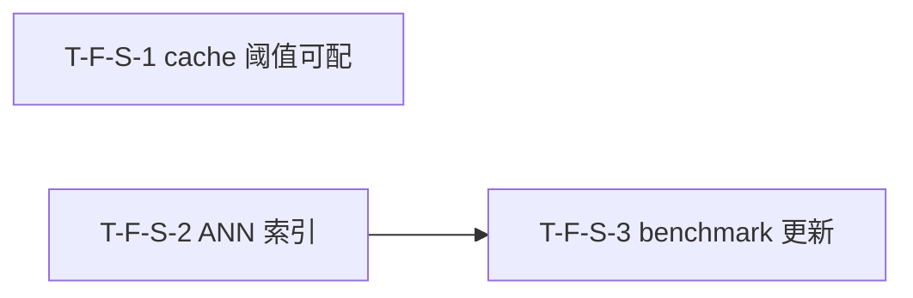

# Tasks Delta — v1.14.0（2026-09-06）

> 04 任务拆解 delta。semantic 性能优化轮：cache 阈值可配 + ANN 索引替代全量 cosine + benchmark 更新。3 Task（1:1 对应 3 Spec F-S-1..3），2 Wave，DAG 无环（S-2→S-3 单向边，S-1 独立），与 decomposition 一致。基线含 v1.13.0（2179 passed, coverage 67.27%, tag v1.13.0@779d6cb）。

## WBS delta（追加行）

| task_id | spec_ref | 描述 | 类型 | 估时 | depends_on | files | acceptance | pms_module |
|---|---|---|---|---|---|---|---|---|
| T-F-S-1 | SPEC-F-S-1 | `engine.py` `_semantic_search` cache.get/set 路径增加 `SAW_SEMANTIC_CACHE_ENABLED` / `SAW_SEMANTIC_CACHE_THRESHOLD_MS` 条件分支（false→跳过 cache.get/set；threshold>0 + API 延迟<阈值→跳过 cache.set，cache.get 仍执行）+ `settings.py` 新增 `_semantic_cache_enabled()` / `_semantic_cache_threshold_ms()` 配置项（复用 `os.environ.get` 范式，非法值回退默认+warning）+ `benchmark_semantic.py` 阈值读 env（benchmark 走生产路径时自动尊重 env 配置）+ `CHANGELOG.md` 追加 v1.14.0 cache 可配条目 + 新建 `tests/unit/test_semantic_cache_config.py`（5 用例：禁用/启用默认/阈值跳过/向后兼容/keyword 不受影响，全 mock embedding CI 始终跑） | backend-logic | M | — | src/saw/engines/query/engine.py, src/saw/config/settings.py, scripts/benchmark_semantic.py, CHANGELOG.md, tests/unit/test_semantic_cache_config.py | AC-A-1, AC-A-2, AC-A-3, AC-A-4, AC-A-5 | semantic-perf |
| T-F-S-2 | SPEC-F-S-2 | `engine.py` `_semantic_search` 规模驱动切 ANN：`embedding_store` 行数 > `SAW_ANN_THRESHOLD`（默认 500 [TBD]）→ hnswlib ANN 索引检索 top-K（`.saw/ann_index_<ws>.bin` lazy load）；≤ 阈值 → numpy 批量矩阵乘 cosine；ANN 失败 → numpy cosine fallback + `meta.ann_fallback: true` + `embeddings.py` 新增 `batch_cosine_similarity(query_vec, matrix)` 函数（numpy 矩阵乘 + L2 normalize）+ `related_pages.py` `compute_related_pages` 复用 ANN/批量 cosine 路径（不逐条 SELECT+cosine）+ `pyproject.toml` 新增 `hnswlib` 到 `[semantic]` extra + 新建 `tests/unit/test_ann_search.py`（5 用例：ANN 切换/小规模 cosine/降级/召回一致/related_pages 复用，mock embedding+mock hnswlib CI 跑）+ 新建 `tests/unit/test_related_pages_ann.py` | backend-logic | L | — | src/saw/engines/query/engine.py, src/saw/adapters/embeddings.py, src/saw/engines/query/related_pages.py, pyproject.toml, tests/unit/test_ann_search.py, tests/unit/test_related_pages_ann.py | AC-B-1, AC-B-2, AC-B-3, AC-B-4, AC-B-5 | semantic-perf |
| T-F-S-3 | SPEC-F-S-3 | `scripts/benchmark_semantic.py` 更新：`_measure_cache_hit` 改通过 `QueryEngine._semantic_search` 生产路径 + `cache.stats().hits` 计数（非延迟比较 `lat2 < lat1*0.5`）+ 新增 `_measure_ann_vs_cosine`（强制 `SAW_ANN_THRESHOLD=0` 走 ANN / `=999999` 走 cosine，分别 P99）+ 新增 `_measure_scale_curve`（100/500/1000/5000 合成随机向量数据集，仅 P99 用真实 vLLM）+ 输出 JSON 新增 `ann_vs_cosine` / `scale_curve` 字段 + 扩 `tests/unit/test_embedding_benchmark.py`（AC-C-1 mock cache stats / AC-C-2/3 标 `@pytest.mark.benchmark_e2e` CI 无 vLLM skip / AC-C-4 mock 不可达报错 exit 1 / AC-C-5 mock CI 始终跑） | infra | M | T-F-S-2 | scripts/benchmark_semantic.py, tests/unit/test_embedding_benchmark.py | AC-C-1, AC-C-2, AC-C-3, AC-C-4, AC-C-5 | semantic-perf |

## DAG delta（Mermaid）

### DAG 校验
- 拓扑序无环：S-1 独立（无入边无出边）；S-2→S-3 单向边；无回边 ✓
- 与 decomposition DEPENDENCY-GRAPH v1.14.0 delta 一致（F-S-2→F-S-3，F-S-1 独立）✓
- 无自环、无环。若 05 重构致环 → 报错停步。

### 关键路径
T-F-S-2 → T-F-S-3（2 步，最长链）
- S-1 独立，与 S-2 可 Wave 1 并行。

### 并行机会
- Wave 1：T-F-S-1 / T-F-S-2 全并行（不同代码路径，engine.py 不同 section）。
- Wave 2：T-F-S-3 独占（依赖 S-2 ANN 路径完成）。

## Wave 重排（v1.14.0）

| Wave | Task 集合 | 可并行性 | 里程碑 |
|---|---|---|---|
| Wave 1 | T-F-S-1 / T-F-S-2 | 2 路并行（engine.py 不同 section：cache 条件分支 vs cosine→ANN 切换） | cache 可配 + ANN 索引就绪 |
| Wave 2 | T-F-S-3 | 独占（依赖 S-2 ANN 路径） | benchmark 更新就绪 → v1.14.0 可交付 |

### 共享资源串行
- `scripts/benchmark_semantic.py`：T-F-S-1（Wave 1，阈值读 env 小改）→ T-F-S-3（Wave 2，大规模更新 cache/ANN/scale）。Wave 1→2 串行，无并行写冲突。
- `src/saw/engines/query/engine.py`：T-F-S-1（cache 条件分支）+ T-F-S-2（cosine→ANN 切换）均 Wave 1 写同文件不同 section。05 实施须 worktree 隔离 + 合并协调（不同代码段，merge 可行）。

### Wave 1 文件冲突分析
| 文件 | Wave 1 写入方 | 新建? | 冲突? |
|---|---|---|---|
| src/saw/engines/query/engine.py | T-F-S-1 + T-F-S-2 | 否 | 同文件不同 section（cache 条件分支 vs cosine→ANN），需合并协调 |
| src/saw/config/settings.py | T-F-S-1 | 否 | 否（仅 S-1） |
| scripts/benchmark_semantic.py | T-F-S-1 | 否 | 否（S-3 在 Wave 2） |
| CHANGELOG.md | T-F-S-1 | 否 | 否（仅 S-1） |
| tests/unit/test_semantic_cache_config.py | T-F-S-1 | 是 | 否 |
| src/saw/adapters/embeddings.py | T-F-S-2 | 否 | 否（仅 S-2） |
| src/saw/engines/query/related_pages.py | T-F-S-2 | 否 | 否（仅 S-2） |
| pyproject.toml | T-F-S-2 | 否 | 否（仅 S-2） |
| tests/unit/test_ann_search.py | T-F-S-2 | 是 | 否 |
| tests/unit/test_related_pages_ann.py | T-F-S-2 | 是 | 否 |

> 并行检测结论：Wave 1 两 Task 文件集无重叠（engine.py 为同文件不同 section，05 实施 worktree 隔离 + 合并协调即可，不阻塞并行启动）。Wave 1 并行安全。

## AC 归属

| AC | Task | Spec | 断言 |
|---|---|---|---|
| AC-A-1（cache 禁用） | T-F-S-1 | SPEC-F-S-1 | 设 `SAW_SEMANTIC_CACHE_ENABLED=false`，连续两次相同 semantic 查询 → `cache.stats().hits` 不增加 |
| AC-A-2（cache 启用默认） | T-F-S-1 | SPEC-F-S-1 | 无 env 或 `=true`，连续两次相同查询 → 第 2 次 `cache.stats().hits` 增加 |
| AC-A-3（阈值跳过写入） | T-F-S-1 | SPEC-F-S-1 | 设 `SAW_SEMANTIC_CACHE_THRESHOLD_MS=100`，mock embedding API 响应 <100ms → cache.set 跳过（新查询不写入），cache.get 仍可命中已有缓存 |
| AC-A-4（向后兼容） | T-F-S-1 | SPEC-F-S-1 | 无任何 `SAW_SEMANTIC_CACHE_*` env → 行为与 v1.13.0 一致（cache 始终启用） |
| AC-A-5（keyword cache 不受影响） | T-F-S-1 | SPEC-F-S-1 | 设 `SAW_SEMANTIC_CACHE_ENABLED=false`，连续两次相同 keyword 查询 → keyword cache 正常命中（`mode=search` 不受影响） |
| AC-B-1（ANN 自动切换） | T-F-S-2 | SPEC-F-S-2 | mock embedding_store 行数 > `SAW_ANN_THRESHOLD` → semantic 查询 → `meta.ann_search: true` |
| AC-B-2（小规模 cosine） | T-F-S-2 | SPEC-F-S-2 | mock embedding_store 行数 ≤ `SAW_ANN_THRESHOLD` → `meta` 不含 ANN 标记 |
| AC-B-3（ANN 降级） | T-F-S-2 | SPEC-F-S-2 | mock hnswlib `ImportError`/索引损坏 → 降级 cosine，`meta.ann_fallback: true`，不报错 |
| AC-B-4（召回一致性） | T-F-S-2 | SPEC-F-S-2 | 构建小数据集，ANN 路径 vs cosine 路径 top-K 重叠率 ≥95% [TBD] |
| AC-B-5（related_pages 复用） | T-F-S-2 | SPEC-F-S-2 | mock 规模 > 阈值 → `compute_related_pages` 走 ANN 路径，不逐条 SELECT+cosine |
| AC-C-1（cache 命中真实度量） | T-F-S-3 | SPEC-F-S-3 | 通过 `QueryEngine._semantic_search` 跑查询 → 检查 `cache.stats().hits` → 第 2 次后 hits 增加（非延迟比较） |
| AC-C-2（ANN vs cosine 对比） | T-F-S-3 | SPEC-F-S-3 | 构建 ≥1k 数据集 → 分别跑 ANN 和 cosine → JSON 含 `ann_p99_ms` + `cosine_p99_ms` |
| AC-C-3（规模延迟曲线） | T-F-S-3 | SPEC-F-S-3 | 生成 100/500/1000/5000 数据集 → JSON 含 `scale_curve: [{doc_count, p99_ms}, ...]` |
| AC-C-4（vLLM 不可达报错） | T-F-S-3 | SPEC-F-S-3 | mock vLLM 不可达 → benchmark 报 "unreachable" 退出（exit 1），不 mock |
| AC-C-5（cache 单元测试 CI 可跑） | T-F-S-3 | SPEC-F-S-3 | CI 跑 cache 命中测试（mock embedding）→ pass，无 skip marker |

## files 归属

| 文件 | Task | 新建? | 说明 |
|---|---|---|---|
| src/saw/engines/query/engine.py | T-F-S-1 + T-F-S-2 | 否 | S-1: cache.get/set 条件分支；S-2: cosine→ANN 规模驱动切换（不同 section） |
| src/saw/config/settings.py | T-F-S-1 | 否 | 新增 `_semantic_cache_enabled()` / `_semantic_cache_threshold_ms()` |
| scripts/benchmark_semantic.py | T-F-S-1 + T-F-S-3 | 否 | S-1: 阈值读 env（Wave 1 小改）；S-3: cache/ANN/scale 大规模更新（Wave 2） |
| CHANGELOG.md | T-F-S-1 | 否 | 追加 v1.14.0 cache 可配条目 |
| tests/unit/test_semantic_cache_config.py | T-F-S-1 | 是 | 5 用例：禁用/启用默认/阈值跳过/向后兼容/keyword 不受影响 |
| src/saw/adapters/embeddings.py | T-F-S-2 | 否 | 新增 `batch_cosine_similarity()` numpy 矩阵乘函数 |
| src/saw/engines/query/related_pages.py | T-F-S-2 | 否 | `compute_related_pages` 复用 ANN/批量 cosine 路径 |
| pyproject.toml | T-F-S-2 | 否 | 新增 `hnswlib` 到 `[semantic]` extra |
| tests/unit/test_ann_search.py | T-F-S-2 | 是 | 5 用例：ANN 切换/小规模 cosine/降级/召回一致/related_pages 复用 |
| tests/unit/test_related_pages_ann.py | T-F-S-2 | 是 | related_pages ANN 路径复用断言 |
| tests/unit/test_embedding_benchmark.py | T-F-S-3 | 否（扩） | AC-C-1/4/5 CI 跑 + AC-C-2/3 标 marker skip if no vLLM |

## 类型分派矩阵
| 类型 | Task | 推荐分派 |
|---|---|---|
| backend-logic | T-F-S-1 | 后端（engine.py cache 条件分支 + settings.py env + CHANGELOG） |
| backend-logic | T-F-S-2 | 后端（engine.py ANN 切换 + embeddings.py batch cosine + related_pages.py 复用 + pyproject.toml hnswlib） |
| infra | T-F-S-3 | DevOps（benchmark 脚本更新 + test marker） |

## 拆解门控
- [x] Spec 完整性：3 Task == 3 Spec（03 穷尽门控通过，3 Spec == 3 原子 Feature F-S-1..3）
- [x] 每个 Feature 有 ≥1 Task（3/3）
- [x] Task 粒度 ≤4h（M×2 / L×1，L=接近 4h 上限但不超）
- [x] DAG 无环（S-2→S-3 单向边，S-1 独立，拓扑序无回边）
- [x] Task 依赖与 decomposition Feature 依赖一致（F-S-2→F-S-3，F-S-1 独立）
- [x] Wave 划分合理（Wave 1 S-1/S-2 并行；Wave 2 S-3 依赖 S-2；`benchmark_semantic.py` 跨 Wave 串行）
- [x] 每 Task acceptance 非空（指向 AC，共 15 AC 全映射）
- [x] 不越 PMS 边界（semantic-perf 模块）
- [x] 并行检测通过（Wave 1 两 Task 文件集无重叠，engine.py 同文件不同 section 需合并协调）

## assumptions / [TBD]
- `SAW_ANN_THRESHOLD` 默认值 500 [TBD]（须 05 实施后 benchmark 实测确认 cosine 可接受延迟的拐点）
- ANN 召回率 ≥95% [TBD]（须 benchmark 验证）
- ANN 索引增量更新策略 [TBD]（05 实施时决定增量更新 vs 下次 rebuild 全量重建）
- ANN P99 / cosine P99 实际值 [TBD]（benchmark 跑完填）
- 规模延迟曲线实际值 [TBD]（benchmark 跑完填）
- `SAW_SEMANTIC_CACHE_THRESHOLD_MS` 实际效果 [TBD]（须 benchmark 验证）
