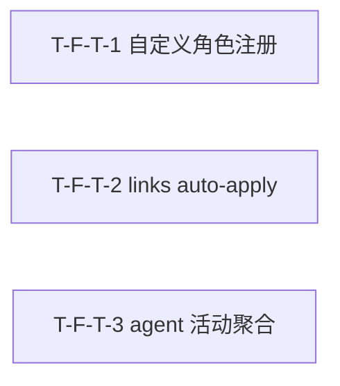

# Tasks Delta — v1.15.0（2026-09-06）

> 04 任务拆解 delta。agent/link 能力轮：自定义 agent 角色注册 + L2 links auto-apply + M2 agent 活动聚合。3 Task（1:1 对应 3 Spec F-T-1..3），1 Wave 全并行，DAG 无环（3 Task 互相独立，无边），与 decomposition 一致。基线含 v1.14.0（2192 passed, coverage 67.34%, tag v1.14.0@136befe）。

## WBS delta（追加行）

| task_id | spec_ref | 描述 | 类型 | 估时 | depends_on | files | acceptance | pms_module |
|---|---|---|---|---|---|---|---|---|
| T-F-T-1 | SPEC-F-T-1 | `agents/__init__.py` 新增 `load_custom_agents(llm_router, agents_dir)` 扫描 `.saw/agents/*.yaml`（yaml.safe_load + name/model_tier/system_prompt/tools_allowed/constraints 校验 + 重名跳过 warning + 非法 model_tier 跳过 + 空 prompt 跳过 + 目录不存在降级）+ 新增 `build_agent_roster(llm_router, feedback_engine)` additive 合并 `build_default_agents` + custom 角色（不改 `build_default_agents` 源码/签名）+ `collaborate.py` `list_agents()` 改调 `build_agent_roster` + `custom: true` 标记 + `agents_cmd.py` CLI 输出含自定义角色（标注 custom）+ `workflow_parser.py` `validate()` available_agents 含自定义角色 + 新建 `tests/unit/test_custom_agents.py`（AC-A-1/2/3：注册/validate/重名跳过，tmp_path fixture，无 LLM）+ 扩 `tests/unit/test_agents_rest.py`（AC-A-4：GET /api/v1/agents 含 custom: true） | backend-logic | M | — | src/saw/engines/collaborate/agents/__init__.py, src/saw/api/routes/collaborate.py, src/saw/drivers/cli/commands/agents_cmd.py, src/saw/engines/collaborate/workflow_parser.py, tests/unit/test_custom_agents.py, tests/unit/test_agents_rest.py | AC-A-1, AC-A-2, AC-A-3, AC-A-4 | agent-link |
| T-F-T-2 | SPEC-F-T-2 | `links_cmd.py` 新增 `apply` 子命令（`saw links apply <page> [--path] [--confirm] [--top N] [--dry-run] [--suggestion <slug>]`）：复用 `compute_related_pages` suggest 输出 → 去重过滤已链接（`extract_unique_targets` + `slugify`）→ 默认 dry-run 打印表格不写回 → `--confirm` 写回 `WikiRepository.write()`（`## Related` 段落追加 `[[link]]` 或新建段落 + frontmatter `related` 字段同步 + 单页失败不中断）+ `--suggestion` 单条应用 + 去重检查（content 含 `[[slug]]` 或 related 含 slug → skipped）+ 新建 `tests/unit/test_links_apply.py`（AC-B-1/2/3/4：dry-run 不写回/confirm 写回 ## Related+related/去重/audit 无新断链，tmp_path wiki + mock compute_related_pages） | backend-logic | M | — | src/saw/drivers/cli/commands/links_cmd.py, tests/unit/test_links_apply.py | AC-B-1, AC-B-2, AC-B-3, AC-B-4 | agent-link |
| T-F-T-3 | SPEC-F-T-3 | 新建 `src/saw/engines/collaborate/activity_tracker.py`（`AgentActivityTracker` 类：`subscribe(event_bus)` 调 `add_subscriber("WorkflowStep", handler)` + `_handle_event` 解析 `{agent}.{action}` 更新内存计数器 calls/failures/last_action/last_active_at + handler try/except 不传播 + `get_activity(name)` 返回聚合 + `get_summary(name)` 返回紧凑摘要或 None）+ `collaborate.py` 新增 `GET /api/v1/agents/{name}/activity` 端点（200 有活动/200 空活动 calls=0/404 agent 不存在）+ `list_agents()` 扩展 `activity_summary` 字段 + `drivers/web/app.py` lifespan 初始化 tracker 绑定 `app.state` + `agents_cmd.py` 新增 `saw agents activity` 子命令 + 新建 `tests/unit/test_agent_activity.py`（AC-C-1/2：事件聚合/无活动空返回，mock event 直接调 handler）+ 扩 `tests/unit/test_agents_rest.py`（AC-C-3/4：404/agents 端点含 activity_summary，TestClient + mock tracker） | backend-logic | M | — | src/saw/engines/collaborate/activity_tracker.py, src/saw/api/routes/collaborate.py, src/saw/drivers/web/app.py, src/saw/drivers/cli/commands/agents_cmd.py, tests/unit/test_agent_activity.py, tests/unit/test_agents_rest.py | AC-C-1, AC-C-2, AC-C-3, AC-C-4 | agent-link |

## DAG delta（Mermaid）

### DAG 校验
- 拓扑序无环：T-1 / T-2 / T-3 互相独立，无依赖边，无回边 ✓
- 与 decomposition DEPENDENCY-GRAPH v1.15.0 delta 一致（F-T-1 / F-T-2 / F-T-3 全独立，无边）✓
- 无自环、无环。若 05 重构致环 → 报错停步。

### 关键路径
- 无关键路径（3 Task 无依赖，全并行 1 步完成）。

### 并行机会
- Wave 1：T-F-T-1 / T-F-T-2 / T-F-T-3 全并行（3 路独立，不同关注点：角色注册 / 链接写回 / 活动聚合）。

## Wave 重排（v1.15.0）

| Wave | Task 集合 | 可并行性 | 里程碑 |
|---|---|---|---|
| Wave 1 | T-F-T-1 / T-F-T-2 / T-F-T-3 | 3 路并行（不同代码路径：agents 模块 / links_cmd + wiki_repository / activity_tracker + event_bus + REST） | 自定义角色注册 + links apply + 活动聚合就绪 → v1.15.0 可交付 |

### 共享资源串行
- 无串行依赖。3 Task 全独立，Wave 1 全并行。
- 文件分工：
  - T-F-T-1：`engines/collaborate/agents/__init__.py`（load_custom_agents + build_agent_roster）+ `api/routes/collaborate.py`（list_agents custom 标记）+ `drivers/cli/commands/agents_cmd.py`（CLI custom 标注）+ `engines/collaborate/workflow_parser.py`（validate available_agents 含自定义）+ 新建 2 测试文件
  - T-F-T-2：`drivers/cli/commands/links_cmd.py`（apply 子命令）+ 新建 1 测试文件（复用 `related_pages.py` / `wiki_repository.py` 不改动）
  - T-F-T-3：新建 `engines/collaborate/activity_tracker.py` + `api/routes/collaborate.py`（activity 端点 + activity_summary）+ `drivers/web/app.py`（lifespan init）+ `drivers/cli/commands/agents_cmd.py`（activity 子命令）+ 新建 1 + 扩 1 测试文件

### Wave 1 文件冲突分析
| 文件 | Wave 1 写入方 | 新建? | 冲突? |
|---|---|---|---|
| src/saw/engines/collaborate/agents/__init__.py | T-F-T-1 | 否 | 否（仅 T-1） |
| src/saw/api/routes/collaborate.py | T-F-T-1 + T-F-T-3 | 否 | 同文件不同端点（T-1: list_agents custom 标记 / T-3: GET /agents/{name}/activity 新增 + activity_summary 扩展），需合并协调 |
| src/saw/drivers/cli/commands/agents_cmd.py | T-F-T-1 + T-F-T-3 | 否 | 同文件不同子命令（T-1: custom 标注输出 / T-3: activity 子命令），需合并协调 |
| src/saw/engines/collaborate/workflow_parser.py | T-F-T-1 | 否 | 否（仅 T-1） |
| src/saw/drivers/cli/commands/links_cmd.py | T-F-T-2 | 否 | 否（仅 T-2） |
| src/saw/engines/collaborate/activity_tracker.py | T-F-T-3 | 是 | 否（仅 T-3 新建） |
| src/saw/drivers/web/app.py | T-F-T-3 | 否 | 否（仅 T-3） |
| tests/unit/test_custom_agents.py | T-F-T-1 | 是 | 否 |
| tests/unit/test_links_apply.py | T-F-T-2 | 是 | 否 |
| tests/unit/test_agent_activity.py | T-F-T-3 | 是 | 否 |
| tests/unit/test_agents_rest.py | T-F-T-1 + T-F-T-3 | 否（扩） | 同测试文件不同用例（T-1: AC-A-4 / T-3: AC-C-3/4），需合并协调 |

> 并行检测结论：Wave 1 三 Task 可全并行启动。`collaborate.py` / `agents_cmd.py` / `test_agents_rest.py` 为同文件不同 section/用例，05 实施须 worktree 隔离 + 合并协调（不同代码段，merge 可行）。不阻塞并行启动。

## AC 归属

| AC | Task | Spec | 断言 |
|---|---|---|---|
| AC-A-1（自定义角色注册并出现在 roster） | T-F-T-1 | SPEC-F-T-1 | 创建 `.saw/agents/expert.yaml` → `build_agent_roster(llm_router=None)` → roster 含 MedicalExpert，model_tier 正确 |
| AC-A-2（自定义角色被 workflow 引用 validate 无错误） | T-F-T-1 | SPEC-F-T-1 | MedicalExpert 已注册 → workflow YAML step.agent=MedicalExpert → `WorkflowParser.validate()` 无错误 |
| AC-A-3（重名角色被拒绝跳过+warning） | T-F-T-1 | SPEC-F-T-1 | 创建 name=Librarian 的自定义 yaml → `load_custom_agents()` → 该角色被跳过 |
| AC-A-4（REST 返回自定义角色 custom:true） | T-F-T-1 | SPEC-F-T-1 | 注册 MedicalExpert → `GET /api/v1/agents` → 响应含 MedicalExpert + `custom: true` |
| AC-B-1（dry-run 预览不写回） | T-F-T-2 | SPEC-F-T-2 | `saw links apply A`（无 --confirm）→ 打印建议链接，文件内容不变 |
| AC-B-2（confirm 写回 ## Related + related 同步） | T-F-T-2 | SPEC-F-T-2 | `saw links apply A --confirm` → 页面新增 `## Related` 段落含 `[[link]]` + frontmatter `related` 同步 |
| AC-B-3（已有链接不重复 skipped） | T-F-T-2 | SPEC-F-T-2 | 页面已含 `[[page-b]]` → `saw links apply A --confirm` → page-b 在 skipped，文件中 `[[page-b]]` 出现 1 次 |
| AC-B-4（apply 后 audit 无新断链） | T-F-T-2 | SPEC-F-T-2 | apply 后 `saw links audit` → 无新 broken links |
| AC-C-1（activity 端点返回聚合数据） | T-F-T-3 | SPEC-F-T-3 | 发布 WorkflowStep 事件 `{"step":"Scholar.synthesize","status":"completed"}` → `tracker.get_activity("Scholar")` calls≥1, last_action 非空 |
| AC-C-2（无活动的 agent 返回空活动） | T-F-T-3 | SPEC-F-T-3 | `tracker.get_activity("Guardian")`（从未发布 Guardian 事件）→ calls=0, last_active_at=null |
| AC-C-3（不存在的 agent 返回 404） | T-F-T-3 | SPEC-F-T-3 | `GET /api/v1/agents/NonExistent/activity` → 404 |
| AC-C-4（agents 端点含 activity_summary） | T-F-T-3 | SPEC-F-T-3 | 发布 3 次 Scholar 事件 → `GET /api/v1/agents` → Scholar 行含 `activity_summary: {calls: 3, ...}` |

## files 归属

| 文件 | Task | 新建? | 说明 |
|---|---|---|---|
| src/saw/engines/collaborate/agents/__init__.py | T-F-T-1 | 否 | load_custom_agents() + build_agent_roster() 新增函数（不改 build_default_agents） |
| src/saw/api/routes/collaborate.py | T-F-T-1 + T-F-T-3 | 否 | T-1: list_agents() custom 标记；T-3: GET /agents/{name}/activity 新增 + activity_summary 扩展（不同端点/section） |
| src/saw/drivers/cli/commands/agents_cmd.py | T-F-T-1 + T-F-T-3 | 否 | T-1: agents CLI 输出含 custom 标注；T-3: activity 子命令（不同子命令/section） |
| src/saw/engines/collaborate/workflow_parser.py | T-F-T-1 | 否 | validate() available_agents 含自定义角色 |
| src/saw/drivers/cli/commands/links_cmd.py | T-F-T-2 | 否 | apply 子命令新增（suggest 消费 + dry-run/confirm + 写回 + 去重） |
| src/saw/engines/collaborate/activity_tracker.py | T-F-T-3 | 是 | AgentActivityTracker 类（subscribe + _handle_event + get_activity + get_summary） |
| src/saw/drivers/web/app.py | T-F-T-3 | 否 | lifespan 初始化 tracker + 绑定 app.state |
| tests/unit/test_custom_agents.py | T-F-T-1 | 是 | AC-A-1/2/3（注册/validate/重名跳过，tmp_path，无 LLM） |
| tests/unit/test_links_apply.py | T-F-T-2 | 是 | AC-B-1/2/3/4（dry-run/confirm/去重/audit，tmp_path wiki + mock） |
| tests/unit/test_agent_activity.py | T-F-T-3 | 是 | AC-C-1/2（事件聚合/空返回，mock event 直接调 handler） |
| tests/unit/test_agents_rest.py | T-F-T-1 + T-F-T-3 | 否（扩） | T-1: AC-A-4 custom:true；T-3: AC-C-3/4 404+activity_summary（不同用例） |

## 类型分派矩阵
| 类型 | Task | 推荐分派 |
|---|---|---|
| backend-logic | T-F-T-1 | 后端（YAML 加载 + additive 合并 + CLI/REST 可见 + workflow validate） |
| backend-logic | T-F-T-2 | 后端（links apply CLI 逻辑 + WikiRepository.write 复用 + 去重） |
| backend-logic | T-F-T-3 | 后端（event_bus subscriber + 内存计数器 + REST activity 端点 + CLI） |

## 拆解门控
- [x] Spec 完整性：3 Task == 3 Spec（03 穷尽门控通过，3 Spec == 3 原子 Feature F-T-1..3）
- [x] 每个 Feature 有 ≥1 Task（3/3）
- [x] Task 粒度 ≤4h（M×3，均在 4h 内）
- [x] DAG 无环（T-1/T-2/T-3 互相独立，无依赖边，拓扑序无回边）
- [x] Task 依赖与 decomposition Feature 依赖一致（F-T-1/F-T-2/F-T-3 全独立无边）
- [x] Wave 划分合理（Wave 1 三 Task 全并行，无共享资源串行约束）
- [x] 每 Task acceptance 非空（指向 AC，共 12 AC 全映射）
- [x] 不越 PMS 边界（agent-link 模块）
- [x] 并行检测通过（Wave 1 三 Task 文件集无硬重叠，`collaborate.py`/`agents_cmd.py`/`test_agents_rest.py` 同文件不同 section 需合并协调）

## assumptions / [TBD]
- 自定义角色 YAML schema 实际用户使用场景 [TBD]（05 实施后 CI 验证）
- links apply 实际建议质量 [TBD]（取决于 compute_related_pages 既有算法质量）
- activity 聚合实际事件频率 [TBD]（取决于 workflow 执行频率，内存态不持久化）
- `collaborate.py` / `agents_cmd.py` / `test_agents_rest.py` 合并冲突解决方案 [TBD]（05 实施时 worktree 隔离 + 合并协调）
