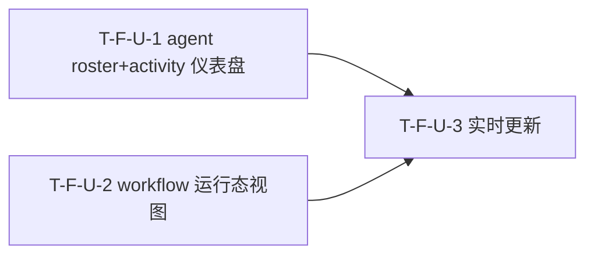

# Tasks Delta — v1.16.0（2026-09-07）

> 04 任务拆解 delta。realtime 仪表盘 v4.3 轮：agent roster+activity 仪表盘 + workflow 运行态视图 + 实时更新。3 Task（1:1 对应 3 Spec F-U-1..3），2 Wave，DAG U-1+U-2→U-3 无环（与 decomposition 一致）。基线含 v1.15.0（2220 passed, coverage 67.42%, tag v1.15.0@d5b644f）。纯前端消费 v1.15.0 后端 REST 端点，不新增后端端点。

## WBS delta（追加行）

| task_id | spec_ref | 描述 | 类型 | 估时 | depends_on | files | acceptance | pms_module |
|---|---|---|---|---|---|---|---|---|
| T-F-U-1 | SPEC-F-U-1 | `Dashboard.tsx` 接 react-query 拉 `GET /api/v1/agents` 渲染 roster 表 + 点击展开 `GET /agents/{name}/activity` 详情；新建 `useAgents.ts`（`useQuery` + `refetchInterval: 15000`）+ `useAgentActivity.ts`（`enabled by click` + `refetchInterval: 15000`）；扩展 `AgentList.tsx`（接受 REST roster props + WS live status 覆盖 + activity_summary 列 + custom 标记）+ `AgentCard.tsx`（显示 calls/failures/last_active_at + custom 标记 + activity null "—"）；新增 `AgentActivityDetail`（calls/failures/last_action/last_active_at + 空态/404）；`types/api.ts` 新增 `AgentRosterEntry`/`AgentActivity`/`ActivitySummary` 类型；WS `agent_status` 经 `invalidateQueries(['agents'])` 触发 REST refetch（既有逻辑）；新建 `test_agent_roster_render.test.tsx`/`test_agent_activity_detail.test.tsx`/`test_agent_activity_null.test.tsx`/`test_agent_activity_404.test.tsx`（vitest + @testing-library/react + vi.mock） | frontend | M | — | web/src/pages/Dashboard.tsx, web/src/components/dashboard/AgentList.tsx, web/src/components/dashboard/AgentCard.tsx, web/src/hooks/useAgents.ts, web/src/hooks/useAgentActivity.ts, web/src/types/api.ts, web/src/lib/api.ts, web/tests/test_agent_roster_render.test.tsx, web/tests/test_agent_activity_detail.test.tsx, web/tests/test_agent_activity_null.test.tsx, web/tests/test_agent_activity_404.test.tsx | AC-D-1, AC-D-2, AC-D-3, AC-D-4 | dashboard |
| T-F-U-2 | SPEC-F-U-2 | `Dashboard.tsx` 新增 `WorkflowRuntimeSection` 区域；新建 `WorkflowList.tsx`（workflow 列表表格 + running 置顶排序 + 空态 + 5xx 错误条 + live 标记）+ `WorkflowRow.tsx`（status badge + steps progress bar + live 标记 + 点击展开）；新建 `useWorkflows.ts`（`useQuery` 拉 `GET /api/v1/workflows` + `refetchInterval: 15000`）+ `useWorkflowStatus.ts`（`enabled by click` + `refetchInterval: 15000`）；`types/api.ts` 新增 `WorkflowExecution`/`WorkflowListResponse`/`WorkflowStatusDetail`/`WorkflowStep` 类型；WS `workflow_progress` 经 `invalidateQueries(['workflows'])` 触发 REST refetch（F-U-3 扩展 useWebSocket，本 Spec 标注改动点）；新建 `test_workflow_list_render.test.tsx`/`test_workflow_running_top.test.tsx`/`test_workflow_ws_update.test.tsx`（vitest + vi.mock） | frontend | M | — | web/src/pages/Dashboard.tsx, web/src/components/dashboard/WorkflowList.tsx, web/src/components/dashboard/WorkflowRow.tsx, web/src/hooks/useWorkflows.ts, web/src/hooks/useWorkflowStatus.ts, web/src/types/api.ts, web/src/lib/api.ts, web/tests/test_workflow_list_render.test.tsx, web/tests/test_workflow_running_top.test.tsx, web/tests/test_workflow_ws_update.test.tsx | AC-D-5, AC-D-6, AC-D-7 | dashboard |
| T-F-U-3 | SPEC-F-U-3 | `useWebSocket.ts` 扩展：`agent_status` case + `workflow_progress` case + `onopen` 均追加 `invalidateQueries({ queryKey: ['workflows'] })`（复用既有 invalidateQueries 范式）；`Dashboard.tsx` 新增 polling 失败计数器（`useRef(0)` + 3 次阈值）+ 降级横幅渲染（3 种降级状态：WS 断连 "Reconnecting..." / polling 3x 失败 "Failed to refresh" + Retry / 双源断 "Live updates paused"）+ 手动刷新按钮（`invalidateQueries()` 全量刷新 + 重置计数器）；`ConnectionStatus.tsx` 扩展降级状态显示；复用 `dashboardStore`（WS 推送仍更新 agents/activeWorkflow）+ `useAgents`/`useWorkflows`（F-U-1/F-U-2 已建好 refetchInterval: 15000）；新建 `test_ws_disconnect_polling_degraded.test.tsx`（vitest + vi.mock react-query + useWebSocket + dashboardStore） | frontend | M | T-F-U-1, T-F-U-2 | web/src/hooks/useWebSocket.ts, web/src/pages/Dashboard.tsx, web/src/components/dashboard/ConnectionStatus.tsx, web/src/stores/dashboardStore.ts, web/tests/test_ws_disconnect_polling_degraded.test.tsx | AC-D-8 | dashboard |

## DAG delta（Mermaid）

### DAG 校验
- 拓扑序无环：U-1 / U-2 独立无依赖（Wave 1 并行），U-1→U-3 + U-2→U-3（Wave 2），无回边 ✓
- 与 decomposition DEPENDENCY-GRAPH v1.16.0 delta 一致（F-U-1→F-U-3 + F-U-2→F-U-3，F-U-1/F-U-2 独立）✓
- 无自环、无环。若 05 重构致环 → 报错停步。

### 关键路径
T-F-U-1 → T-F-U-3（2 步，最长链，与 U-2→U-3 等长）
- U-1/U-2 并行可压缩 Wave 1 段，U-3 Wave 2 依赖两者完成。

### 并行机会
- Wave 1：T-F-U-1 / T-F-U-2 全并行（2 路独立，不同数据源 + 不同组件：agents roster 表 vs workflow 列表；`Dashboard.tsx`/`types/api.ts` 同文件不同 section，需合并协调）。
- Wave 2：T-F-U-3 独占（依赖 U-1 useAgents + U-2 useWorkflows 已建好 react-query 查询）。

## Wave 重排（v1.16.0）

| Wave | Task 集合 | 可并行性 | 里程碑 |
|---|---|---|---|
| Wave 1 | T-F-U-1 / T-F-U-2 | 2 路并行（不同数据源 + 不同组件：GET /api/v1/agents roster 表 + activity 详情 vs GET /api/v1/workflows 列表 + 步骤进度） | agent roster + workflow 列表就绪 → 实时更新可接入 |
| Wave 2 | T-F-U-3 | 独占（依赖 U-1 useAgents + U-2 useWorkflows 完成） | 实时更新 + 降级横幅就绪 → v1.16.0 可交付 |

### 共享资源串行
- `web/src/pages/Dashboard.tsx`：T-F-U-1（AgentRosterSection）+ T-F-U-2（WorkflowRuntimeSection）Wave 1 同文件不同区域 → 须合并协调（worktree 隔离 + 不同 section merge 可行）。
- `web/src/types/api.ts`：T-F-U-1（AgentRosterEntry/AgentActivity/ActivitySummary）+ T-F-U-2（WorkflowExecution/WorkflowListResponse/WorkflowStatusDetail/WorkflowStep）Wave 1 同文件不同类型 → 须合并协调。
- `web/src/hooks/useWebSocket.ts`：T-F-U-1 不改（只读既有 invalidateQueries），T-F-U-3（Wave 2）扩展追加 invalidateQueries(['workflows'])。Wave 1→2 串行，无并行写冲突。
- `web/src/stores/dashboardStore.ts`：T-F-U-3（Wave 2）复用不改（WS 推送仍更新 agents/activeWorkflow）。U-1/U-2 不改 store。

### Wave 1 文件冲突分析
| 文件 | Wave 1 写入方 | 新建? | 冲突? |
|---|---|---|---|
| web/src/pages/Dashboard.tsx | T-F-U-1 + T-F-U-2 | 否 | 同文件不同区域（AgentRosterSection vs WorkflowRuntimeSection），需合并协调 |
| web/src/types/api.ts | T-F-U-1 + T-F-U-2 | 否 | 同文件不同类型定义（AgentRosterEntry 等 vs WorkflowExecution 等），需合并协调 |
| web/src/components/dashboard/AgentList.tsx | T-F-U-1 | 否 | 否（仅 U-1） |
| web/src/components/dashboard/AgentCard.tsx | T-F-U-1 | 否 | 否（仅 U-1） |
| web/src/components/dashboard/WorkflowList.tsx | T-F-U-2 | 是 | 否（仅 U-2 新建） |
| web/src/components/dashboard/WorkflowRow.tsx | T-F-U-2 | 是 | 否（仅 U-2 新建） |
| web/src/hooks/useAgents.ts | T-F-U-1 | 是 | 否 |
| web/src/hooks/useAgentActivity.ts | T-F-U-1 | 是 | 否 |
| web/src/hooks/useWorkflows.ts | T-F-U-2 | 是 | 否 |
| web/src/hooks/useWorkflowStatus.ts | T-F-U-2 | 是 | 否 |
| web/src/lib/api.ts | T-F-U-1 + T-F-U-2 | 否 | 否（复用既有 api.get，不改） |
| web/tests/test_agent_*.test.tsx | T-F-U-1 | 是 | 否（4 文件独占） |
| web/tests/test_workflow_*.test.tsx | T-F-U-2 | 是 | 否（3 文件独占） |

> 并行检测结论：Wave 1 两 Task 可并行启动。`Dashboard.tsx`/`types/api.ts` 为同文件不同 section/类型，05 实施须 worktree 隔离 + 合并协调（不同代码段，merge 可行）。不阻塞并行启动。

### Wave 2 文件冲突分析
| 文件 | Wave 2 写入方 | 新建? | 冲突? |
|---|---|---|---|
| web/src/hooks/useWebSocket.ts | T-F-U-3 | 否 | 否（U-1/U-2 不改此文件） |
| web/src/pages/Dashboard.tsx | T-F-U-3 | 否 | 续写 Wave 1（U-1+U-2 已合并），追加 polling 计数器 + 降级横幅 |
| web/src/components/dashboard/ConnectionStatus.tsx | T-F-U-3 | 否 | 否（仅 U-3） |
| web/src/stores/dashboardStore.ts | T-F-U-3 | 否 | 否（复用不改） |
| web/tests/test_ws_disconnect_polling_degraded.test.tsx | T-F-U-3 | 是 | 否 |

## AC 归属

| AC | Task | Spec | 断言 |
|---|---|---|---|
| AC-D-1（roster 表渲染） | T-F-U-1 | SPEC-F-U-1 | mock `GET /api/v1/agents` 返回 ≥1 agent → render Dashboard → roster 表显示所有 agent，含 name/status/custom 标记/activity_summary.calls |
| AC-D-2（activity 详情展开） | T-F-U-1 | SPEC-F-U-1 | mock roster + `GET /api/v1/agents/{name}/activity` 返回 calls=5/failures=1 → 点击 agent 行 → 详情区展示完整 activity |
| AC-D-3（activity null 降级） | T-F-U-1 | SPEC-F-U-1 | mock `GET /api/v1/agents` 返回 agent activity_summary=null → roster → 计数列显示 "—"，不报错 |
| AC-D-4（activity 404 处理） | T-F-U-1 | SPEC-F-U-1 | mock `GET /api/v1/agents/NonExistent/activity` 返回 404 → 点击 → 详情区显示 "Agent not found" |
| AC-D-5（workflow 列表渲染） | T-F-U-2 | SPEC-F-U-2 | mock `GET /api/v1/workflows` 返回 ≥1 → render Dashboard → 列表显示所有行，含 id/status/step/progress/created_at |
| AC-D-6（workflow running 置顶） | T-F-U-2 | SPEC-F-U-2 | mock 返回 running + completed → render → running 行在 completed 行之前 |
| AC-D-7（WS workflow_progress 更新） | T-F-U-2 | SPEC-F-U-2 | render 列表 → mock WS workflow_progress → invalidateQueries 被调 with ['workflows']；列表不整体替换 |
| AC-D-8（WS 断连降级） | T-F-U-3 | SPEC-F-U-3 | mock WS disconnected + useAgents/useWorkflows 正常返回 → render Dashboard → 顶部 "Reconnecting..." 状态条 + roster/workflow 表仍渲染 |

> AC-D-9（后端不回归，pytest ≥ 2220 passed, ruff 0, coverage ≥ 67%）为系统级 NFR，不归属单一 Feature/Task，见 NFR delta。

## files 归属

| 文件 | Task | 新建? | 说明 |
|---|---|---|---|
| web/src/pages/Dashboard.tsx | T-F-U-1 + T-F-U-2 + T-F-U-3 | 否 | U-1: AgentRosterSection + useAgents/useAgentActivity 接入；U-2: WorkflowRuntimeSection + useWorkflows/useWorkflowStatus 接入；U-3: polling 计数器 + 降级横幅 + 手动刷新 |
| web/src/components/dashboard/AgentList.tsx | T-F-U-1 | 否 | 扩展：接受 REST roster props + WS live status 覆盖 + activity_summary 列 + custom 标记 |
| web/src/components/dashboard/AgentCard.tsx | T-F-U-1 | 否 | 扩展：显示 activity_summary.calls/failures/last_active_at + custom 标记 + null "—" |
| web/src/components/dashboard/WorkflowList.tsx | T-F-U-2 | 是 | workflow 列表表格 + running 置顶 + 空态 + 5xx 错误条 + live 标记 |
| web/src/components/dashboard/WorkflowRow.tsx | T-F-U-2 | 是 | 单行 + status badge + steps progress + live 标记 + 点击展开 |
| web/src/components/dashboard/ConnectionStatus.tsx | T-F-U-3 | 否 | 扩展：WS 断连降级状态显示 |
| web/src/hooks/useAgents.ts | T-F-U-1 | 是 | useQuery 拉 GET /api/v1/agents + refetchInterval: 15000 |
| web/src/hooks/useAgentActivity.ts | T-F-U-1 | 是 | useQuery 拉 GET /agents/{name}/activity + enabled by click + refetchInterval: 15000 |
| web/src/hooks/useWorkflows.ts | T-F-U-2 | 是 | useQuery 拉 GET /api/v1/workflows + refetchInterval: 15000 |
| web/src/hooks/useWorkflowStatus.ts | T-F-U-2 | 是 | useQuery 拉 GET /workflows/{id}/status + enabled by click + refetchInterval: 15000 |
| web/src/hooks/useWebSocket.ts | T-F-U-3 | 否 | 扩展：agent_status/workflow_progress/onopen 追加 invalidateQueries(['workflows']) |
| web/src/types/api.ts | T-F-U-1 + T-F-U-2 | 否 | U-1: AgentRosterEntry/AgentActivity/ActivitySummary；U-2: WorkflowExecution/WorkflowListResponse/WorkflowStatusDetail/WorkflowStep |
| web/src/stores/dashboardStore.ts | T-F-U-3 | 否 | 复用不改（WS 推送仍更新 agents/activeWorkflow） |
| web/src/lib/api.ts | T-F-U-1 + T-F-U-2 | 否 | 复用既有 api.get（不改） |
| web/tests/test_agent_roster_render.test.tsx | T-F-U-1 | 是 | AC-D-1 |
| web/tests/test_agent_activity_detail.test.tsx | T-F-U-1 | 是 | AC-D-2 |
| web/tests/test_agent_activity_null.test.tsx | T-F-U-1 | 是 | AC-D-3 |
| web/tests/test_agent_activity_404.test.tsx | T-F-U-1 | 是 | AC-D-4 |
| web/tests/test_workflow_list_render.test.tsx | T-F-U-2 | 是 | AC-D-5 |
| web/tests/test_workflow_running_top.test.tsx | T-F-U-2 | 是 | AC-D-6 |
| web/tests/test_workflow_ws_update.test.tsx | T-F-U-2 | 是 | AC-D-7 |
| web/tests/test_ws_disconnect_polling_degraded.test.tsx | T-F-U-3 | 是 | AC-D-8 |

## 类型分派矩阵
| 类型 | Task | 推荐分派 |
|---|---|---|
| frontend | T-F-U-1 | 前端（react-query hooks + AgentList/AgentCard 扩展 + types + vitest） |
| frontend | T-F-U-2 | 前端（WorkflowList/WorkflowRow 新建 + react-query hooks + types + vitest） |
| frontend | T-F-U-3 | 前端（useWebSocket 扩展 + polling 降级编排 + 降级横幅 + vitest） |

## 拆解门控
- [x] Spec 完整性：3 Task == 3 Spec（03 穷尽门控通过，3 Spec == 3 原子 Feature F-U-1..3）
- [x] 每个 Feature 有 ≥1 Task（3/3）
- [x] Task 粒度 ≤4h（M×3，均在 4h 内）
- [x] DAG 无环（U-1/U-2 独立，U-1→U-3 + U-2→U-3，拓扑序无回边）
- [x] Task 依赖与 decomposition Feature 依赖一致（F-U-1→F-U-3 + F-U-2→F-U-3，F-U-1/F-U-2 独立）
- [x] Wave 划分合理（Wave 1 U-1/U-2 并行，Wave 2 U-3 依赖 U-1+U-2；`Dashboard.tsx`/`types/api.ts` 同文件不同 section 需合并协调）
- [x] 每 Task acceptance 非空（指向 AC，共 8 AC 全映射 + AC-D-9 系统级 NFR）
- [x] 不越 PMS 边界（dashboard 模块）
- [x] 并行检测通过（Wave 1 两 Task 文件集 `Dashboard.tsx`/`types/api.ts` 同文件不同 section/类型，需合并协调；其余文件独占）

## assumptions / [TBD]
- polling interval 15s 实际体感延迟 [TBD]（05 实施后用户测试）
- WS 断连后 polling 降级横幅实际触发频率 [TBD]（取决于网络稳定性）
- `Dashboard.tsx`/`types/api.ts` 合并冲突解决方案 [TBD]（05 实施时 worktree 隔离 + 合并协调）
- live workflow 标记判定逻辑（`finished_at === null && status === 'running'` vs 后端 live merge 标记）[TBD]（05 实施时确认后端 list_workflows 返回结构）
