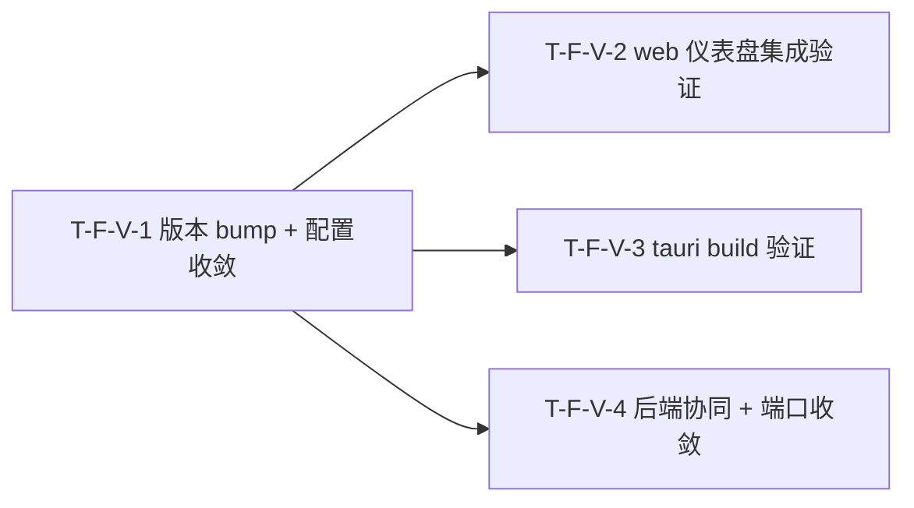

# Tasks Delta — v1.17.0（2026-09-07）

> 04 任务拆解 delta。desktop 完成 v4.4 轮：desktop 1.0 版本 bump + 配置收敛 / web 仪表盘集成验证 / tauri build 验证 / 后端协同 + 端口收敛。4 Task（1:1 对应 4 Spec F-V-1..4），2 Wave，DAG V-1→{V-2,V-3,V-4} 无环（与 decomposition 一致）。基线含 v1.16.0（vitest 64 passed, pytest 2217 passed 7 skipped, tag v1.16.0@57b9550）。desktop 0.1.0→1.0.0 版本对齐，验证 tauri build 产出原生包，收敛 dev/prod 后端协同端口。

## WBS delta（追加行）

| task_id | spec_ref | 描述 | 类型 | 估时 | depends_on | files | acceptance | pms_module |
|---|---|---|---|---|---|---|---|---|
| T-F-V-1 | SPEC-F-V-1 | 4 文件版本号 0.1.0→1.0.0（`desktop/package.json:4` + `desktop/src-tauri/tauri.conf.json:5` + `desktop/src-tauri/Cargo.toml:3` + `web/package.json:4`）+ tauri.conf.json 15 项配置一致性审查确认（`$schema`/`frontendDist`/`devUrl`/`beforeDevCommand`/`beforeBuildCommand`/`bundle.active`/`bundle.targets`/`Cargo.toml rust-version`/`edition`/`[profile.release]`/`macOS.minimumSystemVersion`/`entitlements`/`windows.webviewInstallMode`/`digestAlgorithm`/`linux.deb.depends`）无废弃字段；新建 `test_version_consistency.py`（grep 4 文件 version→断言全部 1.0.0）+ `test_tauri_config_consistency.py`（json.load tauri.conf.json→断言 frontendDist=../../web/dist, devUrl=http://localhost:5173, bundle.active=true, $schema v2, 无废弃字段） | infra | S | — | desktop/package.json, desktop/src-tauri/tauri.conf.json, desktop/src-tauri/Cargo.toml, web/package.json, tests/unit/test_version_consistency.py, tests/unit/test_tauri_config_consistency.py | AC-V-1, AC-V-2 | desktop |
| T-F-V-2 | SPEC-F-V-2 | 验证 desktop 加载 v1.16.0 仪表盘构建产出：`frontendDist=../../web/dist` 路径解析正确性（相对 `desktop/src-tauri/`→项目根 `web/dist/`）+ `web/dist/index.html` 存在性检查 + `beforeBuildCommand`/`beforeDevCommand` 构建链配置验证 + `@tauri-apps/api` ^2.0.0 集成验证 + `devUrl=http://localhost:5173` 指向 vite dev server 验证；新建 `test_web_dist_integration.py`（检查 web/dist/index.html 存在+引用 assets/ + tauri.conf.json frontendDist 断言）+ `test_web_dev_integration.py`（json.load tauri.conf.json devUrl+beforeDevCommand 断言） | frontend | M | T-F-V-1 | desktop/src-tauri/tauri.conf.json, web/dist/index.html, web/package.json, tests/unit/test_web_dist_integration.py, tests/unit/test_web_dev_integration.py | AC-W-1, AC-W-2 | desktop |
| T-F-V-3 | SPEC-F-V-3 | `tauri build` 验证：beforeBuildCommand→`npm run build --prefix ../web`→tsc -b + vite build→`web/dist/`→cargo build --release（8 插件+16 IPC 命令+release profile 优化）→bundle 产出原生包；新建 `test_tauri_build_smoke.py`（subprocess `tauri build` 退出码 0 + `target/release/bundle/` 下至少 1 个原生包，`@pytest.mark.skipif(not shutil.which('cargo'))`）+ `test_bundle_targets_config.py`（json.load tauri.conf.json→断言 bundle.targets 含 "app"+"dmg"） | infra | L | T-F-V-1 | desktop/src-tauri/tauri.conf.json, desktop/src-tauri/Cargo.toml, desktop/src-tauri/Cargo.lock, desktop/src-tauri/src/main.rs, tests/unit/test_tauri_build_smoke.py, tests/unit/test_bundle_targets_config.py | AC-B-1, AC-B-2 | desktop |
| T-F-V-4 | SPEC-F-V-4 | 端口收敛 + CORS 扩展 + prod 模式连接：`web/vite.config.ts:18` proxy /api target 8080→8000 + `web/vite.config.ts:21` proxy /ws target 8080→8000 + `src/saw/drivers/cli/commands/web_cmd.py:33` cors_origins 默认值添加 localhost:5173 + `src/saw/drivers/web/app.py:229` fallback origins 添加 localhost:5173；prod 模式 `VITE_API_BASE_URL`/`VITE_WS_URL` 直连 localhost:8000；新建 `test_port_convergence.py`（parse vite.config.ts→断言 proxy target 含 "8000" 非 "8080"）+ `test_prod_backend_connection.py`（验证 api.ts VITE_API_BASE_URL + useWebSocket.ts VITE_WS_URL 逻辑）+ `test_cors_expansion.py`（parse web_cmd.py+app.py→断言含 localhost:5173） | backend-logic | M | T-F-V-1 | web/vite.config.ts, src/saw/drivers/cli/commands/web_cmd.py, src/saw/drivers/web/app.py, web/src/lib/api.ts, web/src/hooks/useWebSocket.ts, tests/unit/test_port_convergence.py, tests/unit/test_prod_backend_connection.py, tests/unit/test_cors_expansion.py | AC-C-1, AC-C-2, AC-C-3 | desktop |

## DAG delta（Mermaid）

### DAG 校验
- 拓扑序无环：V-1 独立（无入边），V-1→V-2 / V-1→V-3 / V-1→V-4，无回边 ✓
- 与 decomposition DEPENDENCY-GRAPH v1.17.0 delta 一致（F-V-1→{F-V-2, F-V-3, F-V-4}）✓
- 无自环、无环。若 05 重构致环 → 报错停步。

### 关键路径
T-F-V-1 → T-F-V-2（2 步，最长链，与 V-1→V-3 / V-1→V-4 等长）
- V-2/V-3/V-4 并行可压缩 Wave 2 段，V-1 Wave 1 先行。

### 并行机会
- Wave 1：T-F-V-1 独占（版本 bump + 配置收敛先行，后续验证/构建/端口均依赖 1.0.0 基线）。
- Wave 2：T-F-V-2 / T-F-V-3 / T-F-V-4 全并行（3 路独立：仪表盘加载验证 vs tauri build 验证 vs 端口/CORS 配置；不同文件集，无并行写冲突）。

## Wave 重排（v1.17.0）

| Wave | Task 集合 | 可并行性 | 里程碑 |
|---|---|---|---|
| Wave 1 | T-F-V-1 | 独占（版本 bump 4 文件 + 配置审查 15 项先行） | 1.0.0 版本基线就绪 → 验证/构建/端口可启动 |
| Wave 2 | T-F-V-2 / T-F-V-3 / T-F-V-4 | 3 路并行（验证 / 构建 / 端口配置，不同操作不同文件集） | 仪表盘集成验证 + tauri build 原生包 + 端口收敛 CORS 扩展就绪 → v1.17.0 可交付 |

### 共享资源串行
- `desktop/src-tauri/tauri.conf.json`：T-F-V-1（Wave 1，bump version + 配置审查）→ T-F-V-2（Wave 2，只读验证 frontendDist/devUrl/beforeBuildCommand）+ T-F-V-3（Wave 2，只读验证 bundle.targets + 执行 build）。Wave 1→2 串行，Wave 2 内 V-2 只读、V-3 执行构建，无并行写冲突。
- `desktop/src-tauri/Cargo.toml`：T-F-V-1（Wave 1，bump version）→ T-F-V-3（Wave 2，build 验证依赖 1.0.0 版本）。Wave 1→2 串行。
- `web/vite.config.ts`：T-F-V-1 不改（仅 bump web/package.json version），T-F-V-4（Wave 2，改 proxy target 8080→8000）。V-2 只读验证 devUrl/proxy，V-4 修改 proxy target——V-2 验证配置正确性（devUrl=5173），V-4 改 proxy target（8080→8000），同文件不同关注点，但 V-2 只读不写 vite.config.ts，无写冲突。

### Wave 2 文件冲突分析
| 文件 | Wave 2 写入方 | 新建? | 冲突? |
|---|---|---|---|
| desktop/src-tauri/tauri.conf.json | T-F-V-2（只读）+ T-F-V-3（只读） | 否 | 否（V-2/V-3 只读验证，V-1 Wave 1 已 bump version） |
| desktop/src-tauri/Cargo.toml | T-F-V-3（只读 build） | 否 | 否（V-1 Wave 1 已 bump version） |
| web/vite.config.ts | T-F-V-4（改 proxy target） | 否 | 否（V-2 只读不写，V-4 独占写入） |
| src/saw/drivers/cli/commands/web_cmd.py | T-F-V-4 | 否 | 否（仅 V-4） |
| src/saw/drivers/web/app.py | T-F-V-4 | 否 | 否（仅 V-4） |
| tests/unit/test_version_consistency.py | T-F-V-1（Wave 1） | 是 | 否（Wave 1 独占） |
| tests/unit/test_tauri_config_consistency.py | T-F-V-1（Wave 1） | 是 | 否（Wave 1 独占） |
| tests/unit/test_web_dist_integration.py | T-F-V-2 | 是 | 否（仅 V-2） |
| tests/unit/test_web_dev_integration.py | T-F-V-2 | 是 | 否（仅 V-2） |
| tests/unit/test_tauri_build_smoke.py | T-F-V-3 | 是 | 否（仅 V-3） |
| tests/unit/test_bundle_targets_config.py | T-F-V-3 | 是 | 否（仅 V-3） |
| tests/unit/test_port_convergence.py | T-F-V-4 | 是 | 否（仅 V-4） |
| tests/unit/test_prod_backend_connection.py | T-F-V-4 | 是 | 否（仅 V-4） |
| tests/unit/test_cors_expansion.py | T-F-V-4 | 是 | 否（仅 V-4） |

> 并行检测结论：Wave 2 三 Task 可全并行启动。文件集完全无重叠（V-2 只读 tauri.conf.json + web/dist，V-3 只读 Cargo.toml + 执行 build，V-4 写 vite.config.ts + web_cmd.py + app.py）。不阻塞并行启动。

## AC 归属

| AC | Task | Spec | 断言 |
|---|---|---|---|
| AC-V-1（版本 bump 一致性） | T-F-V-1 | SPEC-F-V-1 | grep 4 文件 version 字段 → 全部输出 1.0.0（desktop/package.json + tauri.conf.json + Cargo.toml + web/package.json） |
| AC-V-2（配置收敛审查） | T-F-V-1 | SPEC-F-V-1 | parse tauri.conf.json → frontendDist=../../web/dist, devUrl=http://localhost:5173, bundle.active=true, $schema=https://schema.tauri.app/config/2, 无废弃字段 |
| AC-W-1（web/dist prod 集成） | T-F-V-2 | SPEC-F-V-2 | web/dist/index.html 存在且非空 + 引用 assets/ + tauri.conf.json frontendDist=../../web/dist + beforeBuildCommand 存在 |
| AC-W-2（web dev 集成） | T-F-V-2 | SPEC-F-V-2 | tauri.conf.json devUrl=http://localhost:5173 + beforeDevCommand=npm run dev --prefix ../web |
| AC-B-1（tauri build 成功） | T-F-V-3 | SPEC-F-V-3 | tauri build 退出码 0 + target/release/bundle/ 下产出至少 1 个原生包（skipif no cargo） |
| AC-B-2（bundle.targets 配置） | T-F-V-3 | SPEC-F-V-3 | parse tauri.conf.json → bundle.targets 含 "app" + "dmg" |
| AC-C-1（dev proxy 端口收敛） | T-F-V-4 | SPEC-F-V-4 | parse vite.config.ts → proxy /api target 含 "8000"（非 "8080"）；proxy /ws target 含 "8000"（非 "8080"） |
| AC-C-2（prod 后端连接） | T-F-V-4 | SPEC-F-V-4 | api.ts VITE_API_BASE_URL 逻辑正确；useWebSocket.ts VITE_WS_URL 逻辑正确（既有逻辑不变，验证配置正确性） |
| AC-C-3（CORS 扩展） | T-F-V-4 | SPEC-F-V-4 | web_cmd.py cors_origins 默认值含 "localhost:5173"；app.py fallback origins 含 "localhost:5173" |

> PRD §6 共 9 条 AC，全部 9 条分配到对应 Feature/Task（AC-V-1/2→T-F-V-1, AC-W-1/2→T-F-V-2, AC-B-1/2→T-F-V-3, AC-C-1/2/3→T-F-V-4）→ 无丢失 ✓

## files 归属

| 文件 | Task | 新建? | 说明 |
|---|---|---|---|
| desktop/package.json | T-F-V-1 | 否 | version 0.1.0→1.0.0 |
| desktop/src-tauri/tauri.conf.json | T-F-V-1 | 否 | version 0.1.0→1.0.0 + 15 项配置审查确认；V-2/V-3 只读验证 |
| desktop/src-tauri/Cargo.toml | T-F-V-1 | 否 | version 0.1.0→1.0.0；V-3 build 验证依赖 |
| web/package.json | T-F-V-1 | 否 | version 0.1.0→1.0.0 |
| web/vite.config.ts | T-F-V-4 | 否 | proxy /api + /ws target 8080→8000 |
| src/saw/drivers/cli/commands/web_cmd.py | T-F-V-4 | 否 | cors_origins 默认值添加 localhost:5173 |
| src/saw/drivers/web/app.py | T-F-V-4 | 否 | fallback origins 添加 localhost:5173 |
| web/src/lib/api.ts | T-F-V-4 | 否 | 只读验证 VITE_API_BASE_URL 逻辑（不改） |
| web/src/hooks/useWebSocket.ts | T-F-V-4 | 否 | 只读验证 VITE_WS_URL 逻辑（不改） |
| desktop/src-tauri/Cargo.lock | T-F-V-3 | 否 | 只读（不盲目 cargo update，PRD §8 风险 6） |
| desktop/src-tauri/src/main.rs | T-F-V-3 | 否 | 只读验证 8 插件 + 16 IPC 命令（不改） |
| tests/unit/test_version_consistency.py | T-F-V-1 | 是 | AC-V-1 版本一致性校验 |
| tests/unit/test_tauri_config_consistency.py | T-F-V-1 | 是 | AC-V-2 配置收敛审查 |
| tests/unit/test_web_dist_integration.py | T-F-V-2 | 是 | AC-W-1 web/dist prod 集成验证 |
| tests/unit/test_web_dev_integration.py | T-F-V-2 | 是 | AC-W-2 web dev 集成验证 |
| tests/unit/test_tauri_build_smoke.py | T-F-V-3 | 是 | AC-B-1 tauri build smoke（skipif no cargo） |
| tests/unit/test_bundle_targets_config.py | T-F-V-3 | 是 | AC-B-2 bundle.targets 配置验证 |
| tests/unit/test_port_convergence.py | T-F-V-4 | 是 | AC-C-1 端口收敛验证 |
| tests/unit/test_prod_backend_connection.py | T-F-V-4 | 是 | AC-C-2 prod 后端连接验证 |
| tests/unit/test_cors_expansion.py | T-F-V-4 | 是 | AC-C-3 CORS 扩展验证 |

## 类型分派矩阵
| 类型 | Task | 推荐分派 |
|---|---|---|
| infra | T-F-V-1 | DevOps（版本 bump 4 文件 + 配置审查 15 项 + 版本一致性/配置测试） |
| frontend | T-F-V-2 | 前端（仪表盘集成验证：frontendDist 路径 + web/dist 产出 + beforeBuildCommand/devUrl 配置验证测试） |
| infra | T-F-V-3 | DevOps（tauri build smoke + bundle.targets 配置验证） |
| backend-logic | T-F-V-4 | 后端（vite proxy 端口收敛 + CORS 扩展 + prod 模式连接验证测试） |

## 拆解门控
- [x] Spec 完整性：4 Task == 4 Spec（03 穷尽门控通过，4 Spec == 4 原子 Feature F-V-1..4）
- [x] 每个 Feature 有 ≥1 Task（4/4）
- [x] Task 粒度 ≤4h（S×1 / M×2 / L×1，L=接近 4h 上限但不超，tauri build 首次编译含 Rust 编译预计 2-4h）
- [x] DAG 无环（V-1→{V-2,V-3,V-4}，拓扑序无回边）
- [x] Task 依赖与 decomposition Feature 依赖一致（F-V-1→{F-V-2,F-V-3,F-V-4}）
- [x] Wave 划分合理（Wave 1 V-1 先行；Wave 2 V-2/V-3/V-4 全并行，不同文件集无冲突）
- [x] 每 Task acceptance 非空（指向 AC，共 9 AC 全映射）
- [x] 不越 PMS 边界（desktop 模块）
- [x] 并行检测通过（Wave 2 三 Task 文件集完全无重叠，V-2 只读/V-3 只读+build/V-4 独占写入）

## assumptions / [TBD]
- `tauri build` 首次编译时间 [TBD]（预计 2-4h，PRD §7，05 实施后 `time tauri build` 落定）
- 构建产物大小 [TBD] MB（PRD §4 首次基线，无回归阈值，05 实施后 `ls -lh target/release/bundle/` 落定）
- macOS `.app`/`.dmg` 为声明性目标（bundle.targets 已配置，实际产出依赖构建环境；当前 Linux 环境验证 `.deb`/`.appimage`）
- 签名/公证 defer 到后续版本（需 Apple Developer ID + notarytool）
- 自动更新（tauri updater）defer 到后续版本
- `app.security.csp = null` 后续可加固（defer）
