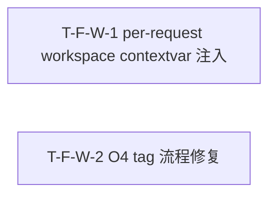

# Tasks Delta — v1.18.0（2026-09-07）

> 04 任务拆解 delta。per-request workspace 注入 + O4 tag 流程修复 v1.18.0 轮：FastAPI middleware contextvar 注入 / O4 tag 流程约定文档化。2 Task（1:1 对应 2 Spec F-W-1..2），1 Wave 全并行，DAG 无环（2 独立节点，无边，与 decomposition 一致）。基线含 v1.17.0（pytest 2267 passed, tag v1.17.0@e391611）。per-request workspace 注入 via contextvar middleware + QueryEngine fallback 读取（构造签名不变），O4 tag 流程修复约定文档化（release-manager.md + scripts/RELEASE-FLOW.md）。

## WBS delta（追加行）

| task_id | spec_ref | 描述 | 类型 | 估时 | depends_on | files | acceptance | pms_module |
|---|---|---|---|---|---|---|---|---|
| T-F-W-1 | SPEC-F-W-1 | FastAPI middleware contextvar 注入（`workspace_id_var` + `WorkspaceContextMiddleware` extract/validate/set/reset）+ `QueryEngine._effective_workspace_id()` helper（contextvar fallback `self._workspace_id`，构造签名不变）+ 子服务 `TreeModeSearch`/`ContextCompiler`/`GraphTraverse` 各加 `_effective_workspace_id()` helper + `engine.py` 4+ 位置 `self._workspace_id` → `self._effective_workspace_id()` + middleware 注册 `app.py` RequestContextMiddleware 之后 + `observability.py` JsonFormatter payload 新增 `workspace_id` 字段 + `collaborate.py` ThreadPoolExecutor 改 `asyncio.to_thread` 或 `copy_context().run()` + 新建 `test_workspace_contextvar.py` + `test_workspace_isolation.py` + `test_workspace_cli_compat.py` + `test_workspace_signature.py` + `test_workspace_validation.py` + `test_workspace_thread_propagation.py` | backend-logic | M | — | src/saw/drivers/web/middleware/workspace.py, src/saw/engines/query/engine.py, src/saw/engines/query/tree_mode.py, src/saw/engines/query/compiler.py, src/saw/engines/query/graph_traverse.py, src/saw/drivers/web/app.py, src/saw/middleware/observability.py, src/saw/engines/collaborate/collaborate.py, tests/unit/test_workspace_contextvar.py, tests/unit/test_workspace_isolation.py, tests/unit/test_workspace_cli_compat.py, tests/unit/test_workspace_signature.py, tests/unit/test_workspace_validation.py, tests/unit/test_workspace_thread_propagation.py | AC-WS-1, AC-WS-2, AC-WS-3, AC-WS-4, AC-WS-5 | per-request-ws |
| T-F-W-2 | SPEC-F-W-2 | `.claude/agents/release-manager.md` S8 节更新（新增 7.4.1 Tag 流程节：reconcile commit → release commit → tag release commit → push → GitHub Release 5 step + 验证命令）+ 新建 `scripts/RELEASE-FLOW.md`（完整 release 流程文档 5 step + 异常处理 + 验证）+ 新建 `test_release_flow_docs.py`（release-manager.md 含 tag 顺序 + RELEASE-FLOW.md 存在 + 5 step 文本解析）+ 新建 `test_o4_tag_flow.py`（06 执行时验证 tag 指向 release commit + GitHub Release 关联） | infra | S | — | .claude/agents/release-manager.md, scripts/RELEASE-FLOW.md, tests/unit/test_release_flow_docs.py, tests/unit/test_o4_tag_flow.py | AC-O4-1, AC-O4-2 | per-request-ws |

## DAG delta（Mermaid）

### DAG 校验
- 拓扑序无环：W-1 / W-2 互相独立，无依赖边 → 无回边 ✓
- 与 decomposition DEPENDENCY-GRAPH v1.18.0 delta 一致（F-W-1 / F-W-2 全独立，无边）✓
- 无自环、无环。若 05 重构致环 → 报错停步。

### 关键路径
- 无关键路径（2 Task 无依赖，全并行 1 步完成）。

### 并行机会
- Wave 1：T-F-W-1 / T-F-W-2 全并行（2 路独立，完全不同文件集与关注点：多租户 web 隔离 vs release 流程文档）。

## Wave 重排（v1.18.0）

| Wave | Task 集合 | 可并行性 | 里程碑 |
|---|---|---|---|
| Wave 1 | T-F-W-1 / T-F-W-2 | 2 路并行（多租户 web 隔离 vs release 流程文档，完全不同文件集与关注点） | per-request workspace 注入 + O4 tag 流程约定文档化就绪 → v1.18.0 可交付 |

### 共享资源串行
- 无共享资源串行约束。2 Task 全独立，Wave 1 全并行。
- T-F-W-1 触及 `src/saw/` 运行时（middleware/engine/子服务/app.py/observability/collaborate），T-F-W-2 触及 `.claude/agents/release-manager.md` + `scripts/RELEASE-FLOW.md`（流程文档），无共享文件冲突。

### Wave 1 文件冲突分析
| 文件 | Wave 1 写入方 | 新建? | 冲突? |
|---|---|---|---|
| src/saw/drivers/web/middleware/workspace.py | T-F-W-1 | 是 | 否（仅 W-1） |
| src/saw/engines/query/engine.py | T-F-W-1 | 否 | 否（仅 W-1） |
| src/saw/engines/query/tree_mode.py | T-F-W-1 | 否 | 否（仅 W-1） |
| src/saw/engines/query/compiler.py | T-F-W-1 | 否 | 否（仅 W-1） |
| src/saw/engines/query/graph_traverse.py | T-F-W-1 | 否 | 否（仅 W-1） |
| src/saw/drivers/web/app.py | T-F-W-1 | 否 | 否（仅 W-1） |
| src/saw/middleware/observability.py | T-F-W-1 | 否 | 否（仅 W-1） |
| src/saw/engines/collaborate/collaborate.py | T-F-W-1 | 否 | 否（仅 W-1） |
| tests/unit/test_workspace_*.py | T-F-W-1 | 是 | 否（仅 W-1，6 测试文件独占） |
| .claude/agents/release-manager.md | T-F-W-2 | 否 | 否（仅 W-2） |
| scripts/RELEASE-FLOW.md | T-F-W-2 | 是 | 否（仅 W-2） |
| tests/unit/test_release_flow_docs.py | T-F-W-2 | 是 | 否（仅 W-2） |
| tests/unit/test_o4_tag_flow.py | T-F-W-2 | 是 | 否（仅 W-2） |

> 并行检测结论：Wave 1 两 Task 可全并行启动。文件集完全无重叠（W-1 写 src/saw/ 运行时 + 6 测试，W-2 写 release-manager.md + RELEASE-FLOW.md + 2 测试），不同关注点（多租户 web 隔离 vs release 流程约定）。不阻塞并行启动。

## AC 归属

| AC | Task | Spec | 断言 |
|---|---|---|---|
| AC-WS-1（contextvar 注入生效） | T-F-W-1 | SPEC-F-W-1 | TestClient + X-Workspace-Id: team-a → QueryEngine._effective_workspace_id() == "team-a" |
| AC-WS-2（fallback 默认值） | T-F-W-1 | SPEC-F-W-1 | TestClient 不带 header → QueryEngine._effective_workspace_id() == "default" |
| AC-WS-3（跨 workspace 不泄漏） | T-F-W-1 | SPEC-F-W-1 | workspace A 搜索结果不含 workspace B claim（mock DB 集成测试） |
| AC-WS-4（CLI 不受影响） | T-F-W-1 | SPEC-F-W-1 | CLI 模式 QueryEngine.query 使用 default workspace（contextvar 保持 default） |
| AC-WS-5（构造签名不变） | T-F-W-1 | SPEC-F-W-1 | inspect.signature(QueryEngine.__init__) 参数列表含 workspace_id: str = "default" |
| AC-O4-1（tag 指向 release commit） | T-F-W-2 | SPEC-F-W-2 | git log v1.18.0 -1 输出含 release: v1.18.0（非 reconcile） |
| AC-O4-2（GitHub Release 关联） | T-F-W-2 | SPEC-F-W-2 | gh release view v1.18.0 tag_name = v1.18.0, target_commitish = release commit SHA |

> PRD §6 共 7 条 AC，全部 7 条分配到对应 Feature/Task（AC-WS-1..5→T-F-W-1, AC-O4-1/2→T-F-W-2）→ 无丢失 ✓

## files 归属

| 文件 | Task | 新建? | 说明 |
|---|---|---|---|
| src/saw/drivers/web/middleware/workspace.py | T-F-W-1 | 是 | workspace_id_var + WorkspaceContextMiddleware |
| src/saw/engines/query/engine.py | T-F-W-1 | 否 | _effective_workspace_id() helper + 4+ 位置 self._workspace_id → _effective_workspace_id() |
| src/saw/engines/query/tree_mode.py | T-F-W-1 | 否 | _effective_workspace_id() helper |
| src/saw/engines/query/compiler.py | T-F-W-1 | 否 | _effective_workspace_id() helper |
| src/saw/engines/query/graph_traverse.py | T-F-W-1 | 否 | _effective_workspace_id() helper |
| src/saw/drivers/web/app.py | T-F-W-1 | 否 | middleware 注册（RequestContextMiddleware 之后） |
| src/saw/middleware/observability.py | T-F-W-1 | 否 | JsonFormatter payload 新增 workspace_id 字段 |
| src/saw/engines/collaborate/collaborate.py | T-F-W-1 | 否 | ThreadPoolExecutor → asyncio.to_thread 或 copy_context |
| tests/unit/test_workspace_contextvar.py | T-F-W-1 | 是 | AC-WS-1/WS-2 middleware contextvar 注入测试 |
| tests/unit/test_workspace_isolation.py | T-F-W-1 | 是 | AC-WS-3 跨 workspace 不泄漏测试 |
| tests/unit/test_workspace_cli_compat.py | T-F-W-1 | 是 | AC-WS-4 CLI 不受影响测试 |
| tests/unit/test_workspace_signature.py | T-F-W-1 | 是 | AC-WS-5 构造签名不变测试 |
| tests/unit/test_workspace_validation.py | T-F-W-1 | 是 | workspace_id 校验（非法字符/超长/合法边界） |
| tests/unit/test_workspace_thread_propagation.py | T-F-W-1 | 是 | asyncio.to_thread contextvar 传播测试 |
| .claude/agents/release-manager.md | T-F-W-2 | 否 | S8 节新增 7.4.1 Tag 流程 |
| scripts/RELEASE-FLOW.md | T-F-W-2 | 是 | 完整 release 流程文档（5 step） |
| tests/unit/test_release_flow_docs.py | T-F-W-2 | 是 | 文档验证测试（release-manager + RELEASE-FLOW.md） |
| tests/unit/test_o4_tag_flow.py | T-F-W-2 | 是 | 06 执行时验证 tag 指向 + GitHub Release 关联 |

## 类型分派矩阵
| 类型 | Task | 推荐分派 |
|---|---|---|
| backend-logic | T-F-W-1 | 后端（FastAPI middleware contextvar 注入 + QueryEngine/子服务 _effective_workspace_id() + JSON 日志 workspace_id + ThreadPoolExecutor 传播） |
| infra | T-F-W-2 | DevOps（release-manager.md S8 tag 流程约定 + scripts/RELEASE-FLOW.md 新建 + 文档验证测试） |

## 拆解门控
- [x] Spec 完整性：2 Task == 2 Spec（03 穷尽门控通过，2 Spec == 2 原子 Feature F-W-1..2）
- [x] 每个 Feature 有 ≥1 Task（2/2）
- [x] Task 粒度 ≤4h（M×1 / S×1）
- [x] DAG 无环（W-1 / W-2 互相独立，无依赖边，实机校验 cycle=none）
- [x] Task 依赖与 decomposition Feature 依赖一致（F-W-1 / F-W-2 全独立无边）
- [x] Wave 划分合理（全 Wave 1 并行，无共享资源串行约束）
- [x] 每 Task acceptance 非空（指向 AC，共 7 AC 全映射）
- [x] 不越 PMS 边界（per-request-ws 模块）
- [x] 并行检测通过（2 Task 文件集完全无重叠，不同关注点）

## assumptions / [TBD]
- contextvar 传播至 ThreadPoolExecutor 实测行为 [TBD]（Python 3.9+ asyncio.to_thread 内置 copy_context，05 实施后验证）
- workspace_id 校验正则 `^[a-zA-Z0-9_-]{1,64}$` 实际用户场景覆盖度 [TBD]（05 实施后 CI 验证）
- 多租户集成测试 mock DB 策略 [TBD]（05 实施时决定 mock vs sqlite 内存）
- GPG 签名 tag defer 到后续版本（当前 threat model 不要求）
- `collaborate.py` ThreadPoolExecutor 改 asyncio.to_thread 后并发控制影响 [TBD]（max_workers=1 → asyncio.to_thread 无并发限制，05 实施时评估是否需要 Semaphore）
