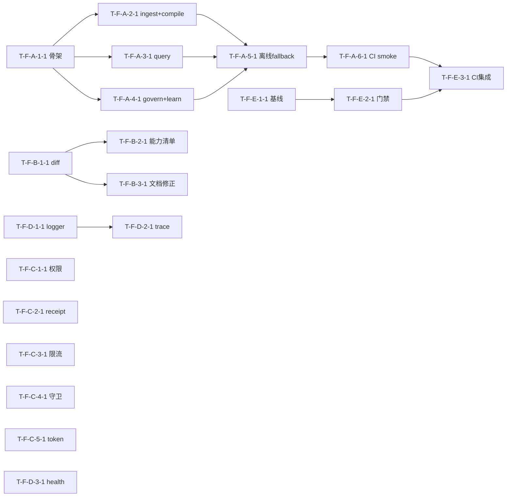

# Dependency DAG — Task 依赖图（无环）

> Task 依赖镜像 decomposition Feature 依赖（不反向）。DAG 无环（实机校验）。

## Mermaid

## DAG 校验
- 拓扑序无环（实机校验 cycle=none）✓
- 与 decomposition DEPENDENCY-GRAPH 一致：A1→{A2,A3,A4}→A5→A6→E3；B1→{B2,B3}；D1→D2；E1→E2→E3；C/D3 独立 ✓
- 无回边。若 05 重构致环 → 报错停步。

## 关键路径
T-F-A-1-1 → T-F-A-2-1 → T-F-A-5-1 → T-F-A-6-1 → T-F-E-3-1（5 步）
- 次长：T-F-E-1-1 → T-F-E-2-1 → T-F-E-3-1（3 步）
- A2/A3/A4 并行可压缩 A1→A5 段。

## 并行机会
- Wave 1 全并行（10 Task 无依赖）。
- Wave 2 中 A2/A3/A4 三引擎冒烟并行。
- C 域 5 Task 全独立并行；B 域（P1）可与 P0 异步。
