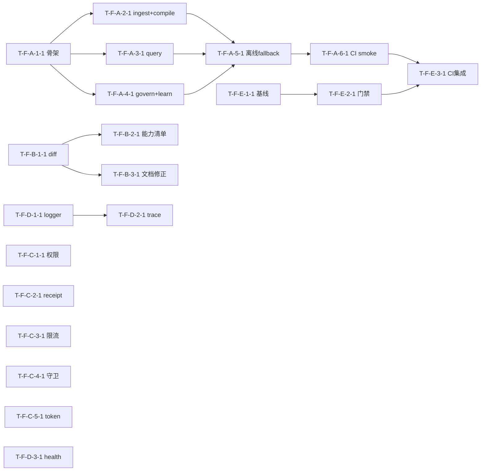
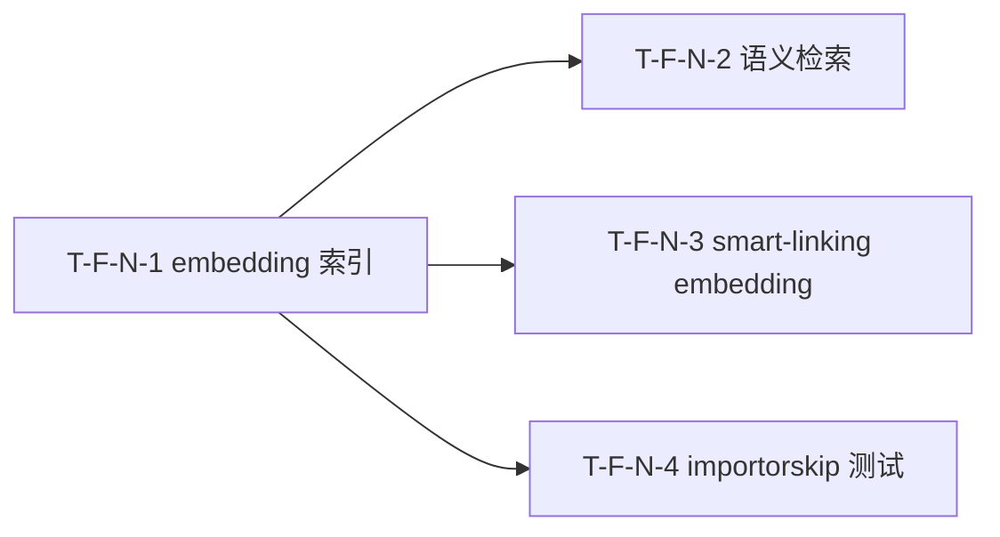
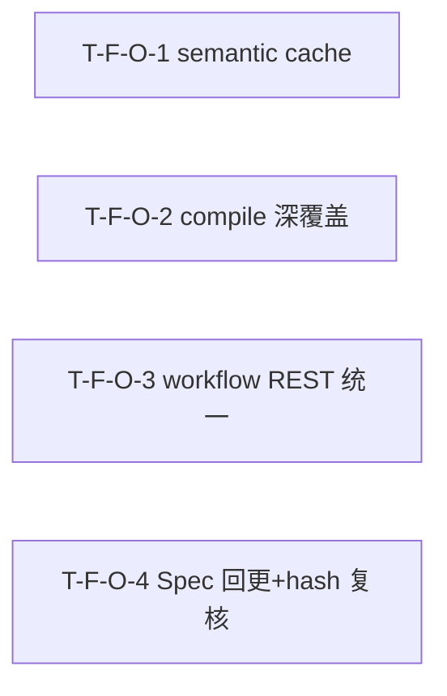
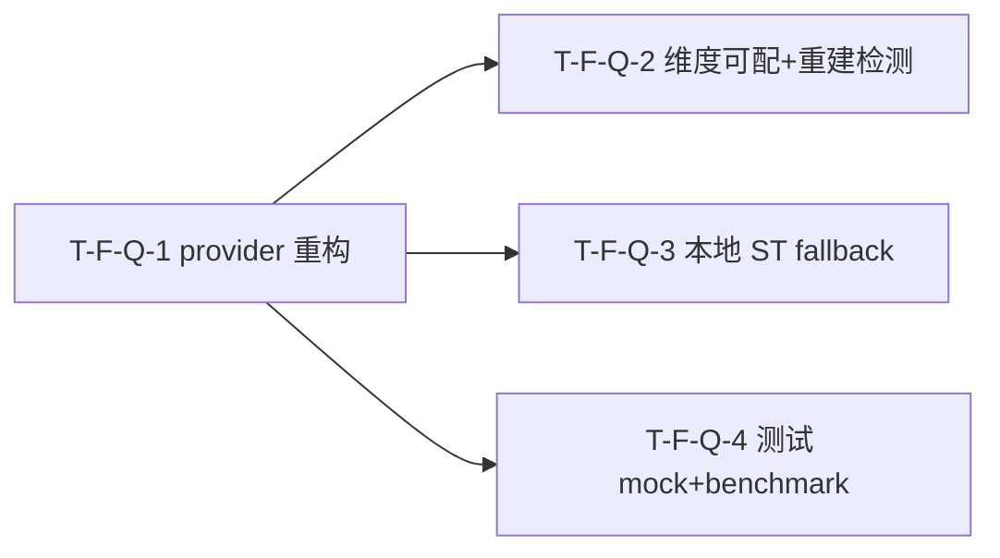
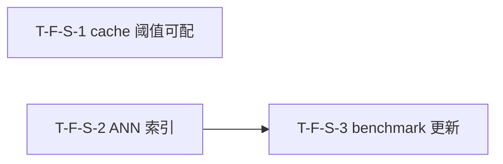

# Dependency DAG — Task 依赖图（无环）

> Task 依赖镜像 decomposition Feature 依赖（不反向）。DAG 无环（实机校验）。

## Mermaid

## DAG 校验
- 拓扑序无环（实机校验 cycle=none）✓
- 与 decomposition DEPENDENCY-GRAPH 一致：A1→{A2,A3,A4}→A5→A6→E3；B1→{B2,B3}；D1→D2；E1→E2→E3；C/D3 独立 ✓
- 无回边。若 05 重构致环 → 报错停步。

## 关键路径
T-F-A-1-1 → T-F-A-2-1 → T-F-A-5-1 → T-F-A-6-1 → T-F-E-3-1（5 步）
- 次长：T-F-E-1-1 → T-F-E-2-1 → T-F-E-3-1（3 步）
- A2/A3/A4 并行可压缩 A1→A5 段。

## 并行机会
- Wave 1 全并行（10 Task 无依赖）。
- Wave 2 中 A2/A3/A4 三引擎冒烟并行。
- C 域 5 Task 全独立并行；B 域（P1）可与 P0 异步。

---

## v1.10.0 delta（embedding track）

### v1.10.0 DAG 校验
- 拓扑序无环：N1 → {N2, N3, N4}，无回边 ✓
- 与 decomposition DEPENDENCY-GRAPH v1.10.0 delta 一致（N-1 → {N-2, N-3, N-4}）✓
- 无自环、无环。若 05 重构致环 → 报错停步。

### v1.10.0 关键路径
T-F-N-1 → T-F-N-2（2 步，最长链）
- N-2/N-3/N-4 并行可压缩 N-1→{N-2/N-3/N-4} 段。

### v1.10.0 并行机会
- Wave 1：T-F-N-1 独占（db migration 共享资源串行先行）。
- Wave 2：T-F-N-2 / T-F-N-3 / T-F-N-4 全并行（3 路独立，无共享文件冲突）。

---

## v1.11.0 delta（债务收口 IV / bug fix track）

### v1.11.0 DAG 校验
- 拓扑序无环：O1 / O2 / O3 / O4 互相独立，无依赖边 → 无回边 ✓
- 与 decomposition DEPENDENCY-GRAPH v1.11.0 delta 一致（4 Feature 全并行，无依赖边）✓
- 无自环、无环。若 05 重构致环 → 报错停步。

### v1.11.0 关键路径
- 无关键路径（4 Task 无依赖，全并行 1 步完成）。

### v1.11.0 并行机会
- Wave 1：T-F-O-1 / T-F-O-2 / T-F-O-3 / T-F-O-4 全并行（4 路独立，无共享文件冲突）。

---

## v1.12.0 delta（embedding API 重构 track）

### v1.12.0 DAG 校验
- 拓扑序无环：Q-1 → {Q-2, Q-3, Q-4}，无回边 ✓
- 与 decomposition DEPENDENCY-GRAPH v1.12.0 delta 一致（F-Q-1 → {F-Q-2, F-Q-3, F-Q-4}）✓
- 无自环、无环。若 05 重构致环 → 报错停步。

### v1.12.0 关键路径
T-F-Q-1 → T-F-Q-2（2 步，最长链，与 Q-1→Q-3/Q-1→Q-4 等长）
- Q-2/Q-3/Q-4 并行可压缩 Q-1→{Q-2,Q-3,Q-4} 段。

### v1.12.0 并行机会
- Wave 1：T-F-Q-1 独占（provider 重构前置）。
- Wave 2：T-F-Q-2 / T-F-Q-3 / T-F-Q-4 全并行（3 路独立，无共享文件冲突；`embeddings.py`/`settings.py` 由 Q-3 续写 Wave 1 Q-1 成果，串行 Wave 1→2 不构成 Wave 2 内冲突）。

---

## v1.14.0 delta（semantic 性能优化 track）

### v1.14.0 DAG 校验
- 拓扑序无环：S-1 独立（无入边无出边）；S-2→S-3 单向边；无回边 ✓
- 与 decomposition DEPENDENCY-GRAPH v1.14.0 delta 一致（F-S-2→F-S-3，F-S-1 独立）✓
- 无自环、无环。若 05 重构致环 → 报错停步。

### v1.14.0 关键路径
T-F-S-2 → T-F-S-3（2 步，最长链）
- S-1 独立，与 S-2 可 Wave 1 并行。

### v1.14.0 并行机会
- Wave 1：T-F-S-1 / T-F-S-2 全并行（engine.py 不同 section：cache 条件分支 vs cosine→ANN 切换，worktree 隔离 + 合并协调）。
- Wave 2：T-F-S-3 独占（依赖 S-2 ANN 路径完成）。
