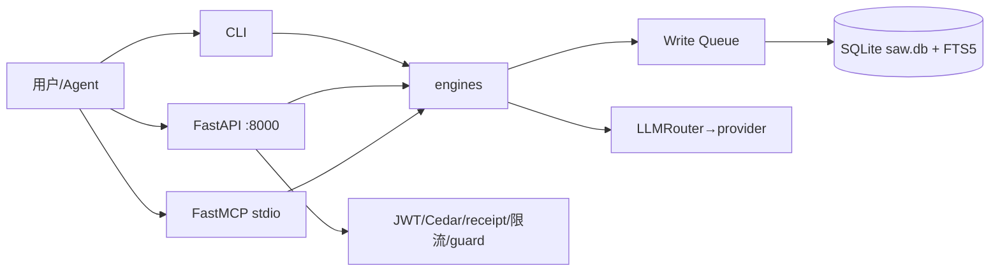

# Architecture Design — 系统架构（源自 CMS）

> 棕地，架构已存，本设计 ground 在 `.csp/code-spec/saw/CODE-MODULE-SPEC.md`。硬化 delta 标注。

## 架构风格
**六角架构（Hexagonal）** — domain → engines → adapters → drivers/api。决策依据：local-first 单机 + AI/ML 生态 + 端口-适配器隔离 IO（`domain/protocols.py`）。对比：微服务（破 local-first，否）、分层单体（接近，但六角的端口隔离更适合多 driver——CLI/Web/MCP 三入口共享 engines）。

## 模块划分（对齐 PMS 5 域 + CMS 13 模块）
| PMS 域 | 职责 | 源自 CMS | 对外接口 | 内部接口 |
|---|---|---|---|---|
| e2e-usability | 冒烟基线 | §M01-05 engines | CLI smoke cmd [TBD] | IngestPipeline/Governor/QueryEngine |
| claim-alignment | 宣称校准 | entry-points.jsonl | diff 脚本 + CAPABILITIES.md | cms_extract.sh |
| security-hardening | 安全闭环 | §M08 auth + §M09 write_queue | auth_dep/receipt/限流 | AuthService/ReceiptSigner/Dispatcher |
| observability | 可观测一致 | §M07 middleware | /health/ready /metrics | init_observability/trace context |
| test-gate | 测试门禁 | 既有 tests | CI ci.yml | pytest --cov |

## 分层 import 边界（强制）
- `domain/` 不 import engines/adapters/drivers。
- `engines/` 经 write_queue 变更，禁直写 repository。
- `adapters/` 不反向依赖 engines。
- `drivers/`/`api/` 委派 engines，禁含业务逻辑。
- CI 检查：`ruff` + 自定义 import-lint [TBD]（循环依赖用 madge/ast 等价 grep 检查）。

## 腰架构
扩展现有工具 > CLI+Skill > Service-gated Tool > Plugin > MCP Server > 新核心工具。硬化项目**全部在既有能力上扩展**（冒烟/自检/diff/CI 集成），不新增核心能力。

## 部署拓扑（Mermaid）

## 架构原则
①分层 import 边界 CI 强制；②腰架构（硬化全在既有扩展）；③插件 import 边界（`plugins/` 不 import core src，CI 检查 [TBD]）；④依赖注入（构造函数注入，禁运行时获取）。

## 与 PMS 一致性
5 域边界 = PMS 5 模块 = CMS 模块组。无越界。
