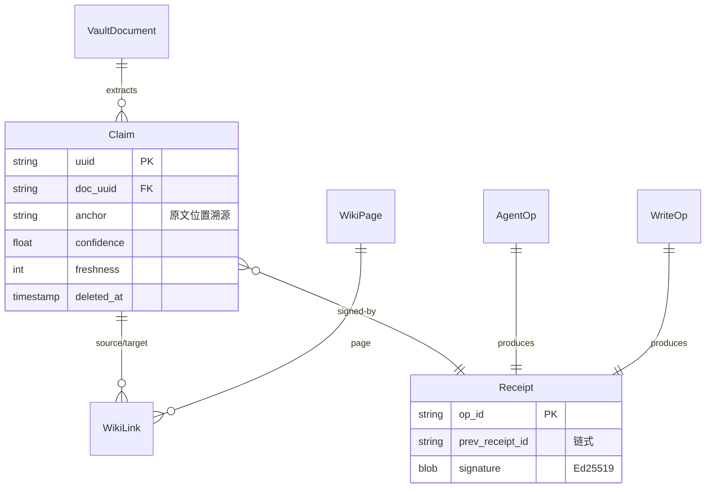

# Data Architecture — 数据架构（源自 CMS §M09）

## 四层存储
Vault（原文）→ Claims（抽取事实）→ Wiki（编译页）→ Index（FTS5）。对应 `adapters/storage/{vault,claims,wiki}_repository.py` + `fts5_utils.py`。单 SQLite 库 `saw.db`。

## 核心 ER（Mermaid）


> 既有 schema 不重设计；本图源自 CMS §M09 + `adapters/storage/*_repository.py`。DDL 级见各 repository 实现（棕地，不重复 spec）。

## 数据流
```
ingest → IngestPipeline._build_write_ops → Dispatcher.enqueue → SQLiteWriteQueue(outbox)
  → dispatch_pending → sinks{vault,claims,wiki,fts5,graph,contradictions} → repositories
```
查询只读：QueryEngine → FTS5Search + repos（不经 write_queue）。

## 一致性策略
- CRUD 强一致（单 SQLite，同步事务）。
- Write Queue outbox：mutation 先入 outbox 事务，再 dispatch 到 sinks，保证不丢（F-C-2 在此挂 receipt）。
- 缓存 write-invalidate（query cache，`engines/query/cache.py`）。
- 跨 sink 最终一致（dispatch_pending 重试 + recover）。

## 数据量预估
| 实体 | 量级 | 增长率 | 存储引擎 | 分区 |
|---|---|---|---|---|
| VaultDocument | [TBD] | [TBD] | SQLite | 无 |
| Claim | [TBD] | [TBD] | SQLite + FTS5 | 无 |
| Receipt | [TBD] | [TBD] | SQLite | 无 |

> DAU/量级未提供，标 [TBD]。单库无分区需求（量级未达分区阈值）。
